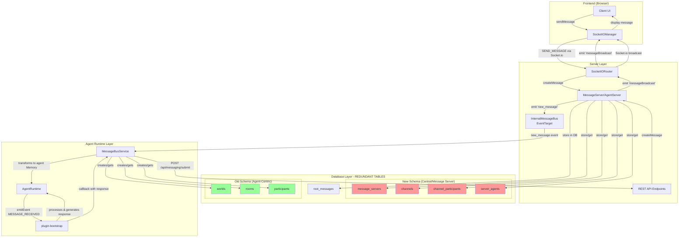
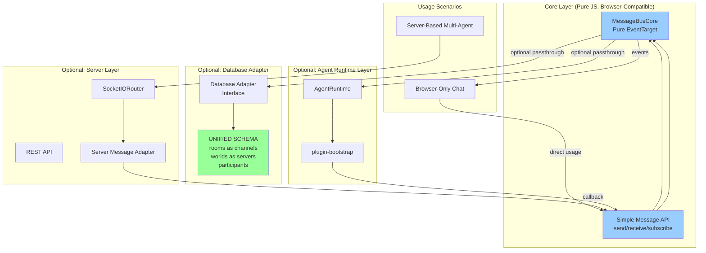

# Message Bus Architecture Analysis

## Current Architecture Diagram



## Current Message Flow

### 1. User Sends Message (Frontend → Server)

```
Client UI
  ↓ sendMessage()
SocketIOManager
  ↓ socket.emit('message', { type: SEND_MESSAGE, payload: {...} })
SocketIORouter.handleMessageSubmission()
  ↓ serverInstance.createMessage()
AgentServer/MessageServer
  ↓ INSERT INTO root_messages
  ↓ Check/Create channel in 'channels' table
Database
```

### 2. Message Broadcast to UI (Server → Frontend)

```
SocketIORouter
  ↓ socket.to(channelId).emit('messageBroadcast', {...})
  ↓ Also: socket.emit('messageBroadcast', {...}) back to sender
SocketIOManager (all connected clients)
  ↓ on('messageBroadcast')
Client UI updates
```

### 3. Message Distribution to Agents (Server → Agent Runtime)

```
AgentServer.createMessage()
  ↓ internalMessageBus.emit('new_message', messageData)
InternalMessageBus (EventTarget)
  ↓ dispatch CustomEvent
MessageBusService.handleIncomingMessage()
  ↓ Transforms message to agent-space
  ↓ Creates agentRoomId/agentWorldId (UUID-swizzled)
  ↓ Gets/Creates room in 'rooms' table
  ↓ Gets/Creates world in 'worlds' table
  ↓ Gets/Creates participant in 'participants' table
  ↓ Creates Memory object
  ↓ runtime.emitEvent(EventType.MESSAGE_RECEIVED)
plugin-bootstrap event handler
  ↓ messageReceivedHandler()
  ↓ Processes message, runs actions, generates response
  ↓ calls callback(responseContent)
MessageBusService.sendAgentResponseToBus()
  ↓ POST /api/messaging/submit
AgentServer → Socket.io broadcast (back to step 2)
```

## Redundant Table Pairs

| New (Message Server)   | Old (Agent-Centric)          | Purpose                         |
| ---------------------- | ---------------------------- | ------------------------------- |
| `message_servers`      | `worlds`                     | Represents a server/guild/world |
| `server_agents`        | (implicit in worlds.agentId) | Links agents to servers         |
| `channels`             | `rooms`                      | Represents a channel/room/chat  |
| `channel_participants` | `participants`               | Links users to channels         |

### Key Differences

1. **ID Types**:

   - New schema: `message_servers.id` is UUID, `channels.id` is TEXT (can store any ID)
   - Old schema: Both `worlds.id` and `rooms.id` are UUIDs (agent-specific, UUID-swizzled)

2. **Relationships**:

   - New schema: `channels` → `message_servers` (central, shared across agents)
   - Old schema: `rooms` → `worlds` → `agents` (agent-specific, isolated)

3. **Purpose**:
   - New schema: Central message server layer (shared truth for all agents)
   - Old schema: Agent memory/perception layer (each agent has own view)

## Problems with Current Architecture

1. **Data Duplication**: Same concepts stored in two places with different IDs
2. **Tight Coupling**: Can't use message bus without full server + database
3. **Complex Mapping**: Constant translation between channelId ↔ roomId, serverId ↔ worldId
4. **Not Browser-Friendly**: Can't run agents in pure browser environment
5. **Unnecessary Abstraction**: For simple use cases (browser-only chat), the layers are overkill
6. **Confusing Architecture**: Hard to understand where data lives and flows

## Current Dependencies

```
Frontend (SocketIOManager)
  ↓ requires
Server (SocketIORouter + REST API)
  ↓ requires
InternalMessageBus (EventTarget)
  ↓ requires
MessageBusService
  ↓ requires
Database (both schemas)
  ↓ requires
plugin-bootstrap
```

All layers are tightly coupled. Cannot skip any layer.

---

## Proposed Refactoring Plan

### Goals

1. ✅ Enable browser-only usage (no server required for simple cases)
2. ✅ Reduce table redundancy (reuse existing tables properly)
3. ✅ Decouple message bus from server infrastructure
4. ✅ Make it optional to pass down to server/bootstrap pipeline
5. ✅ Pure JavaScript core that works anywhere
6. ❌ No new tables - reuse and document existing ones

### Design Principles

- **Layered Architecture**: Core → Optional Server → Optional Bootstrap
- **Progressive Enhancement**: Start simple, add features as needed
- **Interface-Based**: Define clear interfaces between layers
- **Backward Compatible**: Don't break existing server-based deployments

---

## Refactored Architecture



### Refactored Message Flow

#### Simple Browser Mode (No Server)

```
User → MessageBusCore.send() → emit('message') → Subscribers receive → UI updates
```

#### Server Mode (Current Functionality)

```
User → SocketIORouter → ServerAdapter → MessageBusCore.send()
  → emit('message')
    ├─→ Database Adapter (store in rooms/worlds/participants)
    ├─→ Socket.io broadcast (UI updates)
    └─→ Agent Runtime (process with bootstrap)
```

---

## Implementation Plan

### Phase 1: Create Core Message Bus (Pure JS)

**File**: `packages/core/src/messaging/bus-core.ts`

```typescript
// Pure JavaScript, browser-compatible message bus
export interface Message {
  id: string;
  channelId: string;
  serverId: string;
  authorId: string;
  authorName: string;
  content: string;
  timestamp: number;
  metadata?: Record<string, any>;
}

export interface MessageBusOptions {
  // Optional: provide database adapter for persistence
  dbAdapter?: DatabaseAdapter;
  // Optional: provide server adapter for REST/Socket.io
  serverAdapter?: ServerAdapter;
  // Optional: provide runtime for agent processing
  runtime?: IAgentRuntime;
}

export class MessageBusCore extends EventTarget {
  private subscribers = new Map<string, Set<(msg: Message) => void>>();
  private options: MessageBusOptions;

  constructor(options: MessageBusOptions = {}) {
    super();
    this.options = options;
  }

  // Core API - works in any environment
  async send(message: Omit<Message, 'id' | 'timestamp'>): Promise<Message> {
    const fullMessage: Message = {
      ...message,
      id: this.generateId(),
      timestamp: Date.now(),
    };

    // Store in database if adapter provided
    if (this.options.dbAdapter) {
      await this.options.dbAdapter.storeMessage(fullMessage);
    }

    // Emit to local subscribers (browser UI, etc)
    this.emit('message', fullMessage);

    // Pass to server if adapter provided
    if (this.options.serverAdapter) {
      await this.options.serverAdapter.broadcast(fullMessage);
    }

    // Pass to agent runtime if provided
    if (this.options.runtime) {
      await this.routeToAgent(fullMessage);
    }

    return fullMessage;
  }

  subscribe(channelId: string, callback: (msg: Message) => void): () => void {
    if (!this.subscribers.has(channelId)) {
      this.subscribers.set(channelId, new Set());
    }
    this.subscribers.get(channelId)!.add(callback);

    // Return unsubscribe function
    return () => {
      this.subscribers.get(channelId)?.delete(callback);
    };
  }

  private emit(event: string, data: Message) {
    // Notify all subscribers for this channel
    const channelSubscribers = this.subscribers.get(data.channelId);
    if (channelSubscribers) {
      channelSubscribers.forEach((cb) => cb(data));
    }

    // Also emit as CustomEvent for EventTarget listeners
    this.dispatchEvent(new CustomEvent(event, { detail: data }));
  }

  private async routeToAgent(message: Message): Promise<void> {
    // Transform to agent Memory and emit MESSAGE_RECEIVED
    // This replaces MessageBusService logic
  }

  private generateId(): string {
    return crypto.randomUUID();
  }
}
```

### Phase 2: Consolidate Database Schema

**Goal**: Use `rooms`, `worlds`, `participants` as the single source of truth.

**Changes**:

1. Update `rooms` table to serve as both agent rooms AND central channels
2. Update `worlds` table to serve as both agent worlds AND central servers
3. Keep `participants` table as is (already flexible)
4. Document that these tables serve dual purpose

**Migration**:

```typescript
// Add fields to existing tables instead of creating new ones
// rooms table becomes universal:
//   - For agents: has agentId, contains UUID-swizzled IDs
//   - For central: has channelId as primary key, shared across agents

// worlds table becomes universal:
//   - For agents: has agentId, contains UUID-swizzled IDs
//   - For central: has serverId as primary key, shared across agents
```

**Documentation**:

```typescript
/**
 * UNIFIED SCHEMA DOCUMENTATION
 *
 * rooms = channels (universal)
 * - When used by MessageBusCore: rooms.id = channelId (text, any format)
 * - When used by AgentRuntime: rooms.id = agent-specific UUID (UUID-swizzled)
 * - rooms.channelId field links agent room to central channel
 *
 * worlds = servers (universal)
 * - When used by MessageBusCore: worlds.id = serverId (text, any format)
 * - When used by AgentRuntime: worlds.id = agent-specific UUID (UUID-swizzled)
 * - worlds.serverId field links agent world to central server
 *
 * participants = channel_participants (universal)
 * - Works for both agent-specific and central views
 * - participant.entityId can be any user/agent ID
 */
```

### Phase 3: Create Adapters

**Database Adapter Interface**:

```typescript
export interface DatabaseAdapter {
  storeMessage(message: Message): Promise<void>;
  getMessages(channelId: string, limit?: number): Promise<Message[]>;
  getOrCreateChannel(channelId: string, serverId: string): Promise<Channel>;
  getOrCreateServer(serverId: string): Promise<Server>;
  addParticipant(channelId: string, userId: string): Promise<void>;
}
```

**Server Adapter Interface**:

```typescript
export interface ServerAdapter {
  broadcast(message: Message): Promise<void>;
  join(channelId: string, userId: string): Promise<void>;
  leave(channelId: string, userId: string): Promise<void>;
}
```

### Phase 4: Update Server to Use Core

**Changes**:

1. `SocketIORouter` creates `MessageBusCore` with server adapter
2. `AgentServer` provides database adapter to core
3. Remove `InternalMessageBus` (replaced by `MessageBusCore`)
4. Remove `MessageBusService` (logic moved to core)
5. plugin-bootstrap subscribes directly to `MessageBusCore`

### Phase 5: Update Frontend

**Changes**:

1. `SocketIOManager` can optionally use `MessageBusCore` directly in browser mode
2. For server mode, keeps Socket.io connection (unchanged)
3. Add factory method to choose mode:

```typescript
// Browser-only mode
const messageBus = MessageBusCore.createBrowserMode();

// Server-connected mode
const messageBus = MessageBusCore.createServerMode(socketioUrl);
```

---

## Migration Strategy

### Step 1: Add Core (Non-Breaking)

- Create `MessageBusCore` in `packages/core`
- Exists alongside current implementation
- No changes to existing code

### Step 2: Schema Documentation (Non-Breaking)

- Document dual-purpose of `rooms`/`worlds`/`participants`
- Update type definitions and comments
- No schema changes yet

### Step 3: Server Adoption (Gradual)

- Update one server component at a time
- Add adapters that wrap existing logic
- Test thoroughly at each step

### Step 4: Deprecation (Breaking)

- Mark old tables for deprecation
- Provide migration script
- Remove `message_servers`, `channels`, `channel_participants`, `server_agents`

### Step 5: Frontend Update (Optional)

- Add browser-only mode
- Keep server mode for backward compatibility

---

## Benefits

1. **Simpler Architecture**: One unified message bus, clear layers
2. **Browser-Compatible**: Can run agents in pure browser environment
3. **Less Redundancy**: Single schema, no duplicate concepts
4. **Better Performance**: Fewer database queries, less transformation
5. **Easier Testing**: Can test message flow without full server stack
6. **Flexible Deployment**: Choose which layers you need

## Backward Compatibility

- Existing server deployments continue to work
- Migration path is gradual
- New deployments can start with simplified stack
- Browser-only mode is additive, doesn't break anything

---

## Questions for Discussion

1. **Should we keep rooms/worlds as agent-specific AND central?**

   - Option A: Dual-purpose tables (my recommendation)
   - Option B: Separate tables but with clear mapping

2. **Should MessageBusCore be in @elizaos/core or separate package?**

   - Option A: In core (tightly integrated)
   - Option B: Separate @elizaos/messaging package (more modular)

3. **Migration timeline?**

   - Option A: All at once (risky but clean)
   - Option B: Gradual over multiple releases (safer)

4. **Should we support both modes indefinitely or sunset server-centric eventually?**

---

## Next Steps

Please review this analysis and let me know:

1. Do you agree with the redundancy assessment?
2. Do you approve the general direction of the refactoring?
3. Which options do you prefer for the discussion questions?
4. Should I proceed with Phase 1 (creating MessageBusCore)?
