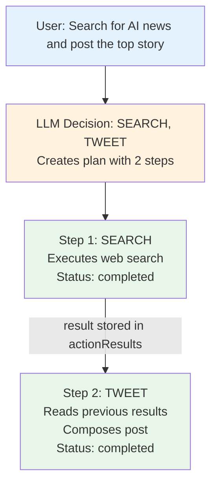

## The Problem

Simple agents can do one thing at a time. But real tasks are complex:

- "Search the web, summarize results, and post the highlights"
- "Check my calendar, find a free slot, and schedule a meeting"
- "Analyze this data, generate a chart, and email it to the team"

Each of these requires **multiple actions** executed in sequence, with results from one feeding into the next.

<Tip>
  **Action planning lets your agent think in steps.** The LLM decides the
  sequence, and ElizaOS executes each action, passing results forward
  automatically.
</Tip>

## How It Works

When the LLM returns multiple actions, ElizaOS creates an **ActionPlan**:

```typescript
interface ActionPlan {
  thought: string; // LLM's reasoning for this plan
  totalSteps: number; // How many actions to execute
  currentStep: number; // Which step we're on (0-indexed)
  steps: ActionPlanStep[];
}

interface ActionPlanStep {
  action: string; // Action name (e.g., "SEARCH", "TWEET")
  status: "pending" | "completed" | "failed";
  error?: string; // If failed, why
  result?: ActionResult; // Output from this step
}
```

The plan flows through state, so each action can see what came before:



## Accessing Previous Results

In your action handler, access results from previous steps:

```typescript
const myAction: Action = {
  name: "SUMMARIZE",
  description: "Summarize the results from previous actions",

  async handler(runtime, message, state, options, callback) {
    // Get all previous action results
    const previousResults = state?.data?.actionResults || [];

    // Find specific action result
    const searchResult = previousResults.find((r) => r.action === "SEARCH");

    if (searchResult?.text) {
      // Use search results to generate summary
      const summary = await runtime.useModel(ModelType.TEXT_SMALL, {
        prompt: `Summarize this: ${searchResult.text}`,
      });

      return {
        text: summary,
        action: "SUMMARIZE",
        success: true,
      };
    }

    return {
      text: "No previous results to summarize",
      action: "SUMMARIZE",
      success: false,
    };
  },
};
```

## Accessing Plan State

The current action plan is available in `state.data.actionPlan`:

```typescript
async handler(runtime, message, state, options, callback) {
  const plan = state?.data?.actionPlan;

  if (plan) {
    console.log(`Step ${plan.currentStep + 1} of ${plan.totalSteps}`);
    console.log(`LLM reasoning: ${plan.thought}`);

    // Check previous steps
    for (const step of plan.steps) {
      if (step.status === 'completed') {
        console.log(`${step.action}: ${step.result?.text}`);
      } else if (step.status === 'failed') {
        console.log(`${step.action} failed: ${step.error}`);
      }
    }
  }

  // Your action logic...
}
```

## Error Handling in Plans

When a step fails, the plan continues by default. Handle failures gracefully:

```typescript
const resilientAction: Action = {
  name: "PROCESS_DATA",

  async handler(runtime, message, state, options, callback) {
    const previousResults = state?.data?.actionResults || [];

    // Check if a required previous step failed
    const fetchResult = previousResults.find((r) => r.action === "FETCH_DATA");

    if (fetchResult?.success === false) {
      // Previous step failed - use fallback
      return {
        text: "Using cached data due to fetch failure",
        action: "PROCESS_DATA",
        success: true,
        data: { usedFallback: true },
      };
    }

    // Normal processing
    return {
      text: `Processed: ${fetchResult?.text}`,
      action: "PROCESS_DATA",
      success: true,
    };
  },
};
```

## Retrieving Results After Execution

After message processing, retrieve action results programmatically:

```typescript
// Process a message
const result = await runtime.handleMessage({
  entityId: userId,
  roomId: roomId,
  content: { text: "Search and summarize AI news", source: "api" },
});

// Get the action results from that message
const actionResults = runtime.getActionResults(result.messageId);

for (const result of actionResults) {
  console.log(`${result.action}: ${result.success ? "OK" : "FAILED"}`);
  console.log(`Output: ${result.text}`);
  if (result.data) {
    console.log(`Data:`, result.data);
  }
}
```

## Designing Actions for Chaining

When building actions that work well in chains:

<CardGroup cols={2}>
  <Card title="Return structured data" icon="database">
    Include a `data` field in results for downstream actions to consume
    programmatically.
  </Card>
  <Card title="Be idempotent" icon="rotate">
    Actions may be retried. Avoid side effects that can't be repeated safely.
  </Card>
  <Card title="Check prerequisites" icon="check-double">
    Verify required previous results exist before proceeding.
  </Card>
  <Card title="Fail gracefully" icon="shield">
    Return `success: false` with a clear error message rather than throwing.
  </Card>
</CardGroup>

### Example: Data Pipeline

```typescript
// Step 1: Fetch data
const fetchAction: Action = {
  name: "FETCH_DATA",
  async handler(runtime, message, state) {
    const data = await fetchFromAPI();
    return {
      text: `Fetched ${data.length} records`,
      action: "FETCH_DATA",
      success: true,
      data: { records: data }, // Structured data for next step
    };
  },
};

// Step 2: Transform data (uses Step 1 output)
const transformAction: Action = {
  name: "TRANSFORM_DATA",
  async handler(runtime, message, state) {
    const fetchResult = state?.data?.actionResults?.find(
      (r) => r.action === "FETCH_DATA",
    );

    if (!fetchResult?.data?.records) {
      return {
        text: "No data to transform",
        action: "TRANSFORM_DATA",
        success: false,
      };
    }

    const transformed = fetchResult.data.records.map((r) => ({
      ...r,
      processed: true,
      timestamp: Date.now(),
    }));

    return {
      text: `Transformed ${transformed.length} records`,
      action: "TRANSFORM_DATA",
      success: true,
      data: { records: transformed },
    };
  },
};

// Step 3: Store data (uses Step 2 output)
const storeAction: Action = {
  name: "STORE_DATA",
  async handler(runtime, message, state) {
    const transformResult = state?.data?.actionResults?.find(
      (r) => r.action === "TRANSFORM_DATA",
    );

    if (!transformResult?.data?.records) {
      return { text: "No data to store", action: "STORE_DATA", success: false };
    }

    await database.insert(transformResult.data.records);

    return {
      text: `Stored ${transformResult.data.records.length} records`,
      action: "STORE_DATA",
      success: true,
    };
  },
};
```

## ActionResult Type

```typescript
interface ActionResult {
  action: string; // Action name
  text: string; // Human-readable result
  success: boolean; // Did it work?
  error?: string; // Error message if failed
  data?: Record<string, unknown>; // Structured data for chaining
}
```

## Next Steps

<CardGroup cols={2}>
  <Card
    title="Actions Reference"
    icon="bolt"
    href="/plugins/components#actions"
  >
    Complete action handler API
  </Card>
  <Card title="State Management" icon="layer-group" href="/runtime/core#state">
    How state flows through the runtime
  </Card>
  <Card title="Background Tasks" icon="clock" href="/guides/background-tasks">
    Long-running actions with task workers
  </Card>
  <Card title="Streaming" icon="wave-pulse" href="/guides/streaming-responses">
    Stream action outputs in real-time
  </Card>
</CardGroup>
