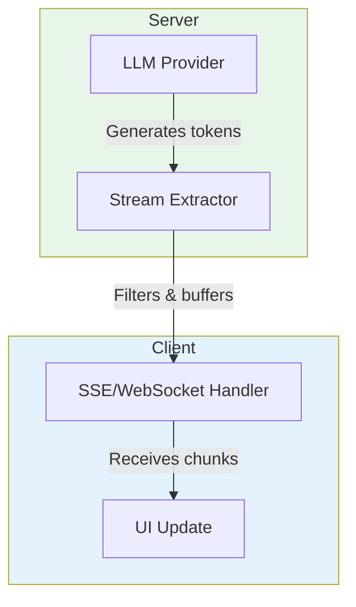

## The Problem

Users hate waiting. A 3-second response feels like an eternity when you're staring at a blank screen.

Traditional request/response patterns make your agent feel sluggish, even when the LLM is fast. The UI waits for the entire response before showing anything.

<Tip>
  **Streaming changes everything.** Users see tokens appear in real-time, making
  responses feel instant even when they take seconds to complete.
</Tip>

## Quick Start

ElizaOS supports three response modes out of the box:

| Mode          | Latency                    | Use Case                              |
| ------------- | -------------------------- | ------------------------------------- |
| **Sync**      | Wait for complete response | Simple integrations, batch processing |
| **Stream**    | Tokens appear in real-time | Chat UIs, interactive experiences     |
| **WebSocket** | Bidirectional, persistent  | Voice conversations, multi-turn       |

### HTTP Streaming

Send a message with `stream: true` to get Server-Sent Events:

```typescript
const response = await fetch(`/api/agents/${agentId}/message`, {
  method: "POST",
  headers: { "Content-Type": "application/json" },
  body: JSON.stringify({
    entityId: "user-123",
    roomId: "room-456",
    content: { text: "Hello!", source: "api" },
    stream: true, // Enable streaming
  }),
});

// Process SSE stream
const reader = response.body.getReader();
const decoder = new TextDecoder();

while (true) {
  const { done, value } = await reader.read();
  if (done) break;

  const chunk = decoder.decode(value);
  const lines = chunk.split("\n").filter((line) => line.startsWith("data: "));

  for (const line of lines) {
    const data = JSON.parse(line.slice(6));
    if (data.type === "chunk") {
      process.stdout.write(data.text); // Display token immediately
    }
  }
}
```

### WebSocket Connection

For bidirectional communication and voice conversations:

```typescript
const socket = new WebSocket(`ws://localhost:3000/api/agents/${agentId}/ws`);

socket.onopen = () => {
  socket.send(
    JSON.stringify({
      type: "message",
      entityId: "user-123",
      roomId: "room-456",
      content: { text: "Hello!", source: "websocket" },
    }),
  );
};

socket.onmessage = (event) => {
  const data = JSON.parse(event.data);

  switch (data.type) {
    case "chunk":
      process.stdout.write(data.text);
      break;
    case "complete":
      console.log("\n--- Response complete ---");
      break;
    case "error":
      console.error("Error:", data.message);
      break;
  }
};
```

## Stream Events

The streaming API emits these event types:

| Event      | Description                                        |
| ---------- | -------------------------------------------------- |
| `chunk`    | A token or text fragment to display                |
| `complete` | Response finished, includes full text and actions  |
| `error`    | Something went wrong                               |
| `control`  | Backend control messages (typing indicators, etc.) |

### Chunk Event

```typescript
{
  type: 'chunk',
  text: 'Hello',      // Text fragment to append
  timestamp: 1703001234567
}
```

### Complete Event

```typescript
{
  type: 'complete',
  text: 'Hello! How can I help you today?',  // Full response
  actions: ['REPLY'],                         // Executed actions
  messageId: 'msg-uuid',
  timestamp: 1703001234890
}
```

## Custom Stream Extractors

ElizaOS uses **stream extractors** to filter LLM output for streaming. The framework provides several built-in extractors:

### PassthroughExtractor

Streams everything as-is. Use for plain text responses.

```typescript
import { PassthroughExtractor } from "@elizaos/core";

const extractor = new PassthroughExtractor();
extractor.push("Hello "); // Returns: 'Hello '
extractor.push("world!"); // Returns: 'world!'
```

### XmlTagExtractor

Extracts content from a specific XML tag. Use when LLM outputs structured XML.

```typescript
import { XmlTagExtractor } from "@elizaos/core";

const extractor = new XmlTagExtractor("text");

// LLM output: <response><text>Hello world!</text></response>
extractor.push("<response><text>Hello "); // Returns: 'Hel' (keeps margin)
extractor.push("world!</text></response>"); // Returns: 'lo world!'
```

### ResponseStreamExtractor

Action-aware extraction used by DefaultMessageService. Understands `<actions>` to decide what to stream.

```typescript
import { ResponseStreamExtractor } from "@elizaos/core";

const extractor = new ResponseStreamExtractor();

// Only streams <text> when action is REPLY
extractor.push("<actions>REPLY</actions><text>Hello!"); // Returns: 'Hel'
extractor.push("</text>"); // Returns: 'lo!'

// Skips <text> when action is something else (action handler will respond)
extractor.push("<actions>SEARCH</actions><text>Ignored</text>"); // Returns: ''
```

### Custom Extractor

Implement `IStreamExtractor` for custom filtering logic:

```typescript
import type { IStreamExtractor } from "@elizaos/core";

class JsonValueExtractor implements IStreamExtractor {
  private buffer = "";
  private _done = false;

  get done() {
    return this._done;
  }

  push(chunk: string): string {
    this.buffer += chunk;

    // Try to parse and extract "response" field
    try {
      const json = JSON.parse(this.buffer);
      this._done = true;
      return json.response || "";
    } catch {
      return ""; // Wait for complete JSON
    }
  }
}
```

## Stream Error Handling

The streaming system provides typed errors for robust handling:

```typescript
import { StreamError } from "@elizaos/core";

try {
  const result = extractor.push(hugeChunk);
} catch (error) {
  if (StreamError.isStreamError(error)) {
    switch (error.code) {
      case "CHUNK_TOO_LARGE":
        console.error("Chunk exceeded 1MB limit");
        break;
      case "BUFFER_OVERFLOW":
        console.error("Buffer exceeded 100KB");
        break;
      case "PARSE_ERROR":
        console.error("Malformed content");
        break;
      case "TIMEOUT":
        console.error("Stream timed out");
        break;
      case "ABORTED":
        console.error("Stream was cancelled");
        break;
    }
  }
}
```

## Performance Tips

<CardGroup cols={2}>
  <Card title="Keep extractors simple" icon="bolt">
    Complex parsing logic in `push()` blocks the stream. Do heavy processing
    after streaming completes.
  </Card>
  <Card title="Use appropriate margins" icon="ruler">
    XML extractors keep a safety margin to avoid splitting closing tags. Default
    is 10 characters.
  </Card>
  <Card title="Handle backpressure" icon="gauge">
    If your UI can't keep up, chunks queue up in memory. Consider throttling or
    dropping old chunks.
  </Card>
  <Card title="Clean up resources" icon="trash">
    Call `extractor.reset()` between conversations to clear buffers and state.
  </Card>
</CardGroup>

## Architecture



**Data Flow:**

1. **LLM Provider** generates tokens via async iterator
2. **Stream Extractor** filters output, extracts streamable content, buffers for tag boundaries
3. **SSE/WebSocket** sends chunks to client progressively
4. **UI** updates in real-time as chunks arrive

## Next Steps

<CardGroup cols={2}>
  <Card title="Message Service" icon="comment" href="/runtime/services">
    Learn how DefaultMessageService uses streaming internally
  </Card>
  <Card title="Model Types" icon="brain" href="/runtime/models">
    Configure streaming behavior per model type
  </Card>
  <Card
    title="WebSocket API"
    icon="plug"
    href="/rest-reference/websocket/socketio-real-time-connection"
  >
    Full WebSocket API reference
  </Card>
  <Card title="Types Reference" icon="code" href="/runtime/types-reference">
    Complete streaming type definitions
  </Card>
</CardGroup>
