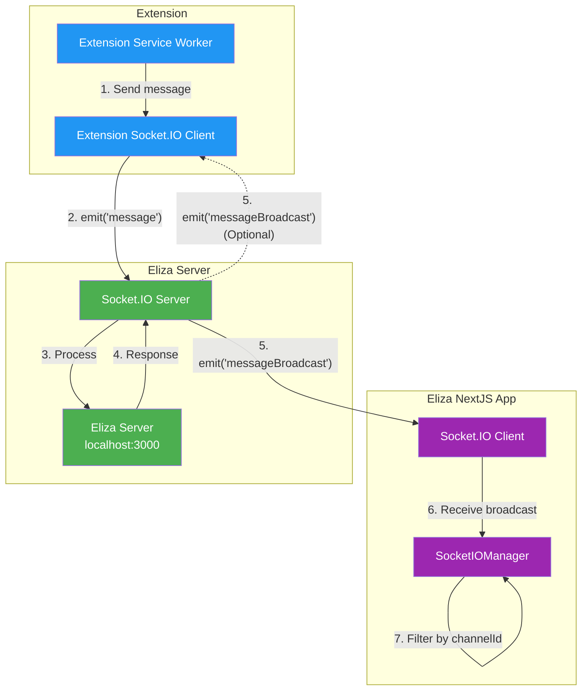

## Overview

The messaging infrastructure provides real-time communication between clients and the ElizaOS server using Socket.IO. This enables instant message delivery, presence tracking, and bidirectional communication.

## Architecture

### How WebSockets Work in ElizaOS

The project uses **Socket.IO** (not raw WebSockets) for real-time communication between clients and the Eliza server.



### Key Components

1. **Direct Connection**: Socket.IO connects directly to the Eliza server (default: `http://localhost:3000`)
2. **Channel-Based Communication**: Messages are organized by channels
3. **Message Filtering**: Clients filter incoming broadcasts by channel/room ID

## Socket.IO Events and Message Types

### Message Types Enum

```javascript
enum SOCKET_MESSAGE_TYPE {
  ROOM_JOINING = 1,      // Join a channel/room
  SEND_MESSAGE = 2,      // Send a message
  MESSAGE = 3,           // Generic message
  ACK = 4,              // Acknowledgment
  THINKING = 5,         // Agent is thinking
  CONTROL = 6           // Control messages
}
```

### Key Events

- `messageBroadcast` - Incoming messages from agents/users
- `messageComplete` - Message processing complete
- `controlMessage` - UI control (enable/disable input)
- `connection_established` - Connection confirmed

## Socket.IO Client Implementation

### Minimal Socket.IO Client

Here's a minimal Socket.IO client implementation:

```javascript
const SOCKET_URL = "http://localhost:3000";

// 1. Connect to Socket.IO
const socket = io(SOCKET_URL, {
  "force new connection": true,
  reconnection: true,
  reconnectionDelay: 1000,
  reconnectionAttempts: 5,
  timeout: 20000,
  transports: ["polling", "websocket"],
});

// Your IDs (make sure these match exactly)
const entityId = "your-entity-id";
const roomId = "your-room-id"; // This should match the agent/channel ID

// 2. CRITICAL: Join the room when connected
socket.on("connect", function () {
  console.log("[SUCCESS] Connected to Eliza, socket ID:", socket.id);

  // JOIN THE ROOM - This is required to receive broadcasts!
  socket.emit("message", {
    type: 1, // ROOM_JOINING
    payload: {
      roomId: roomId,
      entityId: entityId,
    },
  });

  console.log("[SENT] Room join request for room:", roomId);
});

// 3. LISTEN FOR THE CORRECT EVENT: "messageBroadcast" (not "message")
socket.on("messageBroadcast", function (data) {
  console.log("[RECEIVED] Broadcast:", data);

  // Check if this message is for your room
  if (data.roomId === roomId || data.channelId === roomId) {
    console.log("[SUCCESS] Message is for our room!");
    console.log("Sender:", data.senderName);
    console.log("Text:", data.text);
    console.log("Full data:", JSON.stringify(data, null, 2));
  } else {
    console.log(
      "[ERROR] Message is for different room:",
      data.roomId || data.channelId,
    );
  }
});

// 4. Listen for other important events
socket.on("messageComplete", function (data) {
  console.log("[SUCCESS] Message processing complete:", data);
});

socket.on("connection_established", function (data) {
  console.log("[SUCCESS] Connection established:", data);
});

// 5. Send a message (make sure format is exact)
function sendMessageToEliza(text) {
  const messagePayload = {
    type: 2, // SEND_MESSAGE
    payload: {
      senderId: entityId,
      senderName: "Extension User",
      message: text,
      roomId: roomId, // Include roomId
      messageId: generateUUID(),
      source: "extension",
      attachments: [],
      metadata: {},
    },
  };

  console.log("[SENDING] Message:", messagePayload);
  socket.emit("message", messagePayload);
}

// Helper function for UUID
function generateUUID() {
  return "xxxxxxxx-xxxx-4xxx-yxxx-xxxxxxxxxxxx".replace(/[xy]/g, function (c) {
    const r = (Math.random() * 16) | 0;
    const v = c === "x" ? r : (r & 0x3) | 0x8;
    return v.toString(16);
  });
}

// Connection error handling
socket.on("connect_error", function (error) {
  console.error("[ERROR] Connection error:", error);
});

socket.on("disconnect", function (reason) {
  console.log("[DISCONNECTED] Reason:", reason);
});
```

## Modern Implementation (Socket.IO v4.x)

For newer Socket.IO versions, here's a cleaner implementation:

```javascript
import { io } from "socket.io-client";

const SOCKET_URL = "http://localhost:3000";

class ElizaSocketClient {
  constructor(entityId, roomId) {
    this.entityId = entityId;
    this.roomId = roomId;
    this.socket = null;
  }

  connect() {
    this.socket = io(SOCKET_URL, {
      transports: ["polling", "websocket"],
      reconnection: true,
      reconnectionAttempts: 5,
      reconnectionDelay: 1000,
    });

    this.socket.on("connect", () => {
      console.log("Connected to Eliza");
      this.joinRoom();
    });

    this.socket.on("messageBroadcast", (data) => {
      if (data.roomId === this.roomId || data.channelId === this.roomId) {
        this.onMessageReceived(data);
      }
    });

    // Debug: Log all events
    this.socket.onAny((eventName, ...args) => {
      console.log("Event:", eventName, args);
    });
  }

  joinRoom() {
    this.socket.emit("message", {
      type: 1, // ROOM_JOINING
      payload: {
        roomId: this.roomId,
        entityId: this.entityId,
      },
    });
  }

  sendMessage(text) {
    this.socket.emit("message", {
      type: 2, // SEND_MESSAGE
      payload: {
        senderId: this.entityId,
        senderName: "Extension User",
        message: text,
        roomId: this.roomId,
        messageId: this.generateUUID(),
        source: "extension",
        attachments: [],
        metadata: {},
      },
    });
  }

  onMessageReceived(data) {
    console.log("Message received:", data);
    // Handle the message in your application
  }

  generateUUID() {
    return crypto.randomUUID
      ? crypto.randomUUID()
      : "xxxxxxxx-xxxx-4xxx-yxxx-xxxxxxxxxxxx".replace(/[xy]/g, (c) => {
          const r = (Math.random() * 16) | 0;
          const v = c === "x" ? r : (r & 0x3) | 0x8;
          return v.toString(16);
        });
  }

  disconnect() {
    if (this.socket) {
      this.socket.disconnect();
    }
  }
}

// Usage
const client = new ElizaSocketClient("my-extension-id", "agent-room-id");
client.connect();

// Send a message
client.sendMessage("Hello from extension!");
```

## Key Points to Check

### 1. Event Name

```javascript
// [WRONG]
socket.on("message", handler);

// [CORRECT]
socket.on("messageBroadcast", handler);
```

### 2. Room Joining Required

```javascript
// You MUST join the room before receiving broadcasts
socket.emit("message", {
  type: 1, // ROOM_JOINING
  payload: {
    roomId: roomId,
    entityId: entityId,
  },
});
```

### 3. Exact Message Format

```javascript
// The structure must be exact
{
  type: 2, // SEND_MESSAGE type
  payload: {
    senderId: entityId,
    senderName: 'Extension User',
    message: text,
    roomId: roomId,
    messageId: generateUUID(),
    source: 'extension',
    attachments: [],
    metadata: {}
  }
}
```

## Complete Message Flow

1. **Client connects** → Server accepts connection
2. **Client joins room** → Server adds client to room
3. **Client sends message** → Server receives and processes
4. **Server broadcasts response** → All clients in room receive
5. **Clients filter by room ID** → Only relevant messages shown

## Debugging Steps

### 1. Verify Events

```javascript
// For newer Socket.IO versions
socket.onAny((eventName, ...args) => {
  console.log("Event received:", eventName, args);
});

// For older versions
const onevent = socket.onevent;
socket.onevent = function (packet) {
  console.log("Event:", packet.data);
  onevent.call(socket, packet);
};
```

### 2. Check Room ID

- Ensure the room ID matches exactly between your extension and the server
- Even a single character difference will prevent message delivery

### 3. CORS Issues

For browser extensions, ensure your manifest includes:

```json
{
  "permissions": ["http://localhost:3000/*"],
  "host_permissions": ["http://localhost:3000/*"]
}
```

### 4. Transport Issues

If WebSocket fails, force polling:

```javascript
const socket = io(SOCKET_URL, {
  transports: ["polling"], // Avoid WebSocket issues
});
```

## Socket.IO Version Compatibility

### Version Issues

- **v1.3.0** (2015) - Very old, may have compatibility issues
- **v4.x** (Current) - Recommended for new implementations

### Upgrading

```json
// package.json
{
  "dependencies": {
    "socket.io-client": "^4.5.0"
  }
}
```

## Common Mistakes

1. **Wrong event name** - Using `message` instead of `messageBroadcast`
2. **Not joining room** - Forgetting the `ROOM_JOINING` step
3. **ID mismatch** - Room/channel IDs don't match exactly
4. **Missing fields** - Payload missing required fields
5. **CORS blocked** - Extension lacks permissions

## Testing Your Implementation

1. Open browser console
2. Check for connection logs
3. Verify room join confirmation
4. Send test message
5. Check for broadcast reception

## Common Issue: Extension Not Receiving Responses

### The Problem

Your extension can send messages to Eliza (server receives them), but doesn't receive responses back.

### Root Causes

1. **Not listening for the correct event** - Must listen for `messageBroadcast`, not `message`
2. **Not joining the room/channel** - Must emit a `ROOM_JOINING` message first
3. **Room/Channel ID mismatch** - IDs must match exactly
4. **Incorrect message payload structure**

### Solution Checklist

1. Verify you're listening to `messageBroadcast` event
2. Ensure you join the room on connection
3. Check room ID matches exactly
4. Verify message payload structure
5. Check browser console for errors
6. Test with debug logging enabled

## Advanced Features

### Presence Tracking

```javascript
// Track user presence
socket.on("userJoined", (data) => {
  console.log(`User ${data.userId} joined room ${data.roomId}`);
});

socket.on("userLeft", (data) => {
  console.log(`User ${data.userId} left room ${data.roomId}`);
});
```

### Typing Indicators

```javascript
// Send typing indicator
socket.emit("typing", {
  roomId: roomId,
  userId: userId,
  isTyping: true,
});

// Listen for typing indicators
socket.on("userTyping", (data) => {
  if (data.roomId === roomId) {
    console.log(
      `${data.userId} is ${data.isTyping ? "typing" : "stopped typing"}`,
    );
  }
});
```

### Message Acknowledgments

```javascript
// Send message with acknowledgment
socket.emit("message", messagePayload, (ack) => {
  console.log("Message acknowledged:", ack);
});
```

## Server-Side Implementation

The Socket.IO server handles message routing and broadcasting:

```typescript
class SocketIOService extends Service {
  static serviceType = "socketio" as const;
  capabilityDescription = "Real-time messaging via Socket.IO";

  private io: Server;

  async start(runtime: IAgentRuntime) {
    this.io = new Server(server, {
      cors: {
        origin: "*",
        methods: ["GET", "POST"],
      },
    });

    this.io.on("connection", (socket) => {
      console.log("Client connected:", socket.id);

      socket.on("message", async (data) => {
        if (data.type === SOCKET_MESSAGE_TYPE.ROOM_JOINING) {
          await this.handleRoomJoin(socket, data.payload);
        } else if (data.type === SOCKET_MESSAGE_TYPE.SEND_MESSAGE) {
          await this.handleMessage(socket, data.payload);
        }
      });

      socket.on("disconnect", () => {
        console.log("Client disconnected:", socket.id);
      });
    });
  }

  private async handleRoomJoin(socket: Socket, payload: RoomJoinPayload) {
    const { roomId, entityId } = payload;

    // Join the room
    socket.join(roomId);

    // Notify others in room
    socket.to(roomId).emit("userJoined", {
      userId: entityId,
      roomId: roomId,
    });

    console.log(`User ${entityId} joined room ${roomId}`);
  }

  private async handleMessage(socket: Socket, payload: MessagePayload) {
    const { roomId, message, senderId } = payload;

    // Process message through runtime
    const response = await this.runtime.processMessage({
      content: message,
      roomId: roomId,
      userId: senderId,
    });

    // Broadcast to all in room
    this.io.to(roomId).emit("messageBroadcast", {
      roomId: roomId,
      channelId: roomId,
      senderName: response.agentName,
      text: response.text,
      metadata: response.metadata,
    });
  }

  async stop() {
    this.io.close();
  }
}
```

## Reference Implementation

<Card
  title="Eliza NextJS Starter"
  icon="github"
  href="https://github.com/elizaOS/eliza-nextjs-starter"
>
  A complete working example demonstrating Socket.IO integration with Eliza,
  including real-time messaging, agent participation management, and
  comprehensive error handling.
</Card>

## REST API Response Modes

When sending messages via REST endpoints (e.g., `POST /api/messaging/channels/{channelId}/messages`), you can control how responses are delivered using the `mode` parameter.

### Available Modes

| Mode        | Behavior                                    | Use Case                              |
| ----------- | ------------------------------------------- | ------------------------------------- |
| `websocket` | Returns immediately, response via WebSocket | Real-time chat UIs (default)          |
| `stream`    | Server-Sent Events with progressive chunks  | Typing effect, progress feedback      |
| `sync`      | Waits for complete response                 | Scripts, testing, simple integrations |

### WebSocket Mode (Default)

Returns immediately after message is queued. Agent response is delivered via WebSocket connection.

```bash
curl -X POST /api/messaging/channels/{channelId}/messages \
  -H "Content-Type: application/json" \
  -d '{"text": "Hello", "entityId": "...", "mode": "websocket"}'
```

Response:

```json
{
  "success": true,
  "userMessage": { "id": "...", "text": "Hello" }
}
```

Agent response arrives via the `messageBroadcast` WebSocket event (see above).

### Stream Mode (SSE)

Uses Server-Sent Events to stream response chunks progressively.

```bash
curl -X POST /api/messaging/channels/{channelId}/messages \
  -H "Content-Type: application/json" \
  -H "Accept: text/event-stream" \
  -d '{"text": "Hello", "entityId": "...", "mode": "stream"}'
```

SSE Events:

```
event: user_message
data: {"id": "...", "text": "Hello"}

event: chunk
data: {"messageId": "...", "chunk": "Hi", "index": 0}

event: chunk
data: {"messageId": "...", "chunk": " there!", "index": 1}

event: done
data: {"text": "Hi there!", "actions": []}
```

JavaScript client:

```javascript
const response = await fetch("/api/messaging/channels/{channelId}/messages", {
  method: "POST",
  headers: { "Content-Type": "application/json" },
  body: JSON.stringify({ text: "Hello", entityId: "...", mode: "stream" }),
});

const reader = response.body.getReader();
const decoder = new TextDecoder();

while (true) {
  const { done, value } = await reader.read();
  if (done) break;

  const chunk = decoder.decode(value);
  // Parse SSE format: "event: xxx\ndata: {...}\n\n"
  const lines = chunk.split("\n");
  for (const line of lines) {
    if (line.startsWith("data: ")) {
      const data = JSON.parse(line.slice(6));
      console.log("Chunk:", data);
    }
  }
}
```

### Sync Mode

Waits for complete agent response before returning. Useful for scripts and testing.

```bash
curl -X POST /api/messaging/channels/{channelId}/messages \
  -H "Content-Type: application/json" \
  -d '{"text": "Hello", "entityId": "...", "mode": "sync"}'
```

Response:

```json
{
  "success": true,
  "userMessage": { "id": "...", "text": "Hello" },
  "agentResponse": {
    "text": "Hi there! How can I help you today?",
    "actions": []
  }
}
```

### Stream Extractors (Advanced)

For plugin developers, ElizaOS provides stream extractors to control what content is streamed from LLM responses.

```typescript
import { IStreamExtractor } from "@elizaos/core";

interface IStreamExtractor {
  /** Whether extraction is complete */
  readonly done: boolean;

  /**
   * Process a chunk from the LLM stream
   * @returns Text to stream to client (empty = nothing yet)
   */
  push(chunk: string): string;
}
```

Available extractors:

| Extractor                 | Purpose                                   |
| ------------------------- | ----------------------------------------- |
| `PassthroughExtractor`    | Streams all content as-is                 |
| `XmlTagExtractor`         | Extracts content from specific XML tags   |
| `ResponseStreamExtractor` | Default - action-aware XML extraction     |
| `ActionStreamFilter`      | Auto-detects content type (JSON/XML/text) |

## See Also

<CardGroup cols={2}>
  <Card title="Sessions API" icon="comments" href="/runtime/sessions-api">
    Build persistent conversations on messaging
  </Card>

<Card title="Services" icon="server" href="/runtime/services">
  Create messaging service integrations
</Card>

<Card title="Events" icon="bolt" href="/runtime/events">
  Handle real-time messaging events
</Card>

  <Card title="Providers" icon="database" href="/runtime/providers">
    Supply message context to providers
  </Card>
</CardGroup>
