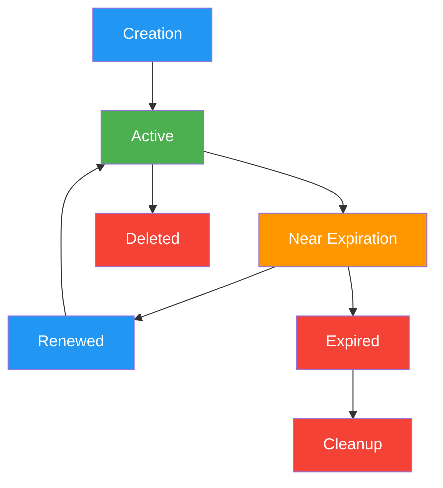

## Overview

The Sessions API provides a sophisticated abstraction layer over the traditional messaging infrastructure, enabling persistent, stateful conversations with automatic timeout management and renewal capabilities.

### Why Use Sessions?

The Sessions API **eliminates the complexity of channel management**. Traditional messaging approaches require you to:

1. Create or find a server
2. Create or find a channel within that server
3. Add agents to the channel
4. Manage channel participants
5. Handle channel lifecycle (creation, deletion, cleanup)

With Sessions API, you simply:

1. Create a session with an agent
2. Send messages
3. (Optional) Configure timeout and renewal policies

### Key Features

- **Zero Channel Management**: No need to create servers, channels, or manage participants
- **Instant Setup**: Start conversations immediately with just agent and user IDs
- **Automatic Timeout Management**: Sessions automatically expire after periods of inactivity
- **Session Renewal**: Support for both automatic and manual session renewal
- **Expiration Warnings**: Get notified when sessions are about to expire
- **Configurable Policies**: Customize timeout, renewal, and duration limits per session or agent
- **Resource Optimization**: Automatic cleanup of expired sessions to prevent memory leaks
- **Persistent Conversations**: Maintain chat history and context across multiple messages
- **State Management**: Track conversation stage, renewal count, and expiration status
- **Multi-Platform Support**: Works across different platforms with metadata support

## Sessions Architecture

### Core Design Principles

#### Abstraction Over Complexity

The Sessions API abstracts away channel and server management complexity:

```typescript
// Traditional approach (complex)
const server = await createServer({ name: "My Server" });
const channel = await createChannel({ serverId: server.id });
await addAgentToServer(server.id, agentId);
await addAgentToChannel(channel.id, agentId);
await sendMessage(channel.id, { content: "Hello" });

// Sessions approach (simple)
const { sessionId } = await createSession({ agentId, userId });
await sendSessionMessage(sessionId, { content: "Hello" });
```

#### State Management

Sessions maintain state across multiple dimensions:

```typescript
interface Session {
  // Identity
  id: string;
  agentId: UUID;
  userId: UUID;
  channelId: UUID;

  // Temporal State
  createdAt: Date;
  lastActivity: Date;
  expiresAt: Date;

  // Configuration
  timeoutConfig: SessionTimeoutConfig;

  // Lifecycle State
  renewalCount: number;
  warningState?: {
    sent: boolean;
    sentAt: Date;
  };

  // Application State
  metadata: Record<string, unknown>;
}
```

## Session Lifecycle



### Lifecycle Phases

1. **Creation**: Initialize session with configuration
2. **Active**: Process messages and maintain state
3. **Near Expiration**: Warning state before timeout
4. **Renewed**: Lifetime extended (auto or manual)
5. **Expired**: Session exceeded timeout
6. **Deleted**: Explicit termination
7. **Cleanup**: Resource cleanup

## Timeout Configuration

### Configuration Interface

```typescript
interface SessionTimeoutConfig {
  timeoutMinutes?: number; // Inactivity timeout (5-1440)
  autoRenew?: boolean; // Auto-renew on activity
  maxDurationMinutes?: number; // Maximum total duration
  warningThresholdMinutes?: number; // Warning threshold
}
```

### Configuration Hierarchy

Configuration follows a three-tier precedence:

```typescript
// Priority Order (highest to lowest)
// 1. Session-specific config
// 2. Agent-specific config
// 3. Global defaults

const finalConfig = {
  ...globalDefaults,
  ...agentConfig,
  ...sessionConfig,
};
```

### Environment Variables

Global default configuration:

- `SESSION_DEFAULT_TIMEOUT_MINUTES` (default: 30)
- `SESSION_MIN_TIMEOUT_MINUTES` (default: 5)
- `SESSION_MAX_TIMEOUT_MINUTES` (default: 1440)
- `SESSION_MAX_DURATION_MINUTES` (default: 720)
- `SESSION_WARNING_THRESHOLD_MINUTES` (default: 5)

## Quick Start

### Complete Example: Chat Application

```javascript
// Initialize a chat with timeout management
async function startChat(agentId, userId) {
  const response = await fetch("/api/messaging/sessions", {
    method: "POST",
    headers: { "Content-Type": "application/json" },
    body: JSON.stringify({
      agentId,
      userId,
      timeoutConfig: {
        timeoutMinutes: 30, // 30 minutes of inactivity
        autoRenew: true, // Auto-renew on each message
        maxDurationMinutes: 180, // 3 hour maximum session
        warningThresholdMinutes: 5, // Warn 5 minutes before expiry
      },
    }),
  });

  const { sessionId, expiresAt, timeoutConfig } = await response.json();

  console.log(`Session expires at: ${expiresAt}`);
  console.log(
    `Auto-renewal: ${timeoutConfig.autoRenew ? "enabled" : "disabled"}`,
  );

  return sessionId;
}

// Send messages with session status tracking
async function sendMessage(sessionId, message) {
  const response = await fetch(
    `/api/messaging/sessions/${sessionId}/messages`,
    {
      method: "POST",
      headers: { "Content-Type": "application/json" },
      body: JSON.stringify({ content: message }),
    },
  );

  const data = await response.json();

  // Check session status
  if (data.sessionStatus) {
    console.log(`Session renewed: ${data.sessionStatus.wasRenewed}`);
    console.log(`Expires at: ${data.sessionStatus.expiresAt}`);

    if (data.sessionStatus.isNearExpiration) {
      console.warn("Session is about to expire!");
    }
  }

  return data;
}

// Keep session alive with heartbeat
async function keepAlive(sessionId) {
  const response = await fetch(
    `/api/messaging/sessions/${sessionId}/heartbeat`,
    { method: "POST" },
  );

  const { expiresAt, timeRemaining } = await response.json();
  console.log(
    `Session renewed, ${Math.floor(timeRemaining / 60000)} minutes remaining`,
  );

  return response.json();
}
```

## Session Creation

### Creation Process

```typescript
async function createSession(request: CreateSessionRequest) {
  // Phase 1: Validation
  validateUUIDs(request.agentId, request.userId);
  validateMetadata(request.metadata);

  // Phase 2: Agent verification
  const agent = agents.get(request.agentId);
  if (!agent) throw new AgentNotFoundError();

  // Phase 3: Configuration resolution
  const agentConfig = getAgentTimeoutConfig(agent);
  const finalConfig = mergeTimeoutConfigs(request.timeoutConfig, agentConfig);

  // Phase 4: Infrastructure setup
  const sessionId = uuidv4();
  const channelId = uuidv4();

  // Atomic channel creation
  await serverInstance.createChannel({
    id: channelId,
    name: `session-${sessionId}`,
    type: ChannelType.DM,
    metadata: {
      sessionId,
      agentId: request.agentId,
      userId: request.userId,
      timeoutConfig: finalConfig,
      ...request.metadata,
    },
  });

  // Phase 5: Session registration
  const session = new Session(sessionId, channelId, finalConfig);
  sessions.set(sessionId, session);

  return session;
}
```

## Session Operations

### Send Messages

```javascript
const messageResponse = await fetch(
  `http://localhost:3000/api/messaging/sessions/${sessionId}/messages`,
  {
    method: "POST",
    headers: {
      "Content-Type": "application/json",
    },
    body: JSON.stringify({
      content: "Hello, I need help with my account",
      metadata: {
        userTimezone: "America/New_York",
      },
    }),
  },
);

const response = await messageResponse.json();
console.log(response.content); // Agent's response
console.log(response.metadata.thought); // Agent's internal reasoning
```

### Retrieve Message History

```javascript
// Initial fetch
const messagesResponse = await fetch(
  `http://localhost:3000/api/messaging/sessions/${sessionId}/messages?limit=20`,
  {
    method: "GET",
  },
);

const { messages, hasMore, cursors } = await messagesResponse.json();

// Pagination - get older messages
if (hasMore && cursors?.before) {
  const olderMessages = await fetch(
    `/api/messaging/sessions/${sessionId}/messages?before=${cursors.before}&limit=20`,
  );
}

// Get newer messages
if (cursors?.after) {
  const newerMessages = await fetch(
    `/api/messaging/sessions/${sessionId}/messages?after=${cursors.after}&limit=20`,
  );
}
```

### Manual Session Renewal

```javascript
// Useful when auto-renew is disabled or to extend before expiration
const renewResponse = await fetch(
  `http://localhost:3000/api/messaging/sessions/${sessionId}/renew`,
  {
    method: "POST",
  },
);

const { expiresAt, timeRemaining, renewalCount } = await renewResponse.json();

console.log(`Session renewed ${renewalCount} times`);
console.log(`New expiration: ${expiresAt}`);
console.log(`Time remaining: ${Math.floor(timeRemaining / 60000)} minutes`);
```

### Update Timeout Configuration

```javascript
// Dynamically update timeout settings for an active session
const updateResponse = await fetch(
  `http://localhost:3000/api/messaging/sessions/${sessionId}/timeout`,
  {
    method: "PATCH",
    headers: { "Content-Type": "application/json" },
    body: JSON.stringify({
      timeoutMinutes: 120, // Extend to 2 hours
      autoRenew: false, // Disable auto-renewal
      maxDurationMinutes: 480, // Increase max to 8 hours
    }),
  },
);

const updatedSession = await updateResponse.json();
```

## Active Session Management

### Message Handling

```typescript
async function handleMessage(sessionId: string, message: SendMessageRequest) {
  const session = sessions.get(sessionId);

  // Expiration check
  if (session.isExpired()) {
    sessions.delete(sessionId);
    throw new SessionExpiredError();
  }

  // Activity tracking
  session.updateLastActivity();

  // Renewal logic
  if (session.timeoutConfig.autoRenew) {
    const renewed = session.attemptRenewal();
    if (renewed) {
      logger.info(`Session ${sessionId} auto-renewed`);
    }
  }

  // Warning detection
  if (session.isNearExpiration()) {
    session.markWarningState();
  }

  // Message creation
  const dbMessage = await serverInstance.createMessage({
    channelId: session.channelId,
    authorId: session.userId,
    content: message.content,
    metadata: {
      sessionId,
      ...message.metadata,
    },
  });

  // Response enrichment
  return {
    ...dbMessage,
    sessionStatus: session.getStatus(),
  };
}
```

## Renewal Mechanism

### Renewal Engine

```typescript
class SessionRenewalEngine {
  attemptRenewal(session: Session): boolean {
    // Check if renewal is allowed
    if (!session.timeoutConfig.autoRenew) {
      return false;
    }

    // Check maximum duration constraint
    const totalDuration = Date.now() - session.createdAt.getTime();
    const maxDurationMs = session.timeoutConfig.maxDurationMinutes * 60 * 1000;

    if (totalDuration >= maxDurationMs) {
      logger.warn(`Session ${session.id} reached max duration`);
      return false;
    }

    // Calculate new expiration
    const timeoutMs = session.timeoutConfig.timeoutMinutes * 60 * 1000;
    const remainingMaxDuration = maxDurationMs - totalDuration;
    const effectiveTimeout = Math.min(timeoutMs, remainingMaxDuration);

    // Update session
    session.lastActivity = new Date();
    session.expiresAt = new Date(Date.now() + effectiveTimeout);
    session.renewalCount++;
    session.warningState = undefined; // Reset warning

    return true;
  }
}
```

### Heartbeat Strategy

```javascript
class SessionManager {
  constructor(sessionId) {
    this.sessionId = sessionId;
    this.heartbeatInterval = null;
    this.warningShown = false;
  }

  startHeartbeat(intervalMs = 5 * 60 * 1000) {
    this.heartbeatInterval = setInterval(async () => {
      try {
        const response = await this.sendHeartbeat();

        if (response.isNearExpiration && !this.warningShown) {
          this.onExpirationWarning(response.timeRemaining);
          this.warningShown = true;
        }

        if (
          response.timeRemaining >
          response.timeoutConfig.warningThresholdMinutes * 60000
        ) {
          this.warningShown = false; // Reset warning flag
        }
      } catch (error) {
        this.stopHeartbeat();
        this.onSessionLost(error);
      }
    }, intervalMs);
  }

  stopHeartbeat() {
    if (this.heartbeatInterval) {
      clearInterval(this.heartbeatInterval);
      this.heartbeatInterval = null;
    }
  }

  async sendHeartbeat() {
    const response = await fetch(
      `/api/messaging/sessions/${this.sessionId}/heartbeat`,
      { method: "POST" },
    );

    if (!response.ok) {
      throw new Error(`Heartbeat failed: ${response.status}`);
    }

    return response.json();
  }
}
```

## Session Store

### In-Memory Storage

```typescript
class SessionStore {
  private sessions = new Map<string, Session>();
  private metrics = {
    totalCreated: 0,
    totalExpired: 0,
    totalDeleted: 0,
    peakConcurrent: 0,
  };

  set(sessionId: string, session: Session) {
    this.sessions.set(sessionId, session);
    this.metrics.totalCreated++;
    this.updatePeakConcurrent();
  }

  get(sessionId: string): Session | undefined {
    const session = this.sessions.get(sessionId);

    // Lazy expiration check
    if (session && session.isExpired()) {
      this.delete(sessionId);
      this.metrics.totalExpired++;
      return undefined;
    }

    return session;
  }

  delete(sessionId: string): boolean {
    const deleted = this.sessions.delete(sessionId);
    if (deleted) {
      this.metrics.totalDeleted++;
    }
    return deleted;
  }

  private updatePeakConcurrent() {
    const current = this.sessions.size;
    if (current > this.metrics.peakConcurrent) {
      this.metrics.peakConcurrent = current;
    }
  }
}
```

## Cleanup Service

### Automatic Cleanup

```typescript
class SessionCleanupService {
  private cleanupInterval: NodeJS.Timeout;

  start(intervalMs: number = 5 * 60 * 1000) {
    this.cleanupInterval = setInterval(() => {
      this.performCleanup();
    }, intervalMs);
  }

  performCleanup() {
    const now = Date.now();
    const stats = {
      cleaned: 0,
      expired: 0,
      warned: 0,
      invalid: 0,
    };

    for (const [sessionId, session] of sessions.entries()) {
      // Validate session structure
      if (!this.isValidSession(session)) {
        sessions.delete(sessionId);
        stats.invalid++;
        continue;
      }

      // Remove expired sessions
      if (session.expiresAt.getTime() <= now) {
        sessions.delete(sessionId);
        stats.expired++;
        stats.cleaned++;

        // Optional: Clean up associated resources
        this.cleanupChannelResources(session.channelId);
      }
      // Issue expiration warnings
      else if (this.shouldWarn(session)) {
        session.markWarningState();
        stats.warned++;

        // Optional: Emit warning event
        this.emitExpirationWarning(session);
      }
    }

    if (stats.cleaned > 0 || stats.warned > 0) {
      logger.info("Cleanup cycle completed:", stats);
    }
  }

  stop() {
    if (this.cleanupInterval) {
      clearInterval(this.cleanupInterval);
    }
  }
}
```

## Integration Examples

### React Hook with Session Management

```javascript
import { useState, useCallback, useEffect, useRef } from "react";

function useElizaSession(agentId, userId) {
  const [sessionId, setSessionId] = useState(null);
  const [messages, setMessages] = useState([]);
  const [loading, setLoading] = useState(false);
  const [sessionStatus, setSessionStatus] = useState(null);
  const [expirationWarning, setExpirationWarning] = useState(false);
  const heartbeatInterval = useRef(null);

  const startSession = useCallback(async () => {
    const response = await fetch("/api/messaging/sessions", {
      method: "POST",
      headers: { "Content-Type": "application/json" },
      body: JSON.stringify({
        agentId,
        userId,
        timeoutConfig: {
          timeoutMinutes: 30,
          autoRenew: true,
          maxDurationMinutes: 120,
          warningThresholdMinutes: 5,
        },
      }),
    });

    const data = await response.json();
    setSessionId(data.sessionId);
    setSessionStatus({
      expiresAt: data.expiresAt,
      timeoutConfig: data.timeoutConfig,
    });

    // Start heartbeat
    startHeartbeat(data.sessionId);

    return data.sessionId;
  }, [agentId, userId]);

  const startHeartbeat = useCallback((sid) => {
    if (heartbeatInterval.current) {
      clearInterval(heartbeatInterval.current);
    }

    heartbeatInterval.current = setInterval(async () => {
      try {
        const response = await fetch(
          `/api/messaging/sessions/${sid}/heartbeat`,
          { method: "POST" },
        );

        const status = await response.json();
        setSessionStatus(status);
        setExpirationWarning(status.isNearExpiration);
      } catch (error) {
        console.error("Heartbeat failed:", error);
      }
    }, 60000); // Every minute
  }, []);

  const sendMessage = useCallback(
    async (content) => {
      if (!sessionId) {
        const newSessionId = await startSession();
        setSessionId(newSessionId);
      }

      setLoading(true);
      try {
        const response = await fetch(
          `/api/messaging/sessions/${sessionId}/messages`,
          {
            method: "POST",
            headers: { "Content-Type": "application/json" },
            body: JSON.stringify({ content }),
          },
        );

        if (!response.ok) {
          if (response.status === 404 || response.status === 410) {
            // Session expired, create new one
            const newSessionId = await startSession();
            setSessionId(newSessionId);
            // Retry with new session
            return sendMessage(content);
          }
          throw new Error(`Failed to send message: ${response.status}`);
        }

        const message = await response.json();
        setMessages((prev) => [...prev, message]);

        // Update session status if provided
        if (message.sessionStatus) {
          setSessionStatus(message.sessionStatus);
          setExpirationWarning(message.sessionStatus.isNearExpiration);
        }

        return message;
      } finally {
        setLoading(false);
      }
    },
    [sessionId, startSession],
  );

  const renewSession = useCallback(async () => {
    if (!sessionId) return;

    const response = await fetch(`/api/messaging/sessions/${sessionId}/renew`, {
      method: "POST",
    });

    const status = await response.json();
    setSessionStatus(status);
    setExpirationWarning(false);

    return status;
  }, [sessionId]);

  useEffect(() => {
    // Cleanup heartbeat on unmount
    return () => {
      if (heartbeatInterval.current) {
        clearInterval(heartbeatInterval.current);
      }
    };
  }, []);

  return {
    sessionId,
    messages,
    sendMessage,
    loading,
    sessionStatus,
    expirationWarning,
    renewSession,
  };
}
```

### WebSocket Integration

```javascript
import { io } from "socket.io-client";

class SessionWebSocketClient {
  constructor(serverUrl) {
    this.socket = io(serverUrl);
    this.sessionId = null;
    this.setupEventHandlers();
  }

  setupEventHandlers() {
    // Session expiration warning via WebSocket
    this.socket.on("sessionExpirationWarning", (data) => {
      if (data.sessionId === this.sessionId) {
        console.warn(`Session expires in ${data.minutesRemaining} minutes`);
        this.onExpirationWarning?.(data);
      }
    });

    // Session expired notification
    this.socket.on("sessionExpired", (data) => {
      if (data.sessionId === this.sessionId) {
        console.error("Session has expired");
        this.onSessionExpired?.(data);
        this.sessionId = null;
      }
    });

    // Session renewed notification
    this.socket.on("sessionRenewed", (data) => {
      if (data.sessionId === this.sessionId) {
        console.log("Session renewed until:", data.expiresAt);
        this.onSessionRenewed?.(data);
      }
    });
  }

  joinSession(sessionId) {
    this.sessionId = sessionId;
    this.socket.emit("join", {
      roomId: sessionId,
      type: "session",
    });
  }

  leaveSession() {
    if (this.sessionId) {
      this.socket.emit("leave", {
        roomId: this.sessionId,
      });
      this.sessionId = null;
    }
  }
}
```

### Handling Session Expiration

```javascript
class ResilientSessionClient {
  constructor(agentId, userId) {
    this.agentId = agentId;
    this.userId = userId;
    this.sessionId = null;
    this.sessionConfig = {
      timeoutMinutes: 30,
      autoRenew: true,
      maxDurationMinutes: 180,
    };
  }

  async ensureSession() {
    if (!this.sessionId) {
      await this.createSession();
      return;
    }

    // Check if session is still valid
    try {
      const response = await fetch(`/api/messaging/sessions/${this.sessionId}`);

      if (!response.ok) {
        if (response.status === 404 || response.status === 410) {
          // Session not found or expired
          await this.createSession();
        }
      }
    } catch (error) {
      console.error("Session check failed:", error);
      await this.createSession();
    }
  }

  async createSession() {
    const response = await fetch("/api/messaging/sessions", {
      method: "POST",
      headers: { "Content-Type": "application/json" },
      body: JSON.stringify({
        agentId: this.agentId,
        userId: this.userId,
        timeoutConfig: this.sessionConfig,
      }),
    });

    const data = await response.json();
    this.sessionId = data.sessionId;

    // Start heartbeat for new session
    this.startHeartbeat();

    return this.sessionId;
  }

  async sendMessage(content) {
    await this.ensureSession();

    const response = await fetch(
      `/api/messaging/sessions/${this.sessionId}/messages`,
      {
        method: "POST",
        headers: { "Content-Type": "application/json" },
        body: JSON.stringify({ content }),
      },
    );

    if (!response.ok && (response.status === 404 || response.status === 410)) {
      // Session was lost, recreate and retry
      await this.createSession();
      return this.sendMessage(content);
    }

    return response.json();
  }
}
```

## Error Handling

### Custom Error Classes

```typescript
abstract class SessionError extends Error {
  constructor(
    message: string,
    public code: string,
    public statusCode: number,
    public details?: Record<string, unknown>,
  ) {
    super(message);
    this.name = this.constructor.name;
  }
}

class SessionNotFoundError extends SessionError {
  constructor(sessionId: string) {
    super(`Session not found: ${sessionId}`, "SESSION_NOT_FOUND", 404, {
      sessionId,
    });
  }
}

class SessionExpiredError extends SessionError {
  constructor(sessionId: string, expiresAt: Date) {
    super(
      `Session has expired`,
      "SESSION_EXPIRED",
      410, // Gone
      { sessionId, expiresAt },
    );
  }
}

class SessionRenewalError extends SessionError {
  constructor(sessionId: string, reason: string, details?: Record<string, unknown>) {
    super(
      `Cannot renew session: ${reason}`,
      "SESSION_RENEWAL_FAILED",
      422, // Unprocessable Entity
      { sessionId, reason, ...details },
    );
  }
}
```

### Error Handling Examples

```javascript
try {
  const response = await fetch(
    `/api/messaging/sessions/${sessionId}/messages`,
    {
      method: "POST",
      headers: { "Content-Type": "application/json" },
      body: JSON.stringify({ content: message }),
    },
  );

  if (!response.ok) {
    const error = await response.json();

    switch (response.status) {
      case 404:
        // Session not found
        console.error("Session not found:", error.details);
        // Create new session
        break;

      case 410:
        // Session expired
        console.error("Session expired at:", error.details.expiresAt);
        // Create new session or notify user
        break;

      case 400:
        // Validation error
        if (error.error.includes("content")) {
          console.error("Invalid message content");
        } else if (error.error.includes("metadata")) {
          console.error("Metadata too large");
        }
        break;

      case 422:
        // Session cannot be renewed
        console.error("Max duration reached:", error.details);
        // Must create new session
        break;

      default:
        console.error("Error:", error.message);
    }
  }
} catch (error) {
  console.error("Network error:", error);
}
```

## Performance Optimization

### Pagination Strategy

```typescript
async function getMessagesOptimized(
  sessionId: string,
  query: GetMessagesQuery,
) {
  const session = sessions.get(sessionId);

  // Smart fetching strategy
  if (query.after && !query.before) {
    // Forward pagination - fetch extra for filtering
    const messages = await fetchMessages(session.channelId, query.limit * 2);

    return messages
      .filter((m) => m.createdAt > query.after)
      .slice(0, query.limit);
  }

  if (query.before && !query.after) {
    // Backward pagination - direct fetch
    return await fetchMessages(session.channelId, query.limit, query.before);
  }

  // Default - latest messages
  return await fetchMessages(session.channelId, query.limit);
}
```

### Configuration Caching

```typescript
class AgentConfigCache {
  private cache = new Map<UUID, SessionTimeoutConfig>();
  private maxAge = 5 * 60 * 1000; // 5 minutes
  private timestamps = new Map<UUID, number>();

  get(agentId: UUID): SessionTimeoutConfig | undefined {
    const timestamp = this.timestamps.get(agentId);

    if (timestamp && Date.now() - timestamp > this.maxAge) {
      // Cache expired
      this.cache.delete(agentId);
      this.timestamps.delete(agentId);
      return undefined;
    }

    return this.cache.get(agentId);
  }

  set(agentId: UUID, config: SessionTimeoutConfig) {
    this.cache.set(agentId, config);
    this.timestamps.set(agentId, Date.now());
  }
}
```

## Memory Management

### Memory Leak Prevention

```typescript
class BoundedCache<T> extends Map<string, T> {
  private maxSize: number;

  constructor(maxSize: number = 1000) {
    super();
    this.maxSize = maxSize;
  }

  set(key: string, value: T) {
    // Remove oldest entries if at capacity
    if (this.size >= this.maxSize) {
      const firstKey = this.keys().next().value;
      this.delete(firstKey);
    }
    return super.set(key, value);
  }
}

// Process lifecycle hooks
process.once("SIGTERM", clearAllIntervals);
process.once("SIGINT", clearAllIntervals);
process.once("beforeExit", clearAllIntervals);
```

### Cache with TTL

```typescript
class CacheWithTTL<T> extends Map<string, T> {
  private ttl: number;
  private timestamps = new Map<string, number>();

  constructor(ttl: number = 5 * 60 * 1000) {
    super();
    this.ttl = ttl;
  }

  set(key: string, value: T) {
    this.timestamps.set(key, Date.now());
    return super.set(key, value);
  }

  get(key: string) {
    const timestamp = this.timestamps.get(key);
    if (timestamp && Date.now() - timestamp > this.ttl) {
      this.delete(key);
      return undefined;
    }
    return super.get(key);
  }
}
```

## Troubleshooting

### Common Issues

1. **Session Not Found (404)**
   - Session may have expired or been deleted
   - Create a new session and retry
   - Check session ID format

2. **Session Expired (410)**
   - Session exceeded its timeout period
   - Check the `expiresAt` timestamp in error details
   - Create a new session or adjust timeout configuration

3. **Cannot Renew Session (422)**
   - Session has reached maximum duration limit
   - Check `maxDurationMinutes` configuration
   - Must create a new session

4. **Invalid Timeout Configuration (400)**
   - Timeout values outside allowed range (5-1440 minutes)
   - Check configuration values against limits
   - Adjust to valid ranges

5. **Agent Not Available**
   - Ensure the agent is started and running
   - Check agent logs for errors
   - Verify agent ID is correct

### Debugging

Enable debug logging:

```javascript
const response = await fetch("/api/messaging/sessions", {
  method: "POST",
  headers: {
    "Content-Type": "application/json",
    "X-Debug": "true", // Enable debug info in response
  },
  body: JSON.stringify({
    agentId,
    userId,
    // Debug mode may include additional session state info
  }),
});
```

Check session cleanup logs:

```bash
# Server logs will show cleanup activity
[Sessions API] Cleanup cycle completed: 3 expired sessions removed, 2 warnings issued
[Sessions API] Session renewed via heartbeat: session-123
[Sessions API] Session abc-123 has reached maximum duration
```

## When to Use Sessions vs Traditional Messaging

### Use Sessions When:

- **Building chat interfaces**: Web apps, mobile apps, or any UI with a chat component
- **Direct user-to-agent conversations**: One-on-one interactions between a user and an agent
- **Simplified integration**: You want to get up and running quickly without infrastructure complexity
- **Stateful conversations**: You need the agent to maintain context throughout the conversation
- **Session management required**: You need timeout, renewal, and expiration handling
- **Resource optimization**: You want automatic cleanup of inactive conversations
- **Personal assistants**: Building AI assistants that remember user preferences and conversation history

### Use Traditional Messaging When:

- **Multi-agent coordination**: Multiple agents need to communicate in the same channel
- **Group conversations**: Multiple users and agents interacting together
- **Platform integrations**: Integrating with Discord, Slack, or other platforms that have their own channel concepts
- **Broadcast scenarios**: One agent sending messages to multiple channels/users
- **Complex routing**: Custom message routing logic between different channels and servers
- **Permanent history**: You need conversations to persist indefinitely without timeout

## Scalability Considerations

### Horizontal Scaling

For production deployments:

1. **Session Store Distribution**
   - Use Redis for distributed session storage
   - Implement session affinity for WebSocket connections
   - Use consistent hashing for session distribution

2. **Message Queue Integration**
   - Decouple message processing from API responses
   - Use message queues for agent processing
   - Implement async response patterns

3. **Database Optimization**
   - Index session-related columns
   - Implement connection pooling
   - Consider read replicas for message retrieval

### Monitoring Metrics

```typescript
interface SessionMetrics {
  // Volume metrics
  sessionsCreated: Counter;
  sessionsExpired: Counter;
  sessionsRenewed: Counter;

  // Performance metrics
  messageLatency: Histogram;
  renewalLatency: Histogram;

  // Health metrics
  activeSessions: Gauge;
  sessionsByAgent: Gauge;
  expirationWarnings: Counter;

  // Error metrics
  validationErrors: Counter;
  expirationErrors: Counter;
  renewalFailures: Counter;
}
```

## Security Considerations

### Input Validation

```typescript
// UUID validation
function validateUuid(value: string): boolean {
  const uuidRegex =
    /^[0-9a-f]{8}-[0-9a-f]{4}-4[0-9a-f]{3}-[89ab][0-9a-f]{3}-[0-9a-f]{12}$/i;
  return uuidRegex.test(value);
}

// Content validation
function validateContent(content: unknown): void {
  if (typeof content !== "string") {
    throw new InvalidContentError("Content must be a string");
  }

  if (content.length === 0) {
    throw new InvalidContentError("Content cannot be empty");
  }

  if (content.length > MAX_CONTENT_LENGTH) {
    throw new InvalidContentError(
      `Content exceeds maximum length of ${MAX_CONTENT_LENGTH}`,
    );
  }
}

// Metadata validation
function validateMetadata(metadata: unknown): void {
  if (!metadata) return;

  const size = JSON.stringify(metadata).length;
  if (size > MAX_METADATA_SIZE) {
    throw new InvalidMetadataError(
      `Metadata exceeds maximum size of ${MAX_METADATA_SIZE} bytes`,
    );
  }
}
```

### Rate Limiting

```typescript
interface RateLimitConfig {
  windowMs: number;
  maxRequests: number;
  keyGenerator: (req: Request) => string;
}

const sessionRateLimits = {
  create: {
    windowMs: 60 * 1000,
    maxRequests: 10,
    keyGenerator: (req) => req.ip,
  },
  message: {
    windowMs: 60 * 1000,
    maxRequests: 100,
    keyGenerator: (req) => `${req.params.sessionId}:${req.ip}`,
  },
};
```

## Best Practices

### Session Design

- **Appropriate Timeouts**: Choose timeouts based on use case
- **Auto-Renewal**: Enable for active conversations
- **Max Duration**: Set limits to prevent infinite sessions
- **Warning Handling**: Notify users before expiration
- **Cleanup Strategy**: Regular cleanup of expired sessions

### Implementation

- **Error Recovery**: Graceful handling of session loss
- **State Persistence**: Consider persistent storage for production
- **Monitoring**: Track session metrics and health
- **Testing**: Test timeout and renewal scenarios
- **Documentation**: Document session behavior clearly

### Agent Configuration

Configure timeout defaults for specific agents via environment variables:

```bash
# Agent-specific settings (in agent's environment)
SESSION_TIMEOUT_MINUTES=60
SESSION_AUTO_RENEW=true
SESSION_MAX_DURATION_MINUTES=240
SESSION_WARNING_THRESHOLD_MINUTES=10
```

Or configure programmatically in the agent:

```javascript
// In agent configuration
const agentConfig = {
  name: "CustomerServiceBot",
  settings: {
    SESSION_TIMEOUT_MINUTES: "45",
    SESSION_AUTO_RENEW: "true",
    SESSION_MAX_DURATION_MINUTES: "180",
    SESSION_WARNING_THRESHOLD_MINUTES: "5",
  },
};
```

## Complete API Reference

The Sessions API provides a comprehensive set of endpoints for managing stateful conversations with ElizaOS agents. This reference covers all available endpoints, request/response schemas, and error handling.

### Base URL

```
http://localhost:3000/api/messaging/sessions
```

### Authentication

Currently, the Sessions API does not require authentication. In production environments, you should implement appropriate authentication mechanisms.

### Endpoints

#### Create Session

Creates a new conversation session with an agent.

<Card title="POST /api/messaging/sessions" icon="plus">
  Create a new session with configurable timeout policies
</Card>

**Request Body:**

```typescript
interface CreateSessionRequest {
  agentId: string; // UUID of the agent
  userId: string; // UUID of the user
  metadata?: {
    // Optional session metadata
    [key: string]: unknown;
  };
  timeoutConfig?: {
    // Optional timeout configuration
    timeoutMinutes?: number; // 5-1440 minutes
    autoRenew?: boolean; // Default: true
    maxDurationMinutes?: number; // Maximum session duration
    warningThresholdMinutes?: number; // When to warn about expiration
  };
}
```

**Response (201 Created):**

```typescript
interface CreateSessionResponse {
  sessionId: string;
  agentId: string;
  userId: string;
  createdAt: Date;
  metadata: object;
  expiresAt: Date;
  timeoutConfig: SessionTimeoutConfig;
}
```

**Example:**

```bash
curl -X POST http://localhost:3000/api/messaging/sessions \
  -H "Content-Type: application/json" \
  -d '{
    "agentId": "123e4567-e89b-12d3-a456-426614174000",
    "userId": "987f6543-e21b-12d3-a456-426614174000",
    "timeoutConfig": {
      "timeoutMinutes": 30,
      "autoRenew": true
    }
  }'
```

---

#### Get Session Information

Retrieves detailed information about a session including its current status.

<Card title="GET /api/messaging/sessions/{sessionId}" icon="info">
  Get session details and current status
</Card>

**Response (200 OK):**

```typescript
interface SessionInfoResponse {
  sessionId: string;
  agentId: string;
  userId: string;
  createdAt: Date;
  lastActivity: Date;
  metadata: object;
  expiresAt: Date;
  timeoutConfig: SessionTimeoutConfig;
  renewalCount: number;
  timeRemaining: number; // Milliseconds until expiration
  isNearExpiration: boolean; // True if within warning threshold
}
```

**Errors:**

- `404 Not Found` - Session does not exist
- `410 Gone` - Session has expired

---

#### Send Message

Sends a message within a session. Automatically renews the session if auto-renewal is enabled.

<Card
  title="POST /api/messaging/sessions/{sessionId}/messages"
  icon="paper-plane"
>
  Send a message in the conversation
</Card>

**Request Body:**

```typescript
interface SendMessageRequest {
  content: string; // Message content (max 4000 chars)
  metadata?: {
    // Optional message metadata
    [key: string]: unknown;
  };
  attachments?: Attachment[]; // Optional attachments
}
```

**Response (201 Created):**

```typescript
interface MessageResponse {
  id: string;
  content: string;
  authorId: string;
  createdAt: Date;
  metadata: object;
  sessionStatus?: {
    // Session renewal information
    expiresAt: Date;
    renewalCount: number;
    wasRenewed: boolean;
    isNearExpiration: boolean;
  };
}
```

**Errors:**

- `400 Bad Request` - Invalid content or metadata
- `404 Not Found` - Session not found
- `410 Gone` - Session expired

---

#### Get Messages

Retrieves messages from a session with pagination support.

<Card title="GET /api/messaging/sessions/{sessionId}/messages" icon="messages">
  Retrieve conversation history
</Card>

**Query Parameters:**

```typescript
interface GetMessagesQuery {
  limit?: string; // Number of messages (1-100, default: 50)
  before?: string; // Timestamp for pagination (older messages)
  after?: string; // Timestamp for pagination (newer messages)
}
```

**Response (200 OK):**

```typescript
interface GetMessagesResponse {
  messages: SimplifiedMessage[];
  hasMore: boolean;
  cursors?: {
    before?: number; // Use for getting older messages
    after?: number; // Use for getting newer messages
  };
}

interface SimplifiedMessage {
  id: string;
  content: string;
  authorId: string;
  isAgent: boolean;
  createdAt: Date;
  metadata: {
    thought?: string; // Agent's internal reasoning
    actions?: string[]; // Actions taken by agent
    [key: string]: unknown;
  };
}
```

---

#### Renew Session

Manually renews a session to extend its expiration time.

<Card title="POST /api/messaging/sessions/{sessionId}/renew" icon="refresh">
  Manually extend session lifetime
</Card>

**Response (200 OK):**

```typescript
interface SessionInfoResponse {
  sessionId: string;
  agentId: string;
  userId: string;
  createdAt: Date;
  lastActivity: Date;
  expiresAt: Date;
  timeoutConfig: SessionTimeoutConfig;
  renewalCount: number;
  timeRemaining: number;
  isNearExpiration: boolean;
}
```

**Errors:**

- `404 Not Found` - Session not found
- `410 Gone` - Session expired
- `422 Unprocessable Entity` - Cannot renew (max duration reached)

---

#### Update Timeout Configuration

Updates the timeout configuration for an active session.

<Card title="PATCH /api/messaging/sessions/{sessionId}/timeout" icon="clock">
  Modify session timeout settings
</Card>

**Request Body:**

```typescript
interface SessionTimeoutConfig {
  timeoutMinutes?: number; // 5-1440 minutes
  autoRenew?: boolean;
  maxDurationMinutes?: number;
  warningThresholdMinutes?: number;
}
```

**Response (200 OK):**

Returns updated `SessionInfoResponse`

**Errors:**

- `400 Bad Request` - Invalid timeout configuration
- `404 Not Found` - Session not found
- `410 Gone` - Session expired

---

#### Send Heartbeat

Keeps a session alive and optionally renews it if auto-renewal is enabled.

<Card title="POST /api/messaging/sessions/{sessionId}/heartbeat" icon="heart">
  Keep session alive with periodic heartbeat
</Card>

**Response (200 OK):**

Returns `SessionInfoResponse` with updated expiration information.

**Errors:**

- `404 Not Found` - Session not found
- `410 Gone` - Session expired

---

#### Delete Session

Explicitly ends and removes a session.

<Card title="DELETE /api/messaging/sessions/{sessionId}" icon="trash">
  End and delete a session
</Card>

**Response (200 OK):**

```typescript
{
  success: true,
  message: "Session {sessionId} deleted successfully"
}
```

**Errors:**

- `404 Not Found` - Session not found

---

#### List Sessions (Admin)

Lists all active sessions in the system. This is an administrative endpoint.

<Card title="GET /api/messaging/sessions" icon="list">
  List all active sessions
</Card>

**Response (200 OK):**

```typescript
interface ListSessionsResponse {
  sessions: SessionInfoResponse[];
  total: number;
  stats: {
    totalSessions: number;
    activeSessions: number;
    expiredSessions: number;
  };
}
```

---

#### Health Check

Checks the health status of the Sessions API service.

<Card title="GET /api/messaging/sessions/health" icon="heart-pulse">
  Check service health
</Card>

**Response (200 OK):**

```typescript
interface HealthCheckResponse {
  status: "healthy" | "degraded" | "unhealthy";
  activeSessions: number;
  timestamp: string;
  expiringSoon?: number; // Sessions near expiration
  invalidSessions?: number; // Corrupted sessions detected
  uptime?: number; // Service uptime in seconds
}
```

### Error Responses

All error responses follow a consistent format:

```typescript
interface ErrorResponse {
  error: string; // Error message
  details?: {
    // Additional context
    [key: string]: unknown;
  };
}
```

#### Common Error Codes

| Status Code | Error Type            | Description                                                |
| ----------- | --------------------- | ---------------------------------------------------------- |
| `400`       | Bad Request           | Invalid input parameters or request body                   |
| `404`       | Not Found             | Session or resource not found                              |
| `410`       | Gone                  | Session has expired                                        |
| `422`       | Unprocessable Entity  | Operation cannot be completed (e.g., max duration reached) |
| `500`       | Internal Server Error | Unexpected server error                                    |

#### Error Classes

The API uses specific error classes for different scenarios:

- `SessionNotFoundError` - Session does not exist
- `SessionExpiredError` - Session has exceeded its timeout
- `SessionCreationError` - Failed to create session
- `AgentNotFoundError` - Specified agent not found
- `InvalidUuidError` - Invalid UUID format
- `MissingFieldsError` - Required fields missing
- `InvalidContentError` - Message content validation failed
- `InvalidMetadataError` - Metadata exceeds size limit
- `InvalidPaginationError` - Invalid pagination parameters
- `InvalidTimeoutConfigError` - Invalid timeout configuration
- `SessionRenewalError` - Cannot renew session
- `MessageSendError` - Failed to send message

### Rate Limiting

Currently, the Sessions API does not implement rate limiting. In production, you should implement appropriate rate limiting based on your requirements.

### WebSocket Events

When using WebSocket connections alongside the Sessions API, the following events are available:

```typescript
// Join a session for real-time updates
socket.emit("join", { roomId: sessionId });

// Listen for new messages
socket.on("messageBroadcast", (message) => {
  // Handle new message
});

// Session expiration warning
socket.on("sessionExpirationWarning", (data) => {
  // data.sessionId, data.minutesRemaining
});

// Session expired
socket.on("sessionExpired", (data) => {
  // data.sessionId, data.expiredAt
});

// Session renewed
socket.on("sessionRenewed", (data) => {
  // data.sessionId, data.expiresAt, data.renewalCount
});
```

### Environment Variables

Configure the Sessions API behavior using these environment variables:

| Variable                            | Default | Description                               |
| ----------------------------------- | ------- | ----------------------------------------- |
| `SESSION_DEFAULT_TIMEOUT_MINUTES`   | 30      | Default session timeout                   |
| `SESSION_MIN_TIMEOUT_MINUTES`       | 5       | Minimum allowed timeout                   |
| `SESSION_MAX_TIMEOUT_MINUTES`       | 1440    | Maximum allowed timeout (24 hours)        |
| `SESSION_MAX_DURATION_MINUTES`      | 720     | Maximum total session duration (12 hours) |
| `SESSION_WARNING_THRESHOLD_MINUTES` | 5       | When to trigger expiration warning        |
| `SESSION_CLEANUP_INTERVAL_MINUTES`  | 5       | How often to clean expired sessions       |
| `CLEAR_SESSIONS_ON_SHUTDOWN`        | false   | Clear all sessions on server shutdown     |

### SDK Examples

#### JavaScript/TypeScript Client

```typescript
class SessionsAPIClient {
  constructor(private baseUrl: string = "http://localhost:3000") {}

  async createSession(
    agentId: string,
    userId: string,
    config?: SessionTimeoutConfig,
  ) {
    const response = await fetch(`${this.baseUrl}/api/messaging/sessions`, {
      method: "POST",
      headers: { "Content-Type": "application/json" },
      body: JSON.stringify({ agentId, userId, timeoutConfig: config }),
    });

    if (!response.ok)
      throw new Error(`Failed to create session: ${response.status}`);
    return response.json();
  }

  async sendMessage(sessionId: string, content: string, metadata?: object) {
    const response = await fetch(
      `${this.baseUrl}/api/messaging/sessions/${sessionId}/messages`,
      {
        method: "POST",
        headers: { "Content-Type": "application/json" },
        body: JSON.stringify({ content, metadata }),
      },
    );

    if (!response.ok)
      throw new Error(`Failed to send message: ${response.status}`);
    return response.json();
  }

  async getMessages(sessionId: string, limit = 50, before?: number) {
    const params = new URLSearchParams({ limit: limit.toString() });
    if (before) params.append("before", before.toString());

    const response = await fetch(
      `${this.baseUrl}/api/messaging/sessions/${sessionId}/messages?${params}`,
    );

    if (!response.ok)
      throw new Error(`Failed to get messages: ${response.status}`);
    return response.json();
  }

  async renewSession(sessionId: string) {
    const response = await fetch(
      `${this.baseUrl}/api/messaging/sessions/${sessionId}/renew`,
      { method: "POST" },
    );

    if (!response.ok)
      throw new Error(`Failed to renew session: ${response.status}`);
    return response.json();
  }

  async sendHeartbeat(sessionId: string) {
    const response = await fetch(
      `${this.baseUrl}/api/messaging/sessions/${sessionId}/heartbeat`,
      { method: "POST" },
    );

    if (!response.ok) throw new Error(`Heartbeat failed: ${response.status}`);
    return response.json();
  }
}
```

#### Python Client

```python
import requests
from typing import Optional, Dict, Any

class SessionsAPIClient:
    def __init__(self, base_url: str = "http://localhost:3000"):
        self.base_url = base_url
        self.session = requests.Session()

    def create_session(
        self,
        agent_id: str,
        user_id: str,
        timeout_config: Optional[Dict[str, Any]] = None
    ) -> Dict[str, Any]:
        """Create a new session with an agent."""
        payload = {
            "agentId": agent_id,
            "userId": user_id
        }

        if timeout_config:
            payload["timeoutConfig"] = timeout_config

        response = self.session.post(
            f"{self.base_url}/api/messaging/sessions",
            json=payload
        )
        response.raise_for_status()
        return response.json()

    def send_message(
        self,
        session_id: str,
        content: str,
        metadata: Optional[Dict[str, Any]] = None
    ) -> Dict[str, Any]:
        """Send a message in a session."""
        payload = {"content": content}

        if metadata:
            payload["metadata"] = metadata

        response = self.session.post(
            f"{self.base_url}/api/messaging/sessions/{session_id}/messages",
            json=payload
        )
        response.raise_for_status()
        return response.json()

    def get_messages(
        self,
        session_id: str,
        limit: int = 50,
        before: Optional[int] = None,
        after: Optional[int] = None
    ) -> Dict[str, Any]:
        """Retrieve messages from a session."""
        params = {"limit": str(limit)}

        if before:
            params["before"] = str(before)
        if after:
            params["after"] = str(after)

        response = self.session.get(
            f"{self.base_url}/api/messaging/sessions/{session_id}/messages",
            params=params
        )
        response.raise_for_status()
        return response.json()

    def renew_session(self, session_id: str) -> Dict[str, Any]:
        """Manually renew a session."""
        response = self.session.post(
            f"{self.base_url}/api/messaging/sessions/{session_id}/renew"
        )
        response.raise_for_status()
        return response.json()

    def send_heartbeat(self, session_id: str) -> Dict[str, Any]:
        """Send a heartbeat to keep session alive."""
        response = self.session.post(
            f"{self.base_url}/api/messaging/sessions/{session_id}/heartbeat"
        )
        response.raise_for_status()
        return response.json()
```

## See Also

<CardGroup cols={2}>
  <Card
    title="WebSocket Integration"
    icon="wifi"
    href="/rest-reference/websocket/socketio-real-time-connection"
  >
    Add real-time capabilities to your sessions
  </Card>
  <Card
    title="Core Concepts"
    icon="lightbulb"
    href="/agents/runtime-and-lifecycle"
  >
    Understand ElizaOS runtime architecture
  </Card>
  <Card title="Create a Plugin" icon="puzzle" href="/guides/create-a-plugin">
    Build custom plugins for your agents
  </Card>
  <Card title="Plugin Architecture" icon="puzzle" href="/plugins/architecture">
    Build plugins that extend sessions
  </Card>
</CardGroup>
