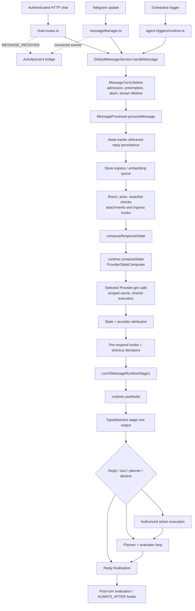
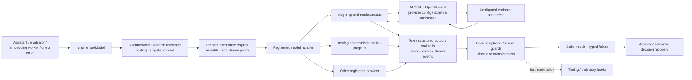
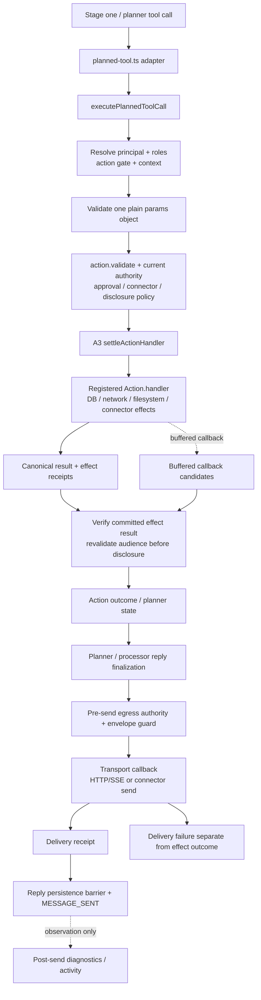
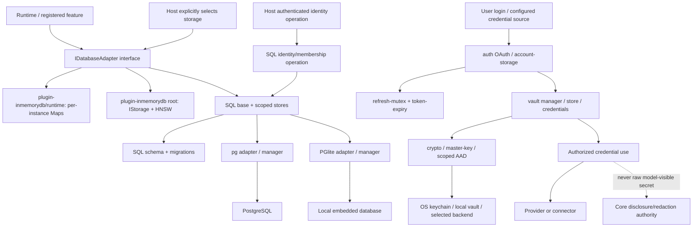
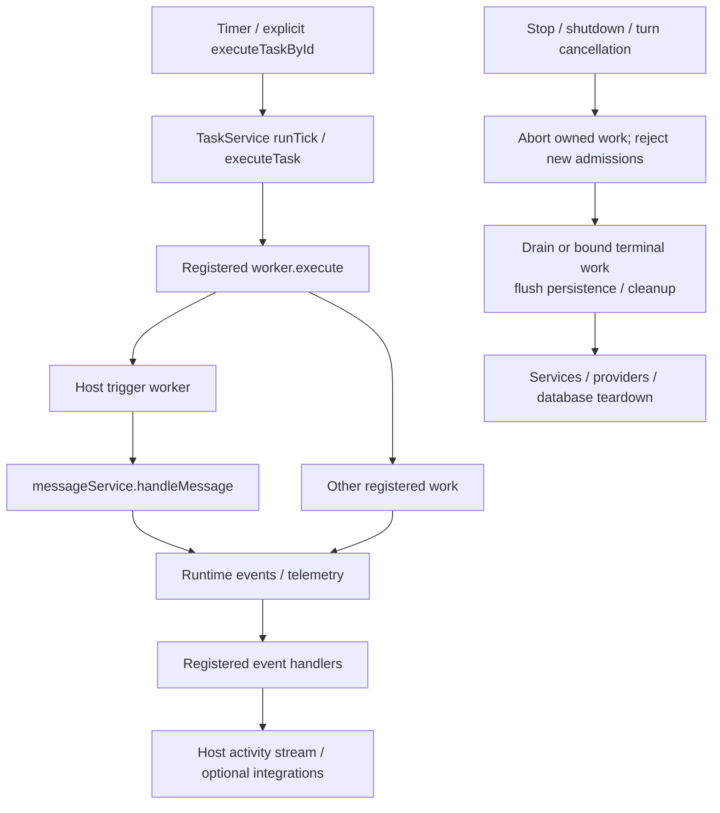
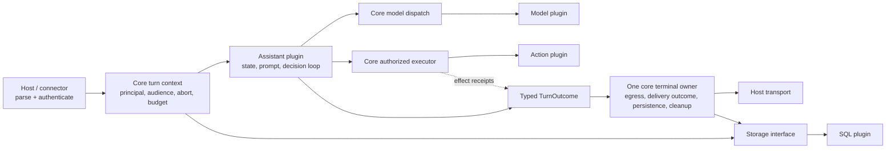

# Runtime flow atlas

Ownership/path update at `fc576976a9`, based on the source audit attached to [issue 31532](https://github.com/elizaOS/eliza/issues/31532). Paths below resolve in the current checkout; obsolete line anchors are removed. Read alongside [implementation status](STATUS.md). This is a flow map, not a claim that every issue acceptance criterion has passed.

This atlas traces the central runtime entry points and all major categories of exit: provider requests, tool effects, storage, user delivery, events, background work, credentials and shutdown. Plugin contributions are dynamic; no static chart can enumerate arbitrary plugin code. Telegram is a concrete connector example. HTTP chat is traced separately because emitting `MESSAGE_RECEIVED` is **not** the call that runs inference. The basic event handler bridges observability; the host/connector calls `messageService.handleMessage` directly.

The baseline import graph attached to the issue records source dependencies, including type-only imports; it is not a call graph. Solid arrows below describe traced execution/data flow; dashed arrows describe registration, hooks or observation. Every diagram refers to IDs in the file-level ledger below.

## 1. Host startup and runtime lifecycle

```mermaid
flowchart TD
    A[CLI / desktop app / configured host] --> B[H1 agent bin and CLI]
    A --> C[H2 app-core runtime/eliza.ts]
    B --> D[H3 agent runtime/eliza.ts\nbootElizaRuntime / startEliza]
    C --> D
    D --> E[H4 plugin collector + resolver\nconfig, discovery, imports]
    E --> F[K1 AgentRuntime constructor]
    F --> G[K2 initialize\nplugin registration / dependency ordering]
    G --> S[S1 SQL plugin init\nregisterDatabaseAdapter]
    S --> S2[S2 pg or PGlite manager / migrations]
    G --> O[M4 OpenAI plugin\nregistered model handlers]
    G --> V[K3 services, actions, providers, events]
    V --> MS[T1 DefaultMessageService (assistant)]
    V --> TS[B1 TaskService]
    G --> R[H5 host HTTP server / connectors]
    R --> READY[Accept input]
    READY --> STOP[K4 stop / cancellation / owned teardown]
    STOP --> CLOSE[S2 database close + service cleanup]
```

The host explicitly supplies SQL/model providers/assistant; assistant registers the transport-neutral message-processing interface. An empty core does not register the assistant message service. Core does not discover/install a model provider or import a database adapter. Host cloud/local routing belongs before runtime construction, not inside it.

## 2. Inbound message → state → assistant decision



Admission and nonresponse branches matter: muted rooms, preemption, cancellation, denied disclosure and a deliberate no-reply decision should not all be converted into a synthetic assistant response. The ingress persistence path differs by transport; the core/host integration must assert idempotence instead of assuming that two `createMemory` calls mean two intended messages.

## 3. Model request, streaming and recovery



Provider transport retries and assistant semantic retries are different. Provider-level retry must stop after externally visible stream output; tool effects cannot be retried because reply delivery failed. A structured response must be parsed before it authorizes a tool. Model/provider objects contain untrusted content even when fixture tests return perfect known values.

Core's dispatcher currently mixes feature-specific routing/trajectory/secret plumbing with these generic steps. The target kernel uses model-registration metadata for limits, opaque credential access where required, and optional instrumentation hooks. No pricing catalog, cloud account topology, or SDK-specific result type belongs in its contract.

## 4. Tool effects, authorization and delivery



Core owns terminal settlement; action results require explicit success and retain receipts. Each transport still enforces its own pre-send egress boundary. Fresh audience checks after asynchronous operations remain required. “Action succeeded” and “user received the response” are distinct facts. A callback failure must not turn a committed transfer/message/write into an eligible retry.

## 5. Storage, credentials and authority



Concrete SQL stores and schemas belong to plugin-sql; feature-specific queries moved with the assistant behavior. The runtime depends on adapter contracts and never selects a fallback from an environment flag. Ephemeral hosts explicitly supply `plugins/plugin-inmemorydb/runtime.ts`; the plugin root retains its separate shared-backend contract. Private test setup lives in `packages/testing/src/in-memory-adapter.ts`. PGlite does not provide the same RLS safety net as PostgreSQL; preserve application access predicates. Credential storage and core secret policy overlap in purpose but use distinct scopes/formats; migrating them requires historical fixture compatibility, not a mechanical crypto replacement.

## 6. Background work, events and shutdown



Event handlers are extensible, so they may have additional effects. Do not turn all events into a second implicit execution pipeline. Task execution primitives belong in core; deciding which autonomous goal to pursue and rendering a scheduled message belong to registered behavior.

## 7. Current ownership boundaries



The assistant cannot bypass action authority. A transport cannot invent a private audience from untrusted request text. The model plugin knows protocol details; the core knows only registered model interfaces. A host can register another message processor without acquiring a dependency on the default assistant implementation.

## File-level input/output ledger

A row names the primary owner and important adjacent files; it does not assert that every branch visits every listed file. Links identify current source files; symbols identify the boundary. Security column names the preserved invariant, not a claim of independent security certification.

| ID | Input / initiating call | Current files and entry | Output / side effect | Owner / invariant |
| --- | --- | --- | --- | --- |
| H1 | CLI process argv | [packages/agent/src/bin.ts](../../../packages/agent/src/bin.ts); `src/cli/index.ts` → `runAutonomousCli` | Host startup request | agent; parse configuration once |
| H2 | Application boot | [packages/app-core/src/runtime/eliza.ts](../../../packages/app-core/src/runtime/eliza.ts) → wrappers `bootElizaRuntime`, `startEliza` | Platform bridges then upstream boot | app-core; no core platform branching |
| H3 | Configured runtime options | [packages/agent/src/runtime/eliza.ts](../../../packages/agent/src/runtime/eliza.ts) | Runtime, server/connectors, cleanup ownership | agent; one composition |
| H4 | Config/plugin names | [packages/agent/src/runtime/plugin-collector.ts](../../../packages/agent/src/runtime/plugin-collector.ts); `plugin-resolver.ts` | Imported Plugin objects / resolution errors | agent; discovery never core auto-install |
| H5 | HTTP request | [packages/agent/src/api/server.ts](../../../packages/agent/src/api/server.ts); `dispatch-route.ts` | Authenticated endpoint dispatch / response | agent; HTTP identity verified before runtime |
| H6 | Chat/conversation body | [packages/agent/src/api/chat-routes.ts](../../../packages/agent/src/api/chat-routes.ts); `conversation-routes.ts` | Inbound memory, direct message service call, streamed/final reply, events | agent; stable IDs and no duplicate persistence |
| H7 | Telegram message/update | [plugins/plugin-telegram/src/service.ts](../../../plugins/plugin-telegram/src/service.ts); `messageManager.ts`; standalone `handler.ts` | Normalized Memory + delivery callback | connector; attest actual audience, preserve reply/thread IDs |
| K1 | Character + plugins/options | [packages/core/src/runtime.ts](../../../packages/core/src/runtime.ts) constructor | Runtime identity/registries/collaborators | core; no hidden provider/storage fallback |
| K2 | `initialize()` | [packages/core/src/runtime.ts](../../../packages/core/src/runtime.ts) | Registered plugins, adapter/services initialized | core; dependency order and rollback |
| K3 | Plugin contributions | [packages/core/src/runtime.ts](../../../packages/core/src/runtime.ts); [packages/core/src/types/components.ts](../../../packages/core/src/types/components.ts); [packages/core/src/types/plugin.ts](../../../packages/core/src/types/plugin.ts) | Actions/providers/models/services/hooks/events | core; ownership, uniqueness and teardown |
| K4 | `stop()` | [packages/core/src/runtime.ts](../../../packages/core/src/runtime.ts) | Cancellation, provider/service cleanup, stopped state | core; no new work after stop |
| T1 | `runtime.messageService.handleMessage` | [plugins/plugin-assistant/src/services/message.ts](../../../plugins/plugin-assistant/src/services/message.ts) | Delegated turn promise | interface core, default implementation assistant |
| T2 | Memory + callback + options | [plugins/plugin-assistant/src/services/message/turn-lifetime.ts](../../../plugins/plugin-assistant/src/services/message/turn-lifetime.ts) | Turn scope, stream callbacks, abort/preemption, terminal tracking | core lifetime; exactly one terminal outcome |
| T3 | Admitted turn | [plugins/plugin-assistant/src/services/message/processor.ts](../../../plugins/plugin-assistant/src/services/message/processor.ts) | MessageProcessingResult / persisted inputs / assistant execution | assistant policy + core terminal owner |
| T4 | Incoming memory and context | [plugins/plugin-assistant/src/services/message/processor.ts](../../../plugins/plugin-assistant/src/services/message/processor.ts) | Room/actor checks, attachment processing, hooks, eligibility | assistant/connector; authority checks retained inward |
| T5 | Message and selected providers | [plugins/plugin-assistant/src/services/message/provider-state.ts](../../../plugins/plugin-assistant/src/services/message/provider-state.ts); [packages/core/src/runtime.ts](../../../packages/core/src/runtime.ts) | State composition request | assistant selects; core enforces access |
| T6 | Composed state and hooks | [plugins/plugin-assistant/src/services/message/processor.ts](../../../plugins/plugin-assistant/src/services/message/processor.ts) | Shortcut/no-reply or stage-one request | assistant; explicit nonresponse outcome |
| T7 | State/action catalog | [plugins/plugin-assistant/src/services/message/pipeline.ts](../../../plugins/plugin-assistant/src/services/message/pipeline.ts) → `runV5MessageRuntimeStage1` | Model decision, tool execution or planner entry | assistant; no benchmark identity branches |
| T8 | Model fields/tool decision | [plugins/plugin-assistant/src/services/message/stage1-output.ts](../../../plugins/plugin-assistant/src/services/message/stage1-output.ts); [plugins/plugin-assistant/src/runtime/message-handler.ts](../../../plugins/plugin-assistant/src/runtime/message-handler.ts) | Parsed action/reply fields | assistant; one canonical decision shape |
| T9 | Decision + previous results | [plugins/plugin-assistant/src/runtime/planner-loop.ts](../../../plugins/plugin-assistant/src/runtime/planner-loop.ts); [plugins/plugin-assistant/src/runtime/evaluator.ts](../../../plugins/plugin-assistant/src/runtime/evaluator.ts); [plugins/plugin-assistant/src/services/message/planned-tool.ts](../../../plugins/plugin-assistant/src/services/message/planned-tool.ts) | Bounded tool/model loop, evaluated progress, final candidate | assistant; no effect replay as prose repair |
| T10 | Settled turn | [plugins/plugin-assistant/src/services/message/processor.ts](../../../plugins/plugin-assistant/src/services/message/processor.ts) | Evaluator effects and ALWAYS_AFTER hooks | assistant/core hooks; cleanup despite failure |
| P1 | `composeState` | [packages/core/src/runtime/state-composition/composer.ts](../../../packages/core/src/runtime/state-composition/composer.ts) | Audience-aware State and cache entries | core mechanism; scoped cache keys |
| P2 | Provider + shared execution key | [packages/core/src/runtime/state-composition/provider-execution.ts](../../../packages/core/src/runtime/state-composition/provider-execution.ts) | Provider result/error/abort; shared waiter accounting | core; one cancelled waiter cannot cancel others |
| P3 | Provider result fragments | [packages/core/src/runtime/state-composition/composer.ts](../../../packages/core/src/runtime/state-composition/composer.ts); [packages/core/src/runtime/trajectory-provider-attribution.ts](../../../packages/core/src/runtime/trajectory-provider-attribution.ts) | Merged state and instrumentation metadata | core contracts, optional telemetry owner |
| M1 | ModelType + params | [packages/core/src/runtime.ts](../../../packages/core/src/runtime.ts) → `useModel` | Delegation to dispatcher | core; model interface |
| M2 | Model call + turn context | [packages/core/src/runtime/model-dispatch/dispatcher.ts](../../../packages/core/src/runtime/model-dispatch/dispatcher.ts) | Selected handler request, guarded result/stream | core; limits, cancellation, complete output |
| M3 | Registered handler invocation | [packages/core/src/runtime/model-dispatch/dispatcher.ts](../../../packages/core/src/runtime/model-dispatch/dispatcher.ts)  | Provider result or typed error | core boundary; preserve original attempt attribution |
| M4 | Text model request | [plugins/plugin-openai/index.ts](../../../plugins/plugin-openai/index.ts); `models/text.ts`; `providers/openai.ts`; `utils/config.ts` | SDK request to configured endpoint | OpenAI plugin; endpoint/protocol-specific policy |
| M5 | Streaming/ordinary provider response | [plugins/plugin-openai/models/text.ts](../../../plugins/plugin-openai/models/text.ts) → transient retry + stream consumption | Text/tool calls/usage/errors/chunks | OpenAI plugin; no retry after visible output |
| M6 | Structured prompt + state | [plugins/plugin-assistant/src/runtime/structured-prompt/executor.ts](../../../plugins/plugin-assistant/src/runtime/structured-prompt/executor.ts); `stream-extractor.ts` | Parsed schema result or bounded recovery failure | assistant structured-output implementation, explicitly registered with core; do not truncate required context |
| M7 | Fixture-matched request | [packages/testing/src/deterministic-model-plugin.ts](../../../packages/testing/src/deterministic-model-plugin.ts); [packages/testing/src/deterministic-action-fixtures.ts](../../../packages/testing/src/deterministic-action-fixtures.ts) | Known response/events/errors, consumption diagnostics | private testing package; reject unexpected calls |
| A1 | Planned tool name/args | [plugins/plugin-assistant/src/services/message/planned-tool.ts](../../../plugins/plugin-assistant/src/services/message/planned-tool.ts) → `executeV5PlannedToolCall` | Executor context and dispatched tool | assistant adapter only |
| A2 | Tool invocation | [packages/core/src/runtime/execute-planned-tool-call.ts](../../../packages/core/src/runtime/execute-planned-tool-call.ts) | Explicit success/failure result; handler invocation | core; args + role + context + approval + audience |
| A3 | Handler + callback candidates | [packages/core/src/runtime/action-handler-settlement.ts](../../../packages/core/src/runtime/action-handler-settlement.ts) | Canonical result, committed effect receipts, settled callbacks | core; effect and delivery outcomes distinct |
| A4 | Current principal and action | [packages/core/src/runtime/action-gate.ts](../../../packages/core/src/runtime/action-gate.ts); [packages/core/src/roles.ts](../../../packages/core/src/roles.ts) | Admission/rejection | core; explicit principal, no accidental undefined bypass |
| A5 | Approval-required operation | [packages/core/src/services/approval.ts](../../../packages/core/src/services/approval.ts) | Pending decision / expiry / cancellation / authorized continuation | core contract and authority, host approval UI |
| A6 | Requested network/path access | [core network boundary](../../../packages/core/src/network); adapter-owned filesystem policy | Authorized I/O or rejection | Actual effect boundary; the unused timer-based capability wrapper was deleted, not replaced with a fictitious sandbox. |
| D1 | Planner/action/no-tool final candidate | [plugins/plugin-assistant/src/runtime/planner-loop.ts](../../../plugins/plugin-assistant/src/runtime/planner-loop.ts); [plugins/plugin-assistant/src/services/message/pipeline.ts](../../../plugins/plugin-assistant/src/services/message/pipeline.ts); `processor.ts` | User-facing candidate text/content | assistant; consolidate multiple fallback owners |
| D2 | Candidate + latest audience | [plugins/plugin-assistant/src/services/message/egress-policy.ts](../../../plugins/plugin-assistant/src/services/message/egress-policy.ts); [packages/core/src/security/outbound-envelope-guard.ts](../../../packages/core/src/security/outbound-envelope-guard.ts); executor/processor disclosure checks | Allowed sanitized delivery or denial | core; enforce before bytes leave |
| D3 | Authorized outbound content | Host callback in `chat-routes.ts`; connector callback in `messageManager.ts` | HTTP/SSE/connector output and delivery status | transport owner; preserve exact audience |
| D4 | Successful delivery | [plugins/plugin-assistant/src/services/message/turn-lifetime.ts](../../../plugins/plugin-assistant/src/services/message/turn-lifetime.ts); `processor.ts`; host `MESSAGE_SENT` sites | Reply memory/persistence barrier, terminal events | one core terminal owner with transport receipts |
| E1 | `MESSAGE_RECEIVED` event | [plugins/plugin-assistant/src/features/basic-capabilities/index.ts](../../../plugins/plugin-assistant/src/features/basic-capabilities/index.ts) | Activity bridge via registered handler | assistant/telemetry; not inference dispatch |
| E2 | `MESSAGE_SENT` event | [plugins/plugin-assistant/src/features/basic-capabilities/index.ts](../../../plugins/plugin-assistant/src/features/basic-capabilities/index.ts) | Debug log and post-send envelope diagnostic | optional telemetry; not a preventive security boundary |
| S1 | SQL plugin init | [SQL entry](../../../plugins/plugin-sql/src/index.ts) | Registered database adapter and migration service | SQL; one default Node entry, no HTTP routes. |
| S2 | Configured database connection | [plugins/plugin-sql/src/pg/manager.ts](../../../plugins/plugin-sql/src/pg/manager.ts); `pglite/manager.ts`; `runtime-migrator/` | Ready DB, migrations, connection/cache lifecycle | SQL; explicit backend and safe migrations |
| S3 | Ingress/reply/embedding persistence | [packages/core/src/runtime.ts](../../../packages/core/src/runtime.ts) adapter delegation; [plugins/plugin-assistant/src/services/message/processor.ts](../../../plugins/plugin-assistant/src/services/message/processor.ts) | Memory records + queued embeddings | core interface/SQL implementation; idempotent IDs |
| S4 | Adapter read/write method | [plugins/plugin-sql/src/base.ts](../../../plugins/plugin-sql/src/base.ts); `stores/memory.store.ts` and other stores | Scoped SQL reads/writes/transactions | SQL; keep application predicates for PGlite |
| S5 | Authenticated identity/person link request | [host route](../../../packages/agent/src/api/identity-person-link-routes.ts); [SQL adapter](../../../plugins/plugin-sql/src/base.ts) | Authorized attestation/membership mutation | Host authenticates; SQL retains transactional domain rules. |
| S6 | Hosted sync/write-back | Removed from the base SQL plugin | No implicit hosted SQL traffic | Optional external integration must be explicitly composed. |
| C1 | Login/API credential input | [packages/credentials/src/auth/oauth-flow.ts](../../../packages/credentials/src/auth/oauth-flow.ts); `account-storage.ts`; provider auth modules | Stored account credentials / refreshable tokens | credentials; preserve atomic account writes |
| C2 | Token expiry/refresh request | [packages/credentials/src/auth/refresh-mutex.ts](../../../packages/credentials/src/auth/refresh-mutex.ts); `token-expiry.ts` | Deduplicated refresh or retryable/auth failure | credentials; concurrent process coordination |
| C3 | Credential read/write | [packages/credentials/src/vault/manager.ts](../../../packages/credentials/src/vault/manager.ts); `store.ts`; `credentials.ts`; `vault.ts` | Scoped backend operation | credentials; no raw secret in planner state |
| C4 | Encrypt/decrypt/master key | [packages/credentials/src/vault/crypto.ts](../../../packages/credentials/src/vault/crypto.ts); `master-key.ts`; `pglite-vault.ts` | Authenticated ciphertext/plaintext for authorized caller | credentials; AAD, scope, old-key migration |
| C5 | Runtime secret access | `plugins/plugin-assistant/src/features/secrets/`; [packages/core/src/settings.ts](../../../packages/core/src/settings.ts); security redaction modules | Authorized credential use / redacted model/log content | policy core, backend credentials, actions assistant |
| B1 | Due task or explicit ID | [packages/core/src/services/task.ts](../../../packages/core/src/services/task.ts) | `worker.execute`, task result/next schedule | core generic task execution |
| B2 | Trigger worker payload | [packages/agent/src/triggers/runtime.ts](../../../packages/agent/src/triggers/runtime.ts) | Message processing / trigger result | agent or autonomy plugin |
| L1 | Log call / thrown failure | `packages/core/src/logger/`; core [packages/core/src/security/redact.ts](../../../packages/core/src/security/redact.ts) | Structured redacted log | core logger; preserve cyclic-object and secret handling |
| G1 | Authored action/provider definitions | [assistant contributions](../../../plugins/plugin-assistant/src/features/basic-capabilities/index.ts); individual action/provider files | Runtime descriptions and schemas | Authored runtime values; no generated action catalog and no generator in the build. |
| G2 | Authored lookup values | [keyword data](../../../packages/prompts/src/keywords.ts) | Typed runtime keyword tables | A declaration alone cannot contain the values used at runtime. |
| G3 | Core TypeScript source | [build.ts](../../../packages/core/build.ts); [manifest](../../../packages/core/package.json) | `dist/index.js` and bundled `dist/index.d.ts` | Build owns dist; typecheck emits nothing; no source-folder JS/declaration emission. |

Linked paths identify the current owner; adjacent bare filenames refer to that owner. Optional feature providers and action handlers add their own I/O beneath P2 and A3; inventory each retained plugin during implementation. The diagram intentionally does not suggest that core can police arbitrary ambient `fetch` or filesystem calls made by trusted in-process plugin code.

## Failure-path review checklist

Use each row as a test scenario, not another layer of runtime guards:

| Interrupted boundary | Required observed result |
| --- | --- |
| Boot fails after some services initialized | Initialized resources stop; no orphan task loop/server/DB remains. |
| Turn is superseded before inference | No later callback becomes a second reply; owned work observes cancellation. |
| One of two provider-state waiters cancels | Other caller still obtains result; no unauthorized cross-audience cache reuse. |
| Model returns malformed/truncated output | No tool effect; bounded typed failure/recovery and full input context retained. |
| Approval expires or roles change after planning | Rejected before effect; no fabricated success receipt. |
| Tool commits then callback fails | Effect recorded once; delivery failure visible; no automatic replay. |
| Audience changes while a private tool runs | Disclosure denied at final egress even if initial admission succeeded. |
| SQL write fails after transport delivery | Delivery remains factual; persistence failure is tracked and later turns respect the barrier/explicit failure policy. |
| Host shuts down midstream | No additional public output after terminal cancellation; resources released. |
| Fixture remains unused | Test fails, rather than merely checking fixture registration. |

## Changed boundary details

- Tool input is `PlannerToolCall { id?, name, params? }`. Provider adapters parse wire JSON; the executor rejects string arguments, legacy `args`/`arguments`, undeclared nested envelopes, and guessed parameter names. Declared optional omission sentinels and authorized secret/PII alias restoration retain their distinct semantics.
- Handler output is an explicit plain `ActionResult` with boolean `success`. The core settlement boundary validates effect receipts before releasing buffered callbacks. A missing or malformed return does not become success.
- `TurnOutcome` is completed, denied, cancelled or failed, with effect receipts independent of delivery. Host reply recovery retains interruption status and never replays a committed mutation merely to regenerate text.
- Core shutdown drains admitted turns, reply persistence and tracked model diagnostics before closing the database. Optional detached host warmups report failures; an absent local-inference entry is unavailable, not a healthy local provider.
- Model handlers return their typed model-specific results through `useModel`; cancellation and invalid text results remain terminal across both provider and action fallback. SHELL emits a typed verification receipt; the assistant consumes that status while preserving workspace-scope and effect checks.
