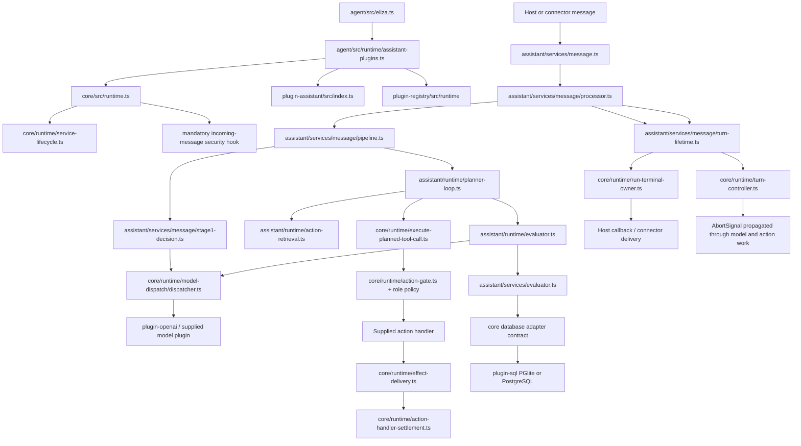

# Runtime consolidation: implementation status

Tracking: [elizaOS/eliza#31532](https://github.com/elizaOS/eliza/issues/31532).
The issue and its attached flow atlas, dependency inventory, and deletion ledger remain the acceptance specification. This document describes an **unfinished integration checkpoint**, not a completed migration or a release candidate. All phases must ship together.

## Implemented boundaries

| Responsibility | Current owner | Change |
| --- | --- | --- |
| Runtime lifecycle, model dispatch, action authorization, effect settlement, cancellation | `packages/core` | Constructor no longer installs assistant behavior, native features, plugin management, or a message service. Incoming-message security remains mandatory. |
| Conversation policy, response fields, planner, evaluators, assistant features | `plugins/plugin-assistant` | Explicit `createAssistantPlugin()` composition. Production imports use the public core barrel. |
| Host feature selection | `packages/agent/src/runtime/assistant-plugins.ts` | Host composes optional documents, credentials, relationship, autonomy, trust, and planning contributions. |
| Plugin discovery/install/eject | `plugins/plugin-registry/src/runtime` | Optional `@elizaos/plugin-registry/runtime` entry; core has no registry dependency or plugin-manager flag. |
| Account authentication and credential storage | `packages/credentials/src/auth`, `src/vault` | Former auth/vault packages combined; auth storage calls local vault directly. |
| KMS adapters and operation-key bundles | `packages/credentials/src/kms` | Local, memory and Steward adapters moved out of core; consumers use `@elizaos/credentials/kms`. |
| Pure diagnostics and text primitives | Dependency-free `packages/common` | Canonical redaction, Unicode boundaries, error formatting and environment primitives. Core and host clients depend on this pure leaf without loading one another. Error classes retain a single package identity. |
| API environment, settings diagnostics and speech cleanup | `packages/shared/src/runtime-env.ts`, `settings-debug.ts`, `spoken-text.ts` | Removed from core exports; production callers and behavioral tests moved with their owner. |
| Host/cloud topology and routing contracts | `packages/shared/src/contracts` | First-run, service-routing, deployment and cloud-topology definitions moved out of core. |
| Cloud settings resolution and cloud authentication | `packages/cloud/routing`, `packages/agent/src/services/cloud-auth-service.ts` | Core cloud-routing shim removed. Relationship graph receives an explicit external-identity resolver. |
| Deterministic fixtures and integration harnesses | Private `packages/testing` | No production core testing exports. Strict model registry checks consumption of known responses. |
| Action metadata and keywords | Authored action definitions; `packages/prompts/src/keywords.ts` | Generated wrappers, action-doc files and duplicated keyword generation removed. |
| Local/remote SQL | `plugins/plugin-sql` | PGlite and PostgreSQL retained; Neon/Electric sync and transaction-publication paths removed. |
| OpenAI-compatible inference | `plugins/plugin-openai/src/index.ts` | One Node entry; browser proxy/transcription installation variants removed. Cerebras and SSRF behavior retained. |

## Package output

Core and assistant now build one `dist/index.js` and one bundled `dist/index.d.ts` each. Core exports only `.`; no browser, edge, Node subpath, testing, wildcard, or source-condition escape. `packages/core/build.ts` replaces the multi-platform wrapper/declaration-rewrite pipeline with a Node tsup build. Build output is confined to `dist`; it does not write generated application source.

`packages/core/scripts/verify-package.mjs` packs the actual local dependency tarballs, installs an external temporary consumer with local tarball overrides, checks its TypeScript import, boots core in native Node, dispatches exactly one known fixture response, checks logging, and verifies that old subpaths are inaccessible. Overrides ensure the test exercises this checkout's dependencies rather than a published package with the same prerelease version.

Node crypto replaced the old Noble-backed compatibility paths. AsyncLocalStorage replaces browser/stack context fallbacks. Mobile bundle-retention globals and their implementation-mirroring test were removed. Provider retry exhaustion now has a generic contract instead of a cloud-provider-specific code. Adapter bootstrap settings have one shared implementation rather than duplicate methods.

## Runtime flow after extraction

| Input | Main files traversed | Output / retained boundary |
| --- | --- | --- |
| Host plugins and character | `agent/src/eliza.ts`, `agent/src/runtime/assistant-plugins.ts`, `core/src/runtime.ts` | Explicit contributions registered; an empty kernel stays empty. |
| Incoming connector message | Assistant `services/message.ts`, `processor.ts`, `pipeline.ts`; core incoming security hooks | Prepared message, authorized audience and response decision. |
| Stage-1 decision | Assistant `stage1-decision.ts`, `runtime/builtin-field-evaluators.ts`; core `runtime/response-grammar.ts` | Structured response fields from the explicitly registered assistant schema. |
| Model request | Core `runtime/model-dispatch/dispatcher.ts`, `runtime/validated-model-call.ts`; provider plugin | Provider response, usage and one recorded attempt; exhausted provider budget does not restart under another registration. |
| Tool selection | Assistant `runtime/action-retrieval.ts`, `action-tiering.ts`, `planner-loop.ts` | Planned tool call; selection does not authorize execution. |
| Tool execution | Core `execute-planned-tool-call.ts`, `action-gate.ts`, `action-role-policy.ts`, `action-handler-settlement.ts` | Authorized result/effect receipt; handler errors retain provenance. |
| Evaluator extraction | Assistant `runtime/evaluator.ts`, `services/evaluator.ts`, `services/identity-evidence.ts`, `relationship-evidence.ts` | Persisted evidence through the supplied database adapter. |
| History review | Assistant `runtime/history-retention.ts`, `services/history-retention.ts` | Source-bound retention checkpoint; original context remains available when review is invalid. |
| Reply and delivery | Assistant `message/processor.ts`, `message/turn-session.ts`, core effect-delivery guards | Delivery callback and terminal turn state. A required TurnOutcome records completion, denial, cancellation or failure independently of delivery, with retained effect receipts. |
| Cancellation | Core `turn-controller.ts`, assistant `message/turn-lifetime.ts`, model/action context | Abort signal and settlement of owned work. |
| Credential acquisition/refresh | Credentials `auth`, `vault`; host-selected consumers | Encrypted scoped credentials; no credential package in the core dependency closure. |
| KMS operation | Credentials `kms/index.ts`, selected adapter, `operation-key-bundle.ts` | Ciphertext / key bundle; no implicit cloud KMS runtime dependency. |
| Plugin installation | Registry `runtime/services/pluginManagerService.ts` | Host-authorized installation and lifecycle changes outside core. |

## Verification and limits

The checkpoint has 45 credentials test files / 606 tests passing, 4 focused kernel test files / 63 tests passing, and 4 assistant composition/tool-result/role/control test files / 43 tests passing. Core and assistant builds and the packed core consumer pass.

The checkpoint has passing targeted evidence for core/assistant/credentials/registry-runtime typechecks, real flat builds, the packed core consumer, explicit assistant composition, provider retry/failover, security/role/effect settlement, KMS, local PGlite, OpenAI-compatible/Cerebras requests, authored metadata, and deterministic fixtures. Commands and final counts must be rerun on the combined final tree before release.

A broad assistant run exposed old implicit-composition fixtures and was stopped to migrate them. Seventeen service test files now explicitly supply `createAssistantPlugin()`; the focused preserved-tool-result/role/control/channel-topic group passes. Service tests that need a lazy service must await `getServiceLoadPromise`, rather than assuming registration starts it synchronously. This is not evidence that the full assistant or repository suite passes.

The logger follow-up passes 117 redaction/logging unit tests, 2 native Node ESM file-sink tests, 4 client logger tests including an executed browser bundle, 45 focused assistant tests, and the packed core consumer. Assistant lint checks all 681 source/test files (warnings remain; no errors). The obsolete equality test between duplicated pattern tables was retired after they became one table.

The settlement/client follow-up moves terminal requests out of processor branches into the outer lifetime, reports recorded failures as error events, and deletes unused room/world logging reads. Five assistant settlement files / 41 tests pass; five focused kernel files / 154 tests pass; five client files / 69 tests pass, including an executed browser bundle importing logging, error, env, settings and speech APIs without core or Adze. Common primitives have 13 tests. Core and shared builds and the packed core consumer pass. Type-check output was found under core/dist/plugins because assistant inherited incremental emission and core outDir; core disables incremental no-emit checks and assistant now owns its output directory. Full combined gates remain pending.

## Remaining acceptance work

- Node logger consolidation is implemented: core owns Adze/file sinks/ring buffer; browser clients use `@elizaos/shared/logger`; the old logger package is removed. The pure redaction leaf is bundled into core at build time and adds no shared runtime dependency. Remaining script/release alias migration is owned by the scripts integration lane.
- Complete browser/client helper ownership and remaining core subpath/source alias migrations. Shared `client-public` facades are migrated; several other consumer build/test aliases still target retired exports. All app, cloud and scaffold consumers must migrate before acceptance.
- Retire remaining native-feature/preset tables and old constructor flags in consumers. Move further host-only setup, app-route, desktop/environment and media policy out of the kernel after caller migration.
- Move policy-owned tests still under core into assistant; finish explicit-composition fixtures and remove only obsolete mode/build tests, preserving security and behavioral assertions.
- Finish action/model result classification and remaining recovery simplification. The required TurnOutcome contract and shared terminal owner are implemented for assistant and cloud message services; committed-effect cancellation/reply-failure regression tests pass.
- SQL and OpenAI package consolidation, identity HTTP extraction, real PostgreSQL and broad local/provider suites pass at the checkpoints below. Repeat required acceptance on the combined candidate.
- Review optional credential/provider-catalog dependencies, simplify docs and verify credentials packaging/native adapter optionality.
- Integrate the separately owned scripts/test changes, root runtime commands and CI lanes. Run full `bun run verify` on the combined tree, required integration lanes, packed consumers and source-artifact checks.
- Produce final dependency closure, package size, file/line and complexity deltas that distinguish moves from deletions. No full-green, zero-cloud closure or final size claim has been made yet.

Do not merge or publish this checkpoint independently of the remaining coordinated migration.

## Setup deletion evidence

The exported generic CLI setup adapter, setup RPC adapter and setup-progress provider have no production consumers (identifier scan plus import review); their own unit suites and public barrels were their only callers. They are deleted, including the unregistered provider and its tests. The active secrets setup service still uses the retained state machine and serialized state contract, now co-located under assistant `features/secrets/setup`; its behavioral tests move with it. This does not remove the actual host onboarding routes or secrets setup flow.

## Host helper and lifecycle consolidation

HTTP request/response implementations, app route loader registry/draining, and runtime route-host context move from core to shared/api. Browser loader registration has a pure module separate from Node route draining. Core/shared curated-app registry implementations collapse into the existing shared contracts owner; the mocked duplicate core registry suite is retired while real registration/copy behavior moves to shared. Host Plugin route types and the runtime route table still require the later HTTP-plugin contract migration.

Agent no longer contains a fallback copy of core plugin ownership/teardown. Its wrapper retains schema migrations, provider role gating, view registration/cleanup and per-plugin operation ordering. Real lifecycle tests pass (3 files / 34 tests); the redundant fallback-mode replay of those same tests is removed. Host helper tests pass (5 files / 27 tests).

The extraction follow-up restores the shared stack-formatting API, fixes moved consumer imports and the SQL MessageExample type collision, and makes the public app-core diagnostic helper use explicit assistant composition and public agent/shared imports. PGlite diagnostic storage allocation is now a public shared utility, while mocks/inference fixtures remain private. Subscription-auth registry/types move from assistant into credentials, removing credentials' assistant dependency. Vault open/probe paths share one alias-aware resolver. Credentials: 46 files / 610 tests passing plus 2 new branded-path tests, typechecks/build pass; shared diagnostic helpers: 13 tests passing. Core, assistant and shared builds, agent/core/testing/credentials typechecks and assistant lint pass at this checkpoint. The agent typecheck required freshly built credentials KMS and cloud SDK declarations, rather than source alias escapes.

## Node cancellation and shared terminal owner

Core now owns `RunTerminalOwner`, used by assistant through the public barrel. Its barrier retains exact connector delivery/lease behavior and rejects late run-owned work. Node AsyncLocalStorage replaces the optional browser turn-context fallback. The actual assistant terminal pipeline and connector settlement suites pass (17 tests), cancellation suites pass (21 tests), and core/assistant typechecks pass. Canonical outcome migration remains unfinished.

A full 141-package lint run identified migrated import ordering/formatting across consumers. Safe Biome fixes are applied to changed files only; unrelated warning-only files remain untouched. Combined final verification is still required.

## Canonical turn outcome checkpoint

`MessageProcessingResult` now requires a `TurnOutcome`: completed, denied, cancelled or failed, with effect receipts independent of response delivery. The former public `terminalFailure` is replaced by `outcome.error`; host chat and child-agent wire DTOs still map to their existing transport fields. Assistant-only routing reasons no longer appear in core run statuses. The lifetime journals settled action receipts before host callbacks and uses the single core terminal owner on return or throw. Terminal settlement takes one closed-admission task snapshot instead of repeatedly polling its shrinking set.

Cloud bootstrap removes its independent branch terminal emitters. Its lifetime uses the same terminal owner, cancellation reaches model/action work and callback delivery, and late compose completion cannot start inference or delivery after timeout. Cloud shared-runtime composition explicitly installs the assistant plugin; retired constructor flags and a duplicate provider/service bundle are removed.

Verification: 42 assistant terminal/delivery tests, 56 effect/reply recovery tests, 221 host chat/benchmark tests, 43 parent-agent broker/dispatch tests (including a real PGlite coding mutation), and 4 cloud deadline/cancellation tests pass. Core, assistant, agent, cloud-shared and orchestrator typechecks pass after rebuilding required published declarations. These are focused checks, not the final combined verify.

A real built-package broker test exposed a transitive export-star failure: core's prompt template re-export existed in source types but was undefined from the ESM bundle. Thirteen consumers now import the canonical prompt package directly, and core's prompt facade/export are deleted. Fresh core build: 2.60 MB JS and 1.74 MB bundled declaration; assistant build and packed core consumer pass. The source tree has no emitted declarations in this checkout. Agent build emission identified in the separate integration checkout is still being isolated and must be fixed before final acceptance.

## HTTP ownership checkpoint

Core no longer stores routes, registers or normalizes HTTP routes, tracks HTTP ownership, or exports Route/request/response/handler helpers. Optional host contracts live in `shared/api/http-plugin`; `shared/api/http-plugin-runtime` owns declaration validation, route state and load/unload integration. The agent installs this host lifecycle explicitly. Kernel plugins remain transport independent; HTTP plugins extend their contract. Shared app-route loaders and production consumers now use this owner.

Validation: core/shared/agent/assistant/SQL type checks; core and shared builds; packed Node and TypeScript consumer (including rejected Route import and absent route table); 113 host lifecycle/HTTP tests; 26 contract/drain tests; 94 remote adapter/capability route tests (three existing external smoke skips). Extended transport checks passed 178 cases, then the remaining legacy route-mode fixture was migrated and its 26-case suite passed. Public-route write authorization checks remain enforced; remote unload fixtures now use the real kernel lifecycle instead of the deleted fallback implementation.

Remaining: capability RPC wire manifests and app-bridge contracts still need their host-owner review, plus the browser/Worker consumers, final suite, documentation and metrics gates below. This checkpoint does not claim complete HTTP contract extraction.

## Retired test contracts

These are deliberate API retirements, not claims of one-for-one coverage replacement. Retained tests must still prove the supported behavior.

| Retired core test files | Reason and retained evidence |
| --- | --- |
| `__tests__/spec-helpers.test.ts`, `action-docs.test.ts`, `features/advanced-capabilities/experience/generated/specs/spec-helpers.test.ts` | Generated lookup/catalog wrappers were removed after materializing effective action/provider metadata. Preserve metadata parity evidence; wrapper lookup tests no longer describe a public API. |
| `__tests__/streaming-context-browser-suite.test.ts`, `__tests__/streaming-context-browser.test.ts`, `streaming-context.browser.test.ts`, `utils/stack-context-manager.test.ts` | Synchronous browser stack manager removed. Node `streaming-context.test.ts` and `runtime/turn-controller.test.ts` retain async context/cancellation coverage. |
| `build-flat-entrypoints.test.ts`, `build-packed-consumer-env.test.ts`, `bundle-safety.test.ts` | Retired flat shim generation, old subprocess environment adapter and retention globals. Actual `scripts/verify-package.mjs` external Node/TypeScript tarball consumer and source-emission boundary checks validate the new build. |
| `features/basic-capabilities/capability-registration.test.ts`, `features/basic-capabilities/config.test.ts`, `features/basic-capabilities/index.edge.test.ts` | Removed implicit capability flags, precedence and Workerd branch. Explicit host composition must test supplied/absent contributions; retain feature behavior tests. |
| `index-browser-audience-export.test.ts` | No browser core entry. Packed export rejection and renderer runtime-import exclusion replace the platform surface assertion; audience authority tests remain required. |
| `plugins/__tests__/native-features-edge.test.ts`, `plugins/native-features.edge.test.ts` | Removed edge-only feature-default tables and throwing feature resolver. Ordinary plugin/composition behavior remains required. |
| `providers/setup-progress.test.ts`, `services/setup-cli.test.ts`, `services/setup-rpc.test.ts` | Deleted unused setup adapters. Active assistant `features/secrets/setup/state-machine.test.ts` and `service.test.ts` exercise the retained setup lifecycle. |

Audit input: `core-migration-body-review.json` from the test-consolidation artifacts. The file list above resolves its eighteen unmatched files and one ambiguous capability-config mapping. It does not certify the full suite or erase outstanding explicit-composition acceptance work.

## Client and cloud boundary checkpoint

Browser clients now import dependency-free contracts and predicates from `common` and host-specific values from shared modules. Errors, role comparisons, effects, message/memory shapes, connector registries, interaction parsing, view/surface metadata and shortcut matching each have one implementation. Core imports the pure leaf as a real dependency so `ElizaError` identity survives package boundaries. This is relocation, not a claim that these lines were deleted.

Wallet contracts and activity formatting moved to shared; core no longer exports them. Shared's root no longer exports Node email classification or server TTS configuration. LifeOps owner lookup has its own Node entry, separate from pure normalization. Browser consumers use shared leaf imports and an explicit Vite guard rejects runtime imports. Deleted the obsolete browser-core source/cache/flat-shim resolver. UI-projected pending notifications use a stable namespaced action ID directly instead of hashing a display key through the runtime.

The cloud Worker uses the ordinary runtime through its existing `nodejs_compat` host support. Removed the duplicated production core shim and its test-only throw table. Their implementation-mirroring tests are retired; canonical security behavior and actual Workerd startup are tested instead. Voice endpoint tests retain their external service/auth boundaries while using real core contracts. No cloud dependency or Worker implementation was added to core.

Evidence at this checkpoint: native core build/typecheck; 174 kernel regression cases; 41 host contract/formatting tests (including the retained pre-existing wallet suite); 289 focused UI cases; actual Chromium launcher render with zero page errors; packed external Node/TypeScript consumer; cloud API typecheck/router-contract/production Worker dry-run; 13 canonical security/real Workerd boot cases and real Miniflare onboarding rejection. The Worker test loads the built ordinary core through Wrangler, initializes a runtime, enforces one known inference input/output, verifies no route table or implicit message service, and stops it. Full combined gates remain pending; this does not certify unrelated cloud services or deployment.

The updated voice tests passed 152 cases across seven isolated files after removing the core-wide mocks. Latest native core build: 2.51 MB JS / 1.62 MB DTS, declaration generation 4.35 seconds; no declarations emitted under core source.

## SQL and inference distribution checkpoint

SQL now has one Node source entry and one root manifest. Removed browser/default/Node implementation duplication, the nested build/declaration shim generator, browser utility copies, CJS variant and wildcard exports. Output stays in package-root `dist`; the root, schema and Drizzle entries each have a bundled declaration. Shared JS chunks preserve schema object identity across public entries. The retained implementation uses the Node pool/RLS behavior. The real database runner discovers current integration filenames instead of maintaining obsolete batch lists.

OpenAI now uses the same Node declaration bundler for its root and endpoint-config entries. Removed wildcard exports and browser-only settings/types/docs. Its assistant dependency is test-only; provider execution does not require the assistant package. Protocol SDKs and tokenization remain in the optional provider package.

Verification: SQL build/typecheck/lint; **97 local test files, 796 passing cases, 36 explicitly reported PostgreSQL/backend skips**; a separate isolated PostgreSQL integration run **50 files / 479 passing cases, no skips**; membership migration concurrency/rollback **2 passing cases** in a separate admitted scratch database. Fixture repairs explicitly compose memory, seed membership in both parity adapters, use the supported PGlite constructor, provide production fixture salt, and reset test-owned PostgreSQL functions between privilege contexts. No authorization assertion was removed. Obsolete summary-provider expectations become retained-history evaluator expectations; the migration test now asserts that agent names are non-unique rather than printing a false failure without failing its test.

OpenAI unit/shape/loopback suite: **41 files / 591 cases pass**. The actual runtime HTTP retry suite passes five cases. The shutdown investigation identified an unowned model-log transaction racing database close. Core now tracks and drains diagnostic writes before service/database teardown; delayed and rejected writes have explicit ordering regressions. Combined real inference acceptance passes **23 cases** (keyless fixture dispatch, loopback retry, router budgets). Identity HTTP routes and five real PGlite authority/registration checks now belong to the agent host; SQL registers no HTTP routes. Host contract curation and final combined acceptance remain open.

## Platform and publication follow-up

Package builders resolve externals from their own manifests, so invoking an exported builder from the repository root cannot accidentally bundle transitive CommonJS dependencies. Native Node imports of both SQL and OpenAI pass after root-invoked builds. The application production renderer builds 9,008 modules / 1,150 assets after removing 53 lines of obsolete core browser patching; generic native-module handling remains.

Store/direct distribution policy moves to explicit shared host leaves. Core's `sandbox/dlopen-gate.ts` is consolidated into the host-owned native-library policy. A follow-up tracked-file audit found an Electrobun caller missed by the initial search, correcting the earlier zero-caller claim. That caller now relies on the existing resolver, strengthened to enforce realpath containment within the authoritative running app's `Contents`, including symlink and cross-bundle rejection. Duplicate variant and sandbox-policy tests are consolidated into one owner with the union of environment normalization, defaults, caching and execution-gating behaviors. This removes duplicate policy implementations while preserving the enforced native-load boundary. Validation: 20 shared policy cases, 59 agent cases and 30 orchestrator cases pass; core build/typecheck pass. App bridge validation awaits the already-prepared shared logger alias integration. Retired basic/extended constructor flags are removed from remaining fixtures and character-schema declarations.

## Authority and unused governance cleanup

`hasRoleAccess` now requires a nonempty runtime identity and sender identity for every role. Missing context no longer grants OWNER/ADMIN by assuming an outer local gate. Existing explicitly resolved owners and agent-self operations retain their checks. Core role tests pass 58 cases; registry authority wrappers pass four cases; agent security passes two cases. The integrated app-host bridge regression also passes after its shared logger alias fix.

Deleted `security/capability-manifest.ts` and its self-contained tests: no production caller used the wrapper or its predicates. Its `cpuMs` field only raced a timer against work and did not stop that work. The real executor's cancellation checks, connector authority, approvals, SSRF guards and scoped filesystem adapters remain. This removes an unused public abstraction instead of preserving a misleading second enforcement path. In-process plugins are trusted Node code; mediated authorization is not isolation of hostile JavaScript.

### Canonical executor arguments

The executor now accepts one `PlannerToolCall` contract with a plain `params`
object. All five production entry points already construct that shape. Removed
JSON-string/`args`/`arguments` fallback, nested envelope flattening, enum shorthand,
wrapper dropping, and parameter-name guessing. Invalid forms fail before handler
invocation. Explicit optional omission sentinels remain because strict provider
schemas require them; authorized entity-alias restoration remains a security
boundary. Provider wire JSON parsing stays with the provider adapter.
Validation: 74 core argument/executor cases, 27 assistant planner/shortcut cases,
agent fallback-action suite, and core typecheck pass. This does not yet complete
the separate model/action outcome consolidation.

### Explicit action results and interrupted-turn recovery

Action handlers now return a plain `ActionResult` with an explicit boolean
`success`; absent, null, primitive, and missing-success returns no longer become
successful work. The trust pre-action explicitly returns a successful no-op;
trajectory wrappers preserve the actual result. Receipt validation and deferred
callback delivery remain at the settlement boundary. Invalid returns cannot
release buffered success text.

Host recovery preserves committed receipts and recovered reply text while
retaining `cancelled` or `failed` execution status. A recovered reply no longer
turns an interrupted turn into `completed`. Deadline failures stay failures,
and committed work is not classified as automatically retryable.

Validation: 104 core settlement/executor/reply cases initially passed, followed
by 41 settlement cases including five malformed-return callback checks; 56
assistant security/trajectory cases pass; all three agent chat, idempotency and
SSE suites pass. Assistant and orchestrator typechecks pass. Broad typecheck
reached 133/232 tasks before a separately identified login-relative-import
failure; the remaining workspaces are being checked separately. These are
checkpoint results, not a final repository-green claim.

### Benchmark behavior is explicitly registered

The default assistant no longer registers `CONTEXT_BENCH`. The provider and its
metadata tests now live in private testing; the integration case moved to the
assistant owner and uses the real initialized runtime plus that explicit fixture.
Its complete context appears only on the carrying request and does not bleed
into the following ordinary request. Eight fixture tests, two composition tests
and the initialized-runtime integration test pass; testing and assistant
TypeScript checks pass. The first migrated integration attempt timed out because
it attempted role-aware composition before initializing the runtime; the test
now exercises the correct lifecycle and tears it down.

### Retired generated catalog inputs

The action catalog is now authored ownership/navigation documentation with a
read-only source inventory command. Removed the three unused JSON spec snapshots
and two tests that only asserted those snapshots against themselves. Runtime
metadata remains in typed owning implementations; no generator was reintroduced.
Docs resolve all source paths (18 tests pass), prompt rendering remains covered
(11 tests pass), and paired repository guides agree. This removes over 2,500 net
lines of duplicate metadata/documentation, not runtime behavior.

### Terminal model outcomes

Model dispatch retains its typed result/throwing API. Action-level fallback now
uses the same retryable-provider classifier as normal dispatch; cancellation,
admission errors, and malformed built-in text results stay terminal. Caller
signals are checked before dispatch, after provider completion and during stream
consumption. An interrupted stream rejects rather than returning a successful
partial answer. Unknown/custom model slots retain their own result contract.

Validated 147 model routing/stream/classification cases plus 31 secret/PII/
trajectory regression cases; core typecheck and lint pass (existing lint warnings
remain). The default missing-provider message no longer prescribes cloud login.

### Coding verification ownership

SHELL now produces an explicit verification receipt from actual command execution.
Command-family classification and empty-test log interpretation moved from the
assistant planner into coding-tools. The planner consumes passed/failed/no-tests
status and keeps workspace-delta, execution-domain and background-handle gates.
The old `verificationEvidence: true` escape hatch is removed. Tests without a
receipt cannot establish verification by command/prose alone.

Validated 232 planner cases, 180 coding-tools cases including real SHELL execution
and remote receipt scope, and the agent remote-coding-runner suite. Core, assistant
and coding-tools typechecks pass; package lint passes with existing warnings.

### Test ownership and dependency cycles

Moved advanced-memory persistence and relationship-evidence integration tests
to the assistant that owns those policies. SQL's embedding-source test now uses
its existing migrated real-database fixture and directly seeds its adapter rows.
Removed SQL's now-unused assistant/testing dev dependencies and declared SQL as
an assistant test dependency. No workspace dependency cycles remain according
to the actual Turbo build dependency audit. Moved tests retain discovery, including
the real-test lane. Nine relationship, two advanced-memory and two embedding
cases pass; assistant/SQL typechecks and lint pass.
