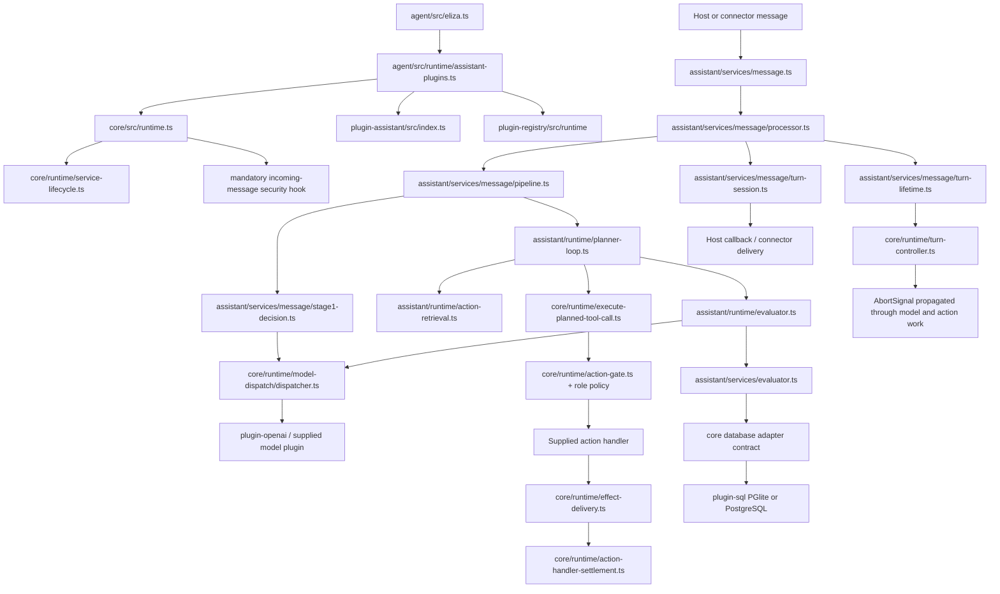

# Runtime consolidation: implementation status

Tracking: [elizaOS/eliza#31532](https://github.com/elizaOS/eliza/issues/31532).
The issue and its attached flow atlas, dependency inventory, and deletion ledger remain the acceptance specification. This document describes an **unfinished integration checkpoint**, not a completed migration or a release candidate. All phases must ship together.

## Implemented boundaries

| Responsibility | Current owner | Change |
| --- | --- | --- |
| Runtime lifecycle, model dispatch, action authorization, effect settlement, cancellation | `packages/core` | Constructor no longer installs assistant behavior, native features, plugin management, or a message service. Incoming-message security remains mandatory. |
| Conversation policy, response fields, planner, evaluators, assistant features | `plugins/plugin-assistant` | Explicit `createAssistantPlugin()` composition. Production imports use the public core barrel. |
| Host feature selection | `packages/agent/src/runtime/assistant-plugins.ts` | Host composes optional documents, credentials, relationship, autonomy, trust, and planning contributions. |
| Plugin discovery/install/eject | `plugins/plugin-registry/src/runtime` | Optional `@elizaos/plugin-registry/runtime` entry; core has no registry dependency or plugin-manager flag. |
| Account authentication and credential storage | `packages/credentials/src/auth`, `src/vault` | Former auth/vault packages combined; auth storage calls local vault directly. |
| KMS adapters and operation-key bundles | `packages/credentials/src/kms` | Local, memory and Steward adapters moved out of core; consumers use `@elizaos/credentials/kms`. |
| Pure diagnostics and text primitives | Dependency-free `packages/common` | Canonical redaction, Unicode boundaries, error formatting and environment primitives. Core bundles this leaf; shared clients import it without loading core. |
| API environment, settings diagnostics and speech cleanup | `packages/shared/src/runtime-env.ts`, `settings-debug.ts`, `spoken-text.ts` | Removed from core exports; production callers and behavioral tests moved with their owner. |
| Host/cloud topology and routing contracts | `packages/shared/src/contracts` | First-run, service-routing, deployment and cloud-topology definitions moved out of core. |
| Cloud settings resolution and cloud authentication | `packages/cloud/routing`, `packages/agent/src/services/cloud-auth-service.ts` | Core cloud-routing shim removed. Relationship graph receives an explicit external-identity resolver. |
| Deterministic fixtures and integration harnesses | Private `packages/testing` | No production core testing exports. Strict model registry checks consumption of known responses. |
| Action metadata and keywords | Authored action definitions; `packages/prompts/src/keywords.ts` | Generated wrappers, action-doc files and duplicated keyword generation removed. |
| Local/remote SQL | `plugins/plugin-sql` | PGlite and PostgreSQL retained; Neon/Electric sync and transaction-publication paths removed. |
| OpenAI-compatible inference | `plugins/plugin-openai/src/index.ts` | One Node entry; browser proxy/transcription installation variants removed. Cerebras and SSRF behavior retained. |

## Package output

Core and assistant now build one `dist/index.js` and one bundled `dist/index.d.ts` each. Core exports only `.`; no browser, edge, Node subpath, testing, wildcard, or source-condition escape. `packages/core/build.ts` replaces the multi-platform wrapper/declaration-rewrite pipeline with a Node tsup build. Build output is confined to `dist`; it does not write generated application source.

`packages/core/scripts/verify-package.mjs` packs the actual local dependency tarballs, installs an external temporary consumer with local tarball overrides, checks its TypeScript import, boots core in native Node, dispatches exactly one known fixture response, checks logging, and verifies that old subpaths are inaccessible. Overrides ensure the test exercises this checkout's dependencies rather than a published package with the same prerelease version.

Node crypto replaced the old Noble-backed compatibility paths. AsyncLocalStorage replaces browser/stack context fallbacks. Mobile bundle-retention globals and their implementation-mirroring test were removed. Provider retry exhaustion now has a generic contract instead of a cloud-provider-specific code. Adapter bootstrap settings have one shared implementation rather than duplicate methods.

## Runtime flow after extraction

| Input | Main files traversed | Output / retained boundary |
| --- | --- | --- |
| Host plugins and character | `agent/src/eliza.ts`, `agent/src/runtime/assistant-plugins.ts`, `core/src/runtime.ts` | Explicit contributions registered; an empty kernel stays empty. |
| Incoming connector message | Assistant `services/message.ts`, `processor.ts`, `pipeline.ts`; core incoming security hooks | Prepared message, authorized audience and response decision. |
| Stage-1 decision | Assistant `stage1-decision.ts`, `runtime/builtin-field-evaluators.ts`; core `runtime/response-grammar.ts` | Structured response fields from the explicitly registered assistant schema. |
| Model request | Core `runtime/model-dispatch/dispatcher.ts`, `runtime/validated-model-call.ts`; provider plugin | Provider response, usage and one recorded attempt; exhausted provider budget does not restart under another registration. |
| Tool selection | Assistant `runtime/action-retrieval.ts`, `action-tiering.ts`, `planner-loop.ts` | Planned tool call; selection does not authorize execution. |
| Tool execution | Core `execute-planned-tool-call.ts`, `action-gate.ts`, `action-role-policy.ts`, `action-handler-settlement.ts` | Authorized result/effect receipt; handler errors retain provenance. |
| Evaluator extraction | Assistant `runtime/evaluator.ts`, `services/evaluator.ts`, `services/identity-evidence.ts`, `relationship-evidence.ts` | Persisted evidence through the supplied database adapter. |
| History review | Assistant `runtime/history-retention.ts`, `services/history-retention.ts` | Source-bound retention checkpoint; original context remains available when review is invalid. |
| Reply and delivery | Assistant `message/processor.ts`, `message/turn-session.ts`, core effect-delivery guards | Delivery callback and terminal turn state. Canonical outcome consolidation is still pending. |
| Cancellation | Core `turn-controller.ts`, assistant `message/turn-lifetime.ts`, model/action context | Abort signal and settlement of owned work. |
| Credential acquisition/refresh | Credentials `auth`, `vault`; host-selected consumers | Encrypted scoped credentials; no credential package in the core dependency closure. |
| KMS operation | Credentials `kms/index.ts`, selected adapter, `operation-key-bundle.ts` | Ciphertext / key bundle; no implicit cloud KMS runtime dependency. |
| Plugin installation | Registry `runtime/services/pluginManagerService.ts` | Host-authorized installation and lifecycle changes outside core. |

## Verification and limits

The checkpoint has 45 credentials test files / 606 tests passing, 4 focused kernel test files / 63 tests passing, and 4 assistant composition/tool-result/role/control test files / 43 tests passing. Core and assistant builds and the packed core consumer pass.

The checkpoint has passing targeted evidence for core/assistant/credentials/registry-runtime typechecks, real flat builds, the packed core consumer, explicit assistant composition, provider retry/failover, security/role/effect settlement, KMS, local PGlite, OpenAI-compatible/Cerebras requests, authored metadata, and deterministic fixtures. Commands and final counts must be rerun on the combined final tree before release.

A broad assistant run exposed old implicit-composition fixtures and was stopped to migrate them. Seventeen service test files now explicitly supply `createAssistantPlugin()`; the focused preserved-tool-result/role/control/channel-topic group passes. Service tests that need a lazy service must await `getServiceLoadPromise`, rather than assuming registration starts it synchronously. This is not evidence that the full assistant or repository suite passes.

The logger follow-up passes 117 redaction/logging unit tests, 2 native Node ESM file-sink tests, 4 client logger tests including an executed browser bundle, 45 focused assistant tests, and the packed core consumer. Assistant lint checks all 681 source/test files (warnings remain; no errors). The obsolete equality test between duplicated pattern tables was retired after they became one table.

The settlement/client follow-up moves terminal requests out of processor branches into the outer lifetime, reports recorded failures as error events, and deletes unused room/world logging reads. Five assistant settlement files / 41 tests pass; five focused kernel files / 154 tests pass; five client files / 69 tests pass, including an executed browser bundle importing logging, error, env, settings and speech APIs without core or Adze. Common primitives have 13 tests. Core and shared builds and the packed core consumer pass. Type-check output was found under core/dist/plugins because assistant inherited incremental emission and core outDir; core disables incremental no-emit checks and assistant now owns its output directory. Full combined gates remain pending.

## Remaining acceptance work

- Node logger consolidation is implemented: core owns Adze/file sinks/ring buffer; browser clients use `@elizaos/shared/logger`; the old logger package is removed. The pure redaction leaf is bundled into core at build time and adds no shared runtime dependency. Remaining script/release alias migration is owned by the scripts integration lane.
- Complete browser/client helper ownership and remaining core subpath/source alias migrations. Shared `client-public` facades are migrated; several other consumer build/test aliases still target retired exports. All app, cloud and scaffold consumers must migrate before acceptance.
- Retire remaining native-feature/preset tables and old constructor flags in consumers. Move further host-only setup, app-route, desktop/environment and media policy out of the kernel after caller migration.
- Move policy-owned tests still under core into assistant; finish explicit-composition fixtures and remove only obsolete mode/build tests, preserving security and behavioral assertions.
- Consolidate `TurnOutcome`, action/model result classification and terminal reply ownership; prove committed effects are neither replayed nor replied to twice under cancellation and failure.
- Finish SQL single-entry/package output and schema/HTTP ownership, required real PostgreSQL integration, and its broad test suite. Finish OpenAI build/full tests and remove remaining browser-only expectations.
- Review optional credential/provider-catalog dependencies, simplify docs and verify credentials packaging/native adapter optionality.
- Integrate the separately owned scripts/test changes, root runtime commands and CI lanes. Run full `bun run verify` on the combined tree, required integration lanes, packed consumers and source-artifact checks.
- Produce final dependency closure, package size, file/line and complexity deltas that distinguish moves from deletions. No full-green, zero-cloud closure or final size claim has been made yet.

Do not merge or publish this checkpoint independently of the remaining coordinated migration.
