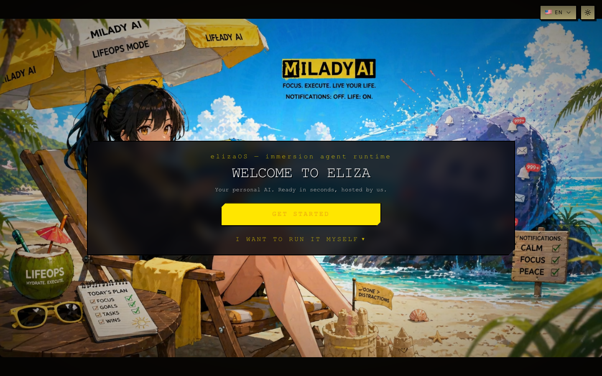
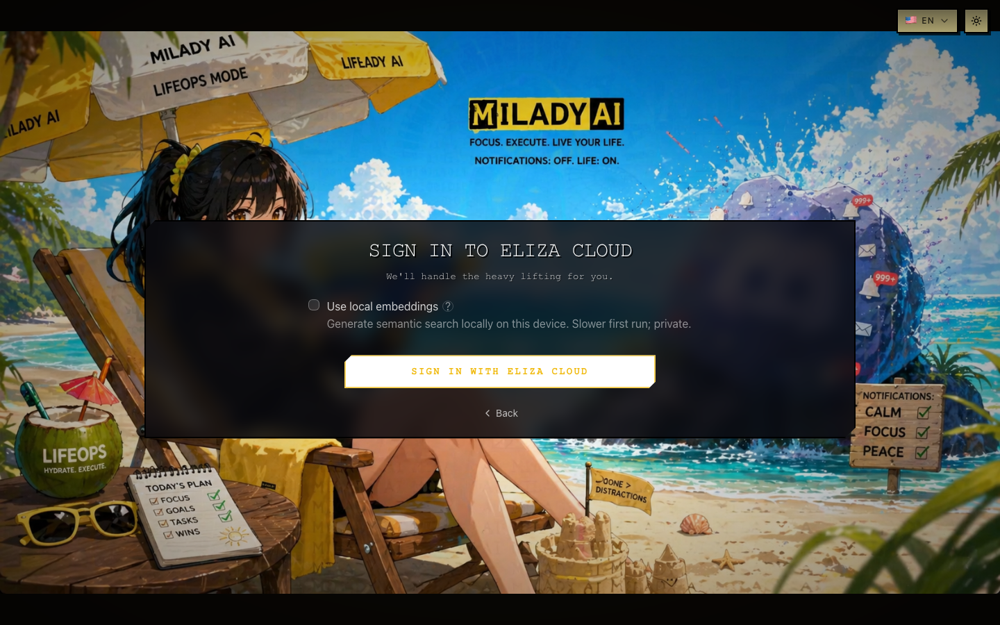
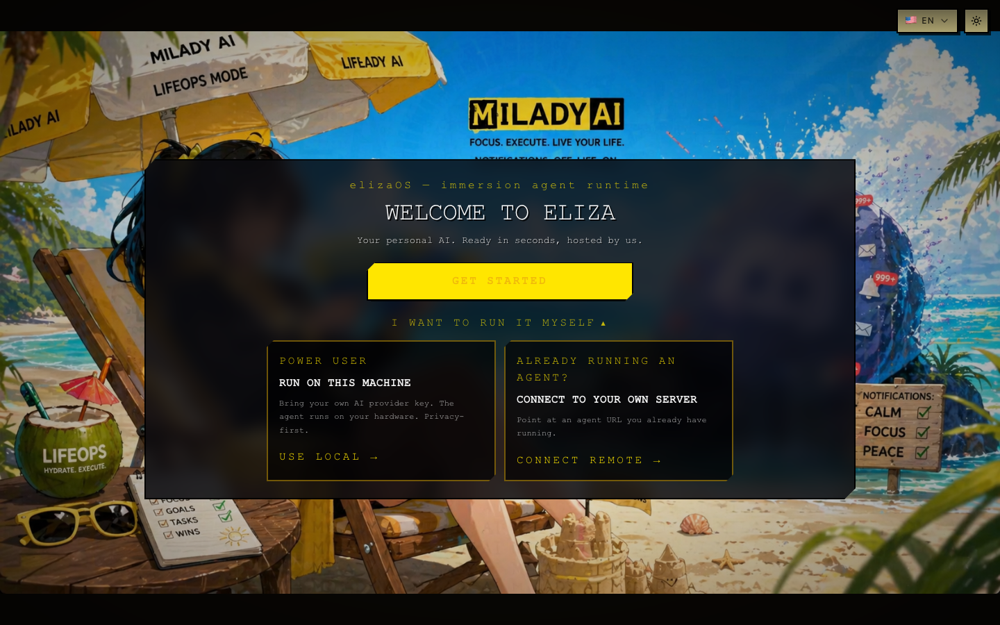
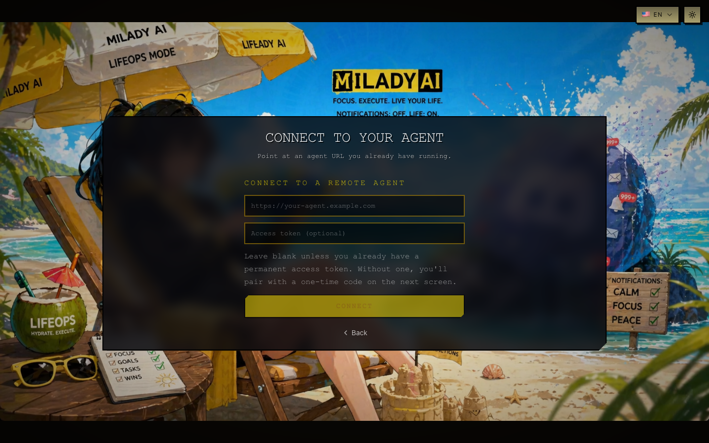
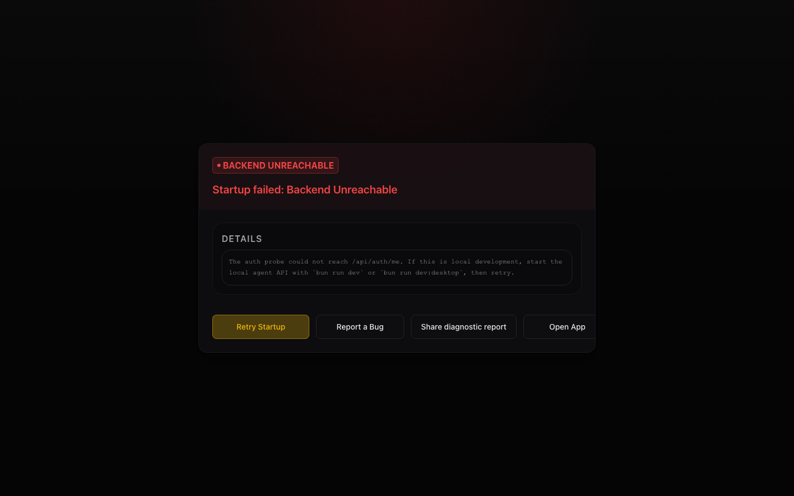
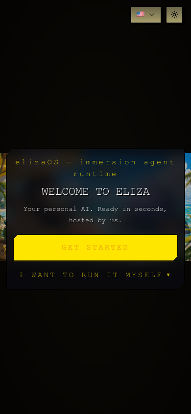
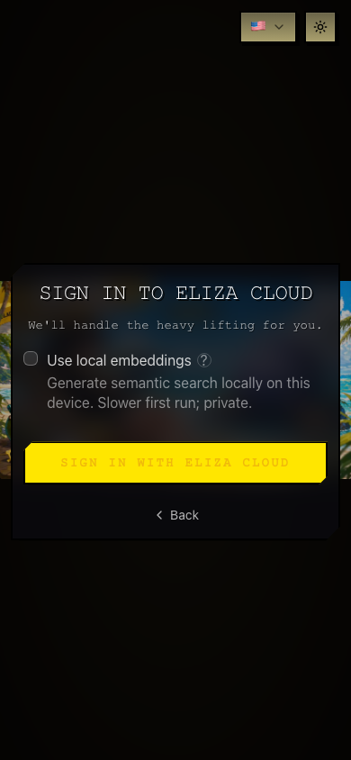

# Current Onboarding Research Report

Date: 2026-05-12

## Scope

This report reviews the current Eliza startup/onboarding implementation, captures its visual state from the local app, and assesses the gap against the proposed sky/cloud companion onboarding.

## Capture Notes

Screenshots were captured from the local Vite app with the mock API returning `onboardingComplete: false`.

Two harness-only workarounds were required:

- `onnxruntime-node` was stubbed because Vite dependency optimization attempted to bundle native `.node` files.
- `packages/app/src/main.tsx` was transformed in memory to add a `React` binding because this checkout emitted `React.createElement` and otherwise produced `ReferenceError: React is not defined`.

The first failed attempt produced a blank white page, which is relevant to the requested "no white blip" requirement. After the harness-only transform, the current onboarding screens rendered.

## Screenshot Gallery

### Desktop Welcome

### Desktop Cloud Sign-In

### Desktop Advanced Options

### Desktop Remote Form

### Desktop Local Click Failure

### Mobile Welcome

### Mobile Cloud Sign-In

## Current Implementation

### Startup Shell

The main app boot config is wired in `packages/app/src/main.tsx`. It registers branding, default apps, VRM assets, onboarding styles, companion shell, and desktop runtime hooks around `appBootConfig` at `packages/app/src/main.tsx:306`.

The UI root is gated by `StartupShell` before the app shell renders. `packages/ui/src/App.tsx:1190` makes the startup coordinator the authority for loading, pairing, onboarding, and error states.

### Runtime Gate

`packages/ui/src/components/shell/RuntimeGate.tsx:1` explicitly describes the current pre-chat setup as a single runtime decision: Cloud, Local, or Remote. It also states that LLM provider, subscriptions, connectors, and capabilities now happen inside chat/settings rather than the old wizard.

The current chooser prefers a primary Cloud path:

- `packages/ui/src/components/shell/RuntimeGate.tsx:1396` renders the chooser.
- `packages/ui/src/components/shell/RuntimeGate.tsx:1403` makes Get started choose Cloud first when available.
- `packages/ui/src/components/shell/RuntimeGate.tsx:1414` hides Local/Remote behind "I want to run it myself."
- `packages/ui/src/components/shell/RuntimeGate.tsx:1478` renders Cloud sign-in and provisioning.
- `packages/ui/src/components/shell/RuntimeGate.tsx:1644` still contains a Local provider/API-key wizard.

This is simpler than the removed multi-step wizard, but it conflicts with the new requirement that Cloud, Remote, and Local be visible equal choices during first setup.

### Language and Theme

`RuntimeGate` imports both `LanguageDropdown` and `ThemeToggle` at `packages/ui/src/components/shell/RuntimeGate.tsx:74`. Screenshots show both controls in the top right. The new flow should move language into onboarding and remove theme selection from onboarding entirely.

### Apps Navigation

User-facing navigation still says Apps:

- Navigation group label: `packages/ui/src/navigation/index.ts:202`.
- Tab title resolution: `packages/ui/src/navigation/index.ts:518`.
- App page components still use Apps naming, including `AppsPageView` and `AppsView`.

The new taxonomy needs a compatibility migration from Apps to Views.

### Dynamic Pages and Existing View-Like Architecture

`packages/ui/src/App.tsx:467` routes the active tab through `ViewRouter`. At `packages/ui/src/App.tsx:475`, dynamic plugin pages are already resolved before the switch statement. This is a useful foundation for plugin `views` registration.

### Local Model Download

`packages/ui/src/onboarding/auto-download-recommended.ts:1` already describes background auto-download of a recommended local model after Local mode. It waits for the local agent, gets the local inference hub, selects a recommended model, and starts download at `packages/ui/src/onboarding/auto-download-recommended.ts:85`.

Gap: the current user path can still look like "bring your own AI provider key" in the advanced local copy, and the local click captured a backend unreachable error in the mock desktop path. The proposed flow should make model download the first-class local onboarding behavior, not provider-key setup.

### Hardware Detection

`packages/app-core/src/services/local-inference/hardware.ts:1` probes RAM, GPU backend, VRAM, and architecture. Apple Silicon shared memory is considered in the bucket recommendation at `packages/app-core/src/services/local-inference/hardware.ts:23`. The fit assessment returns `fits`, `tight`, or `wontfit` at `packages/app-core/src/services/local-inference/hardware.ts:188`.

This is enough substrate for the new local warnings, but disk-space checks need to be added to the onboarding path.

### Kokoro Voice

The repo has Kokoro runtime scaffolding but not checked-in model weights:

- `packages/app-core/src/services/local-inference/voice/kokoro/kokoro-runtime.ts:1` describes ONNX, GGUF, and Python execution paths.
- `packages/app-core/src/services/local-inference/voice/kokoro/kokoro-runtime.ts:26` says the runtime itself does not auto-download in that session.
- Canonical model/voice URLs are documented at `packages/app-core/src/services/local-inference/voice/kokoro/kokoro-runtime.ts:28`.

Prototype audio in `docs/prototypes/onboarding-reimagined/audio/` was generated with the Python Kokoro package and the `hexgrad/Kokoro-82M` model.

## Design Assessment

### What Works

- The current runtime gate is materially simpler than the old multi-step wizard.
- The default Cloud path is clear for users who do not care where the agent runs.
- The visual background is brand-forward and memorable.
- The current code already has startup coordination, companion shell assets, desktop tray runtime, dynamic page routing, local inference hardware probing, and background model download pieces.

### What Does Not Work For The New Direction

- The current aesthetic is loud and retro: anime beach scene, high-contrast yellow, clipped panels, monospace type, heavy drop shadows. The requested direction is minimal future: Open Sans, blue sky, orange accents, white translucency, and fewer borders.
- The visual density is high before the user understands the product. The background competes with the runtime decision.
- Mobile welcome crops the branded image severely and leaves a large black region. It does not feel like a native companion start.
- Language and theme controls are global chrome, not part of a guided setup.
- Cloud sign-in is still a blocking panel, not an immediate conversation while provisioning continues.
- Cloud onboarding includes a local embeddings option on the sign-in panel. That is technically useful, but it increases cognitive load at the wrong moment.
- Local setup messaging says "Bring your own AI provider key," which conflicts with the new local model download requirement.
- The advanced local click failed in the mock desktop harness with "Backend Unreachable." Even if this is a test harness artifact, the new flow needs resilient local-download status and a useful blocked state.
- There is no first-class speaker/mic calibration.
- There is no compact companion chat as the start screen.
- Apps naming is still user-facing.
- Avatar customization is not presented as an editable character surface.

## Background Animation Assessment

The referenced CodePen (`https://codepen.io/najarro93/full/NWvmyGQ`) has the right conceptual feel: layered drifting cloud mass across a blue sky. It appears too fast for this product and should not be copied directly. The product implementation should be independent and tuned for:

- Slow parallax.
- Infinite repeat without visible seams.
- CSS compositor transforms or a low-cost canvas worker.
- Reduced motion support.
- Blue first paint before cloud module load.
- Agent-editable module boundaries.

## Voice and Speaker Research

Speaker diarization and recognition should be treated as probabilistic signals, not identity proof on their own.

Useful references:

- [pyannote.audio](https://pyannote.github.io/pyannote-audio/) is an open-source Python library with neural building blocks for speaker diarization.
- [pyannote/speaker-diarization on Hugging Face](https://huggingface.co/pyannote/speaker-diarization) shows the pipeline API and model task tags for speaker diarization, speaker-change detection, voice activity detection, and overlapped speech detection.
- [SpeechBrain ECAPA-TDNN docs](https://speechbrain.readthedocs.io/en/v1.0.3/API/speechbrain.lobes.models.ECAPA_TDNN.html) document ECAPA-TDNN as a speaker embedding model used for speaker verification.
- [SpeechBrain pretrained speaker verification tutorial](https://speechbrain.readthedocs.io/en/stable/tutorials/advanced/pre-trained-models-and-fine-tuning-with-huggingface.html) shows `speechbrain/spkrec-ecapa-voxceleb` for speaker verification from embeddings.
- [NIST Speaker and Language Recognition](https://www.nist.gov/programs-projects/speaker-and-language-recognition) describes systematic evaluation for speaker and language recognition technology.
- [NIST SRE site](https://sre.nist.gov/) frames speaker recognition evaluation around text-independent speaker recognition and calibration of technical capabilities.

Recommended architecture:

- Use VAD first to segment likely speech.
- Use diarization to partition speakers.
- Use embeddings for speaker similarity and clustering.
- Maintain rolling profile summaries instead of storing every raw embedding forever.
- Track profile quality: seconds of clean speech, noise, device/source, recency, and confidence.
- Never grant sensitive access on voice similarity alone. Require owner confidence plus context, or ask a private challenge.
- Keep local-first defaults for household voice profiles.

## Implications For The New Flow

- The requested experience is not a skin on `RuntimeGate`; it is a new startup product surface.
- The new Cloud setup needs a backend bridge, not just UI changes.
- Local setup needs status-driven model download UX, disk checks, and cloud fallback.
- Voice setup needs real platform capability work: audio output test, mic permission, input selection, waveform signal, and retry line playback.
- Apps-to-Views is a cross-repo naming/API migration.
- Dynamic background/avatar/view editing requires code sandbox, permissioning, version history, and rollback.

## Prototype

The mocked end-to-end prototype is at:

`docs/prototypes/onboarding-reimagined/index.html`

It includes:

- Blue first paint and slow independent cloud animation.
- Runtime choices: Cloud, Remote, Local.
- Language step.
- Speaker/mic setup with generated Kokoro audio.
- Owner fact collection.
- Companion chat with waveform avatar, compact messages, composer modes.
- Avatar presets.
- Views panel.
- Desktop bar mock.
- `BACKGROUND_EDIT` mock action.
