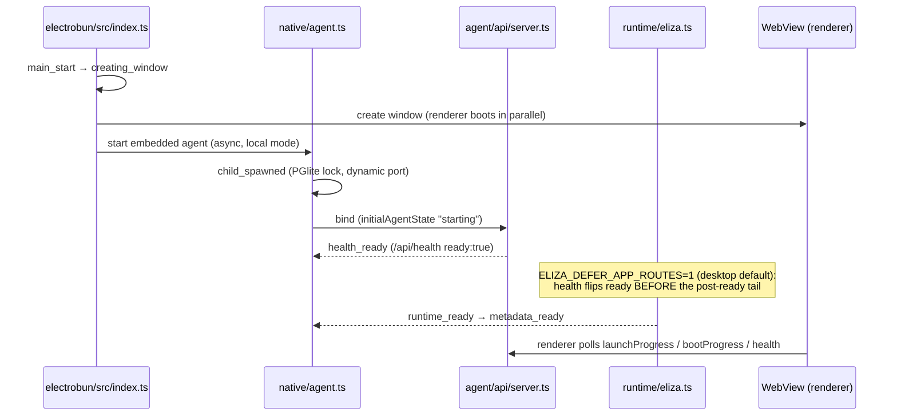

# Device agent boot & startup readiness

Issue: [#9565](https://github.com/elizaOS/eliza/issues/9565).

End-to-end cold-start story for an Eliza device agent — from process/app launch
to a usable agent — across desktop (Electrobun), Android, iOS (local + cloud),
and web/PWA (remote). It documents the boot sequence per platform, the renderer
startup-trace checkpoints, how to capture a trace, and the guardrails that keep
the first-paint critical path from silently expanding.

This complements the renderer-asset work in
[`frontend-performance-optimization-report.md`](./frontend-performance-optimization-report.md);
that report covers view/page module registration, this one covers the boot path.

> Non-goal (per #9565): this does **not** mark the agent ready before first-turn
> dependencies exist, and it does **not** add a second boot state machine — the
> sole startup authority is `useStartupCoordinator`
> (`packages/ui/src/state/useStartupCoordinator.ts`), the desktop launch gate is
> the Electrobun launch orchestrator, and backend timing stays in the agent boot
> telemetry. The renderer trace only **observes**.

---

## The four boot subsystems

A device launch spans four independently-instrumented systems:

| Subsystem | Owns | Source of truth |
|---|---|---|
| Renderer / app shell | First paint, startup shell, hydration | `packages/app/src/main.tsx`, `packages/ui/src/state/startup-coordinator.ts` |
| Native host | Window/WebView, child agent process, health polling | `packages/app-core/platforms/electrobun/src/` (desktop); Capacitor bridges (mobile) |
| Local API server | Binds `/api/*`, flips `/api/health ready:true` | `packages/agent/src/api/server.ts` |
| AgentRuntime boot | Plugin/service load, model handlers | `packages/agent/src/runtime/eliza.ts`, `boot-timer.ts`, `boot-telemetry.ts` |

---

## Renderer boot sequence (all platforms)

The renderer composition root is `packages/app/src/main.tsx`. The order, with the
`performance.mark()` checkpoints emitted by
`@elizaos/ui/state/startup-telemetry`:

```mermaid
sequenceDiagram
    participant HTML as index.html (FOUC)
    participant Main as main.tsx
    participant Mods as initializeAppModules
    participant Br as bridges
    participant React as React tree
    participant Shell as StartupShell
    participant Co as useStartupCoordinator

    HTML->>HTML: paint --launch-bg (#ef5a1f)
    Main->>Main: ⌖ module-eval
    Main->>Main: ⌖ main-start
    Main->>Mods: ⌖ app-modules:start
    Note over Mods: BLOCK on app-core + 3 companion modules only;<br/>7 plugins deferred until after React paint (see optimization below)
    Mods-->>Main: ⌖ app-modules:end (measure: app-modules)
    Main->>Br: ⌖ bridges:start (storage + platform bridges)
    Br-->>Main: ⌖ bridges:end (measure: bridges)
    Main->>React: ⌖ react-mount:start → createRoot().render()
    React-->>Main: ⌖ react-mount:end (measure: react-mount)
    React->>Shell: ⌖ startup-shell:first-paint
    Shell->>Co: drive state machine
    Co->>Co: ⌖ coordinator:restoring-session
    Co->>Co: ⌖ coordinator:polling-backend
    Co->>Co: ⌖ coordinator:starting-runtime
    Co->>Co: ⌖ coordinator:hydrating
    Co-->>Shell: ⌖ coordinator:ready (usable agent)
```

Coordinator phases (`startup-coordinator.ts`):
`restoring-session → resolving-target → polling-backend → starting-runtime →
hydrating → ready`, with `pairing-required` / `first-run-required` / `error`
gates. `cloud-managed` and `remote-backend` targets skip local-runtime startup
(`startup-phase-runtime.ts`).

### Checkpoint catalog

| Checkpoint | Meaning |
|---|---|
| `module-eval` | First renderer JS after the import graph evaluates |
| `main-start` | `main()` entered |
| `app-modules:start` / `:end` | `initializeAppModules()` blocking window (span `app-modules`) |
| `bridges:start` / `:end` | storage + platform (iOS/Android) bridge install (span `bridges`) |
| `react-mount:start` / `:end` | `createRoot().render()` (span `react-mount`) |
| `startup-shell:first-paint` | the startup front door has painted (renderer-only; no backend needed) |
| `coordinator:<phase>` | first entry into each coordinator phase |
| `coordinator:ready` | backend reached, conversation hydrated, agent usable |

All marks are mirrored onto `window.__ELIZA_STARTUP_TRACE__`
(`{ traceId, timeOrigin, marks[] }`) and emitted as real `performance.mark()`s
prefixed `eliza.startup:`, so they appear in the Performance panel and
`performance.getEntriesByType("mark")`.

---

## Per-platform boot

### Desktop (Electrobun, local runtime)



- Native host trace: `electrobun/src/startup-trace.ts` (phases `main_start`,
  `creating_window`, `child_spawned`, `health_ready`, `runtime_ready`,
  `metadata_ready`; state/events files keyed by `session_id`).
- `boot-progress.ts` composes typed progress from `AgentManager.getStatus()` +
  `/api/health`; `launch-orchestrator.ts` aggregates agent/boot/auth/first-run.
- Desktop-spawned agents default `ELIZA_DEFER_APP_ROUTES=1`
  (`applyDesktopDeferAppRoutesPolicy()`), so `/api/health` flips ready before
  app-route plugins, training hooks, sensitive adapters, trigger bridge,
  connector catalog, and voice warmup finish.

### Android (local, in-process bionic agent)

`main.tsx` installs `installAndroidNativeAgentFetchBridge()`; `/api/*` fetches
route through the native `Agent` Capacitor plugin to the in-process agent. No
loopback TCP port. The renderer trace is identical; native readiness is exposed
through the same coordinator polling.

### iOS local (full-Bun runtime)

`main.tsx` installs `installIosLocalAgentNativeRequestBridge()` +
`installIosLocalAgentFetchBridge()`; `eliza-local-agent://ipc` and loopback
fetches resolve to `ElizaBunRuntime` (`@elizaos/app-core/api/ios-local-agent-transport`).

### iOS cloud / web-PWA (remote backend)

Coordinator target `cloud-managed` / `remote-backend` skips local-runtime
startup entirely and polls the remote `/api/health`; the renderer trace stops at
`coordinator:polling-backend → ready` with no `starting-runtime` local boot.

### Backend boot phases (`agent/src/runtime/eliza.ts`)

`blocking static plugin imports → pre-resolve setup → blocking plugin
resolution/import → SQL + local-inference preregister + runtime initialize →
server binds → (deferred) plugin imports/registration → TEE, embedding re-probe,
bundled docs, web search, autonomy, agent skills, wallet warmup, validation`.
`boot-timer.ts` logs per-phase laps; `boot-telemetry.ts` persists
`<stateDir>/telemetry/boot/latest.json` + restart events.

---

## Unified trace id (cross-process correlation)

The renderer trace adopts a native-host-injected id when present so one launch
shares a single id end to end:

- Native host (Electrobun / Capacitor) injects
  `window.__ELIZA_STARTUP_TRACE_ID__` ahead of renderer JS (same mechanism as
  `window.__ELIZA_APP_API_BASE__`, `apiBaseOwner.injectIntoHtml`). The value
  should be the host startup-trace `session_id`.
- Electrobun's static-server HTML path now injects that startup-trace
  `session_id` through `apiBaseOwner.injectIntoHtml`, so desktop renderer marks
  adopt the host id before module evaluation.
- Android's Capacitor host now exposes a process-local startup trace id through
  the synchronous `window.ElizaNative.getStartupTraceId()` bridge and passes the
  same value into the local agent as `ELIZA_STARTUP_TRACE_ID`, so renderer marks,
  restart events, and `<stateDir>/telemetry/boot/latest.json` can be correlated
  on Android device boots.
- iOS's Capacitor host now uses an `ElizaBridgeViewController` document-start
  `WKUserScript` to inject `window.__ELIZA_STARTUP_TRACE_ID__` before renderer
  module evaluation. The iOS full-Bun local runtime passes that same id into the
  agent env as `ELIZA_STARTUP_TRACE_ID`, so renderer marks and
  `<stateDir>/telemetry/boot/latest.json` can be correlated on iOS local boots.
- The renderer reads it (`initStartupTrace()` →
  `STARTUP_TRACE_ID_WINDOW_KEY`, then Android's bridge fallback); absent an
  injected/native id it derives a
  renderer-local id and still records `timeOrigin` (epoch ms), so traces can be
  aligned by wall-clock even before the id seam is wired.

> Wiring status: renderer adoption, Electrobun injection, Android bridge/env
> propagation, and iOS document-start injection/full-Bun env propagation now
> ship together.

---

## Capturing a trace

```bash
# Boot a dev server first (renderer on $ELIZA_UI_PORT, default 2138):
bun run dev            # or: bun run dev:desktop for the Electrobun renderer

# Renderer-only first-paint trace (no backend / model key needed):
bun run --cwd packages/app trace:startup --out /tmp/startup-trace.json

# Full boot to a usable agent (needs a reachable backend):
bun run --cwd packages/app trace:startup --wait-ready --runs 2 \
  --out .github/issue-evidence/9565-startup-trace.json
```

`--runs 2` captures cold + warm. The harness
(`scripts/capture-startup-trace.mjs`) loads the renderer in headless Chromium,
waits for `startup-shell:first-paint` (or `coordinator:ready` with
`--wait-ready`), and prints the per-checkpoint timeline + Δ between checkpoints.
Point `--url` at the Electrobun dev renderer or a device-tunnelled WebView to
trace those paths.

### Baseline matrix status

| Path | Capturable here | Notes |
|---|---|---|
| Web / PWA (remote) | ✅ harness | repeatable in CI behind a dev server; M4 Max Vite-dev baseline captured in `.github/issue-evidence/9565-startup-readiness/desktop-web-renderer-trace-m4max.json` |
| Desktop Electrobun renderer | ✅ harness (`--url`) | same renderer trace inside the WebView; use `--url` against the Electrobun renderer |
| Android / iOS local | device-only | renderer trace identical; needs a real device/sim + the `--url` device tunnel |
| iOS cloud | device-only | remote target; stops at `coordinator:ready` with no local boot |

### Checked-in baseline: M4 Max desktop web renderer

Evidence lives in
`.github/issue-evidence/9565-startup-readiness/desktop-web-renderer-trace-m4max.json`
with a short index at
`.github/issue-evidence/9565-startup-readiness/README.md`.

Captured on 2026-06-24 local / 2026-06-25 UTC from `bun run --cwd packages/app
trace:startup -- --runs 2` against Vite dev on `http://localhost:2138`.

| Run | Kind | `app-modules` | `react-mount:end` | `startup-shell:first-paint` | Last coordinator mark |
|---|---:|---:|---:|---:|---|
| 0 | cold | 109 ms | 117 ms | 16021 ms | `coordinator:restoring-session` |
| 1 | warm | 381 ms | 382 ms | 1402 ms | `coordinator:first-run-required` |

Interpretation: the first-paint import reduction is visible in the small
`app-modules` span. The remaining cold Vite-dev delay is after React dispatch,
so the next local optimization target is renderer/UI paint and dev module
evaluation rather than the boot-config import batch.

On-device baseline already recorded on the issue (physical Pixel 9a):
`/api/health ready` shortly after launch; warm generation ~0.6–1.0 tok/s
(prompt-eval-dominated cold path) — a concrete decode-warmup target, separate
from the boot critical path this doc covers.

---

## Optimization landed: shrink the first-paint critical path

`initializeAppModules()` blocked the first React mount on **9** plugin imports,
but the boot config only reads **3** of them synchronously (companion app
registration + scene-status hook + inference-notice resolver). The other 6
(`personal-assistant`, `task-coordinator` ×2, `phone`, `steward`,
`training`) were awaited purely for self-registration side effects and to
pre-warm their `React.lazy` chunks — none feeds the boot config build.

Those 7 now ride the existing idle path (`BOOT_CONFIG_DEFERRED_MODULE_LOADERS`
via `scheduleAppModuleIdleLoads`), exactly like `SIDE_EFFECT_APP_MODULE_LOADERS`,
and the idle wave is kicked only after React has had a paint opportunity. The
blocking `await Promise.all` is 3 imports instead of 9; their nav tabs / overlay
apps register a tick later (and on-demand render still triggers the cached
import if idle work has not run), so no surface is missed. The `app-modules`
`performance.measure` quantifies the win per boot.

---

## Guardrails

| Guard | What it pins |
|---|---|
| `packages/app/test/first-paint-guard.test.ts` | `initializeAppModules()` blocks only on the 3 allow-listed companion importers; the 7 heavy plugins stay deferred; React mounts after app modules |
| `packages/app/test/brand-surface.test.ts` | every boot/loading/launch surface = `#ef5a1f` (= `DEFAULT_BACKGROUND_COLOR`), including native Android splash bitmap corners and the solid iOS launch view; brand accent stays `#FF5800` |
| `packages/ui/src/state/startup-telemetry.test.ts` | trace recording, dedup, host-id adoption, window mirror |

## Boot/launch orange

All boot/loading/launch surfaces use `#ef5a1f` (the default home
`ShaderBackground`, `DEFAULT_BACKGROUND_COLOR`) so the native splash → React
StartupShell → home transition is one seamless orange with no flash. The brand
accent (logos, brand surfaces) stays `#FF5800`. Surfaces: `index.html` FOUC,
React `StartupShell` (`--launch-bg`), `capacitor.config.ts`, `app.config.ts` web
colors + PWA manifest, Android `colors.xml`/`styles.xml` launch resources plus
the tracked `splash.png` density bitmaps, and the iOS solid-color
`LaunchScreen.storyboard` view. iOS intentionally does not put a full-screen
image above the launch backdrop; otherwise the configured launch orange is
hidden and the first visible frame can diverge from home.
