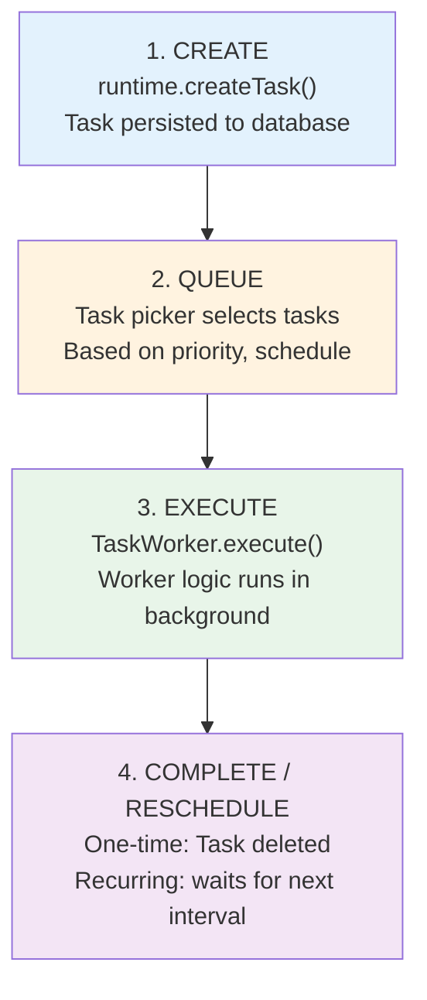

## The Problem

Some operations take too long for a request/response cycle:

- Scraping a website every hour
- Processing a large file upload
- Syncing with external APIs periodically
- Generating weekly reports

Blocking the main thread kills responsiveness. Polling wastes resources.

<Tip>
  **Task workers handle the heavy lifting.** Register a worker, create tasks,
  and ElizaOS executes them in the background with built-in persistence and
  scheduling.
</Tip>

## Quick Start

### 1. Define a Task Worker

```typescript
import type { TaskWorker } from "@elizaos/core";

const dataSync: TaskWorker = {
  name: "SYNC_EXTERNAL_DATA",

  async execute(runtime, options, task) {
    const { sourceUrl, batchSize = 100 } = options;

    // Fetch data from external source
    const response = await fetch(sourceUrl);
    const data = await response.json();

    // Process in batches
    for (let i = 0; i < data.length; i += batchSize) {
      const batch = data.slice(i, i + batchSize);
      await processRecords(runtime, batch);
    }

    console.log(`Synced ${data.length} records from ${sourceUrl}`);
  },

  // Optional: validate before creating task
  async validate(runtime, message, state) {
    return message.content.text?.includes("sync");
  },
};
```

### 2. Register the Worker

```typescript
// In your plugin initialization
const plugin: Plugin = {
  name: "my-sync-plugin",

  async init(runtime) {
    // Register the task worker
    runtime.registerTaskWorker(dataSync);
  },
};
```

### 3. Create Tasks

```typescript
// One-time task
const taskId = await runtime.createTask({
  name: "SYNC_EXTERNAL_DATA",
  description: "Sync user data from CRM",
  roomId: context.roomId,
  tags: ["sync", "crm"],
  metadata: {
    sourceUrl: "https://api.crm.com/users",
    batchSize: 50,
  },
});

// Recurring task (runs every hour)
await runtime.createTask({
  name: "SYNC_EXTERNAL_DATA",
  description: "Hourly CRM sync",
  tags: ["sync", "crm", "scheduled"],
  metadata: {
    sourceUrl: "https://api.crm.com/users",
    updateInterval: 60 * 60 * 1000, // 1 hour in ms
  },
});
```

## Task Lifecycle



## Task Types

### Task Interface

```typescript
interface Task {
  id?: UUID; // Auto-generated if not provided
  name: string; // Must match a registered TaskWorker.name
  description: string; // Human-readable purpose
  roomId?: UUID; // Associate with a room
  worldId?: UUID; // Associate with a world
  entityId?: UUID; // Associate with an entity
  tags: string[]; // For filtering and organization
  metadata?: TaskMetadata; // Custom options and scheduling
  updatedAt?: number; // Last execution timestamp
}
```

### Task Metadata

```typescript
type TaskMetadata = {
  // Scheduling
  updateInterval?: number; // Recurring interval in ms

  // UI configuration (optional)
  options?: {
    name: string;
    description: string;
  }[];

  // Custom data (passed to execute())
  [key: string]: unknown;
};
```

### TaskWorker Interface

```typescript
interface TaskWorker {
  name: string; // Unique identifier

  execute: (
    runtime: IAgentRuntime,
    options: Record<string, unknown>, // From task.metadata
    task: Task,
  ) => Promise<void>;

  validate?: (
    // Optional pre-creation check
    runtime: IAgentRuntime,
    message: Memory,
    state: State,
  ) => Promise<boolean>;
}
```

## Managing Tasks

### Query Tasks

```typescript
// Get tasks by room
const roomTasks = await runtime.getTasks({
  roomId: "room-uuid",
});

// Get tasks by tags
const syncTasks = await runtime.getTasks({
  tags: ["sync"],
});

// Get tasks by entity
const userTasks = await runtime.getTasks({
  entityId: "user-uuid",
});

// Get tasks by name
const allSyncWorkers = await runtime.getTasksByName("SYNC_EXTERNAL_DATA");

// Get specific task
const task = await runtime.getTask("task-uuid");
```

### Update Tasks

```typescript
await runtime.updateTask(taskId, {
  description: "Updated description",
  metadata: {
    ...existingMetadata,
    sourceUrl: "https://new-api.example.com",
  },
});
```

### Delete Tasks

```typescript
// Stop a recurring task
await runtime.deleteTask(taskId);
```

## Recurring Tasks

Set `metadata.updateInterval` to create tasks that run periodically:

```typescript
// Daily summary at midnight
await runtime.createTask({
  name: "DAILY_SUMMARY",
  description: "Generate daily activity summary",
  tags: ["scheduled", "daily"],
  metadata: {
    updateInterval: 24 * 60 * 60 * 1000, // 24 hours
  },
});

// Check external service every 5 minutes
await runtime.createTask({
  name: "HEALTH_CHECK",
  description: "Ping external service",
  tags: ["scheduled", "monitoring"],
  metadata: {
    updateInterval: 5 * 60 * 1000, // 5 minutes
    serviceUrl: "https://api.example.com/health",
  },
});
```

## Error Handling

Handle errors gracefully in your workers:

```typescript
const robustWorker: TaskWorker = {
  name: "ROBUST_SYNC",

  async execute(runtime, options, task) {
    try {
      await performSync(options);
    } catch (error) {
      // Log the error
      console.error(`Task ${task.id} failed:`, error);

      // Optionally update task with error info
      if (task.id) {
        await runtime.updateTask(task.id, {
          metadata: {
            ...task.metadata,
            lastError: error.message,
            lastErrorAt: Date.now(),
          },
        });
      }

      // Re-throw to mark task as failed
      // Or swallow to silently continue (for recurring tasks)
      throw error;
    }
  },
};
```

## Best Practices

<CardGroup cols={2}>
  <Card title="Keep workers idempotent" icon="rotate">
    Tasks may be retried on failure. Design workers to handle duplicate
    execution safely.
  </Card>
  <Card title="Use meaningful tags" icon="tags">
    Tags make querying easier. Use consistent naming like `sync:crm`,
    `schedule:daily`.
  </Card>
  <Card title="Set reasonable intervals" icon="clock">
    Avoid too-frequent recurring tasks. Consider rate limits and system load.
  </Card>
  <Card title="Validate before creating" icon="check">
    Use the `validate` function to prevent invalid tasks from being queued.
  </Card>
</CardGroup>

## Common Patterns

### Triggered by Actions

```typescript
const scheduleAction: Action = {
  name: "SCHEDULE_REPORT",
  description: "Schedule a background report generation",

  async handler(runtime, message, state) {
    const taskId = await runtime.createTask({
      name: "GENERATE_REPORT",
      description: "Weekly analytics report",
      roomId: message.roomId,
      tags: ["report", "analytics"],
      metadata: {
        format: "pdf",
        recipients: ["team@example.com"],
      },
    });

    return {
      text: `Report scheduled. Task ID: ${taskId}`,
      action: "SCHEDULE_REPORT",
      success: true,
      data: { taskId },
    };
  },
};
```

### With Progress Updates

```typescript
const progressWorker: TaskWorker = {
  name: "LONG_PROCESSING",

  async execute(runtime, options, task) {
    const items = options.items as string[];
    let processed = 0;

    for (const item of items) {
      await processItem(item);
      processed++;

      // Update progress in metadata
      if (task.id && processed % 10 === 0) {
        await runtime.updateTask(task.id, {
          metadata: {
            ...task.metadata,
            progress: Math.round((processed / items.length) * 100),
          },
        });
      }
    }
  },
};
```

### Chained Tasks

```typescript
const step1Worker: TaskWorker = {
  name: "PIPELINE_STEP_1",

  async execute(runtime, options, task) {
    const result = await doStep1();

    // Create next step
    await runtime.createTask({
      name: "PIPELINE_STEP_2",
      description: "Continue pipeline",
      roomId: task.roomId,
      tags: task.tags,
      metadata: {
        previousResult: result,
        pipelineId: options.pipelineId,
      },
    });
  },
};
```

## Next Steps

<CardGroup cols={2}>
  <Card
    title="Actions Reference"
    icon="bolt"
    href="/plugins/components#actions"
  >
    Trigger tasks from agent actions
  </Card>
  <Card title="Events System" icon="bell" href="/runtime/events">
    Monitor task lifecycle with events
  </Card>
  <Card
    title="Jobs API"
    icon="briefcase"
    href="/rest-reference/jobs/create-job"
  >
    External task creation via REST
  </Card>
  <Card title="Database Adapter" icon="database" href="/runtime/core#database">
    Task persistence internals
  </Card>
</CardGroup>
