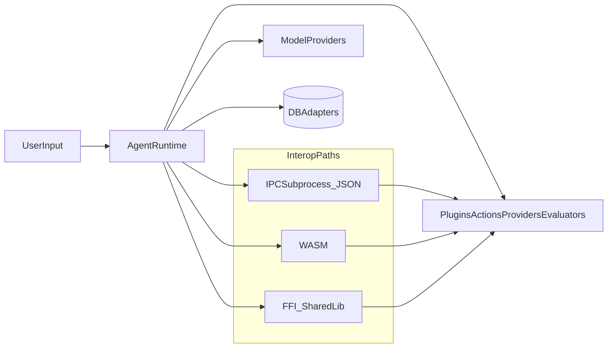

## What this document is (and is not)

SOC 2 is an **organization-level attestation** covering people, process, and technology. This repository (as an OSS library/SDK) cannot be “SOC 2 compliant” by itself.

This guide documents **SOC 2–aligned engineering defaults** and **operator guidance** for downstream teams building a SOC 2–scoped service on top of elizaOS packages.

## System boundary (OSS library scope)

Within this repository, the SOC 2–relevant components are the runtimes and interoperability layers:

- `packages/typescript` (`@elizaos/core`)
- `packages/python` (`elizaos`)
- `packages/rust` (`elizaos`)
- `packages/interop` (`@elizaos/interop` + Python/Rust helpers)
- `packages/prompts` (`@elizaos/prompts`)

Anything outside these packages (your deployment, infrastructure, access controls, monitoring, incident response, vendor management) is **owned by the operator**.

## Data classification (practical)

In typical deployments:

- **PII** may appear in `Memory` and `State` (messages, usernames, IDs, metadata, attachments).
- **Secrets** may exist in environment variables and runtime settings (API keys, OAuth tokens, service credentials).
- **Confidential customer data** may be present in embeddings, logs, and prompt context depending on integration choices.

Default stance for SOC 2: treat `Memory`, `State`, logs, and prompt context as **Confidential**.

## High-level data flow

## Control mapping (Trust Services Criteria)

This is a practical mapping of what the codebase helps with vs what operators must implement.

### Security (CC series)

- **Codebase support**
  - Redaction-first logging in TypeScript core (`packages/typescript/src/logger.ts`) and Python core (`packages/python/elizaos/logger.py`).
  - Secret encryption for stored settings/secrets with authenticated encryption (v2 AES-GCM) and legacy read support.
  - Interop limits and safer defaults (message size limits, max pending requests, WASM size/memory caps).
  - CI checks for prompt templates to avoid accidental secret commits.
- **Operator responsibilities**
  - Access control, authn/z, key management (KMS/HSM), secret rotation.
  - Network egress controls and sandboxing constraints for untrusted plugins.
  - Vulnerability management program (triage, remediation SLAs).

### Availability

- **Codebase support**
  - Timeouts in IPC bridge, bounded buffers, and coarse WASM limits.
- **Operator responsibilities**
  - Capacity planning, autoscaling, DDoS protection, SLOs, monitoring/alerting, incident response.

### Confidentiality

- **Codebase support**
  - Redaction controls in logs, authenticated secret encryption for stored settings.
- **Operator responsibilities**
  - Encryption at rest/in transit in your storage and network, retention policies, least-privilege access.

### Processing Integrity

- **Codebase support**
  - Typed interfaces and cross-language parity tests, deterministic UUID generation, consistent serialization semantics.
- **Operator responsibilities**
  - End-to-end validation for external integrations, reconciliation/monitoring for automated actions.

### Privacy

- **Codebase support**
  - Guidance and guardrails (prompt secret scanning, redaction primitives).
- **Operator responsibilities**
  - Privacy notice, consent, data subject request workflows, deletion policies, vendor DPAs.

## Package-specific notes

### `packages/interop`

- **FFI is not sandboxed**. Treat FFI-loaded plugins as fully trusted native code.
- IPC and WASM isolate memory space but still require **operator enforcement** for network/filesystem access and resource caps.
- For TypeScript→Python IPC, consider `inheritEnv: false` and pass only required env vars for the plugin.

### `packages/prompts`

- Prompts are source-controlled and often distributed. Do not embed real secrets.
- Run `npm run check:secrets` in `packages/prompts` to catch obvious credential strings.

### `packages/typescript`, `packages/python`, `packages/rust` (core runtimes)

- Secrets/settings encryption uses a **versioned envelope**:
  - **v2**: `v2:<ivHex>:<ciphertextHex>:<tagHex>` (AES-256-GCM, AAD = `elizaos:settings:v2`)
  - **v1 legacy**: `<ivHex>:<ciphertextHex>` (AES-256-CBC) is still readable for backward compatibility.
- If you have persisted v1 values, use the migration helpers to re-encrypt as v2.

## Operator checklist (evidence-friendly)

- **Secrets**
  - Set `SECRET_SALT` to a strong, unique value per environment.
  - In production (`NODE_ENV=production`), the core settings helpers **fail closed** if `SECRET_SALT` is unset/default (`secretsalt`). You can override with `ELIZA_ALLOW_DEFAULT_SECRET_SALT=true` (not recommended).
  - Store secrets in a managed secret store; avoid long-lived plaintext in env where possible.
  - Migrate legacy encrypted values to v2.

- **Logging**
  - Enable redaction in production.
  - Review log sinks (SIEM, APM) and ensure retention/access controls match data classification.
  - Avoid sending PII to third-party telemetry unless explicitly configured and permitted.

- **Plugins / interop**
  - Decide whether plugins are **trusted** or **untrusted**.
  - For untrusted plugins, enforce OS/container sandboxing, egress controls, and strict resource limits.

- **Supply chain**
  - Use SBOM artifacts and vulnerability reports from CI for evidence.
  - Track remediation SLAs and approvals for dependency updates.

## Production readiness checklist (deployment)

This is an operator-focused “final checklist” for deploying a service that embeds these packages.

- **Tests (real execution)**
  - TypeScript core: `bun run test:core`
  - TypeScript interop: `cd packages/interop && bun run test`
  - Python core: `cd packages/python && python -m pytest -q`
  - Python interop: `cd packages/interop/python && python -m pytest -q`
  - Rust core: `cd packages/rust && cargo test -q`

- **Configuration (no hardcoded secrets)**
  - Set `SECRET_SALT` (unique per env).
  - For IPC subprocesses: prefer not inheriting the full parent environment; pass only what the plugin needs.
  - Use CI secret storage (GitHub Actions secrets/vars) and a runtime secret store (KMS/Secrets Manager) in production deployments.

- **Monitoring & alerting**
  - This repository does **not** ship a metrics/tracing exporter “out of the box”. What it provides is:
    - structured logs with stable `src` fields (and, for key interop paths, stable `event` codes)
    - bounded-resource failure modes (limits cause explicit termination + error logs)
  - Production deployments should ship logs to a centralized log sink (SIEM/APM) and alert on (examples):
    - plugin subprocess exits / crashes
    - repeated IPC parse failures / message limit terminations
    - action failures or validation failures above threshold
    - abnormal latency / queue growth in embedding/task services
  - Suggested log-based alert queries (vendor-agnostic):
    - `event=interop.ipc.stdout_buffer_exceeded OR event=interop.ipc.message_exceeded OR event=interop.ipc.parse_failed`
    - `event=core.settings.default_secret_salt` (should be 0 in production)
    - `src=interop:python-bridge AND (stream=stderr)` with elevated rate

- **Rollback path**
  - Pin released versions (SemVer) and roll back by reverting to a prior known-good version/tag.
  - Keep persisted secret formats backward-readable (v1→v2) and prefer additive migrations.
  - For deployments, treat lockfiles as part of rollback (revert lockfile + version).

- **Performance**
  - Establish an expected load model (requests/sec, plugin concurrency, prompt sizes) and validate with your infra.
  - Quick crypto throughput sanity check: `cd packages/typescript && bun run perf:settings`
  - Use the benchmark suites in `benchmarks/` and `benchmark_results/` as starting points, and add deployment-specific load tests.

## Lockfiles / reproducible installs (operator guidance)

- **JavaScript/TypeScript**: `bun.lock` pins the workspace dependency graph when installing with Bun.
- **Rust**: `packages/rust/Cargo.lock` is committed; CI runs `cargo ... --locked` to enforce it.
- **Python**: `packages/python/requirements.lock` and `packages/python/requirements-dev.lock` are generated via `pip-compile` and used by CI to pin transitive dependencies.

## Evidence artifacts in this repo

- `SECURITY.md` (vulnerability reporting)
- `.github/workflows/codeql.yml` (static analysis)
- `.github/workflows/supply-chain.yaml` (SBOM + vulnerability scan artifacts)
- `.github/workflows/ci.yaml` (tests, including prompt secret scan)
