# Farcaster Cast Flow

## Overview

This document provides a visual and detailed explanation of how the Farcaster plugin processes casts, from initial receipt through evaluation, response generation, and posting.

## Cast Processing Pipeline

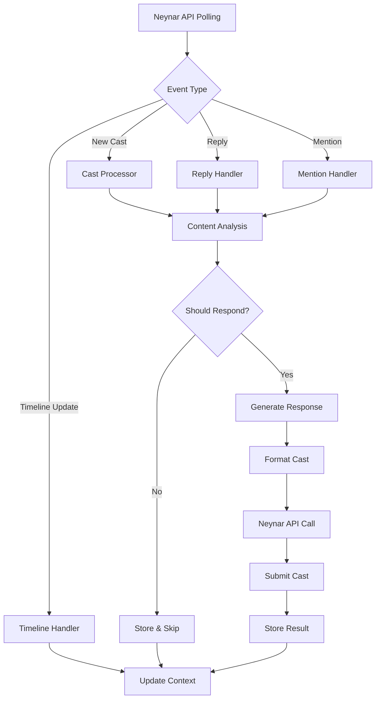

## Detailed Flow Stages

### 1. Event Reception

The plugin polls the Neynar API for relevant events and interactions:

```typescript
// Neynar API polling for mentions and timeline
setInterval(async () => {
  const mentions = await neynarClient.fetchMentions({
    fid: agentFid,
    limit: 10
  });
  
  const timeline = await neynarClient.fetchTimeline({
    fid: agentFid,
    type: 'ForYou'
  });
  
  await processEvents(mentions, timeline);
}, FARCASTER_POLL_INTERVAL * 60000);
```

### 2. Event Classification

Events are classified and routed to appropriate handlers:

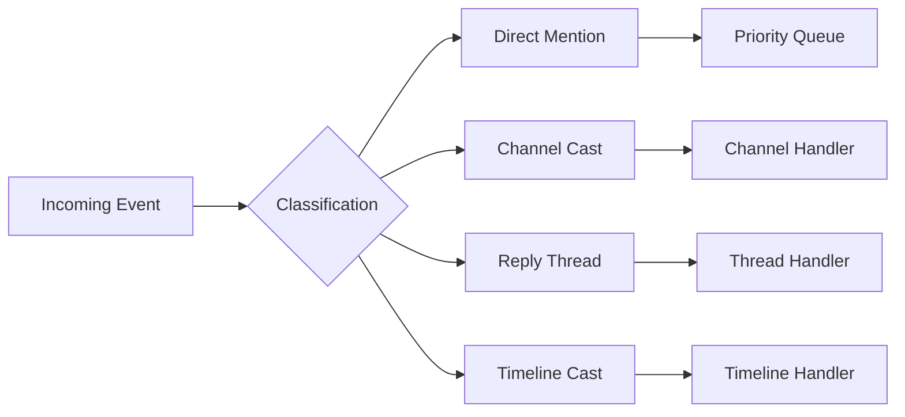

### 3. Content Analysis

Each cast undergoes multi-stage analysis:

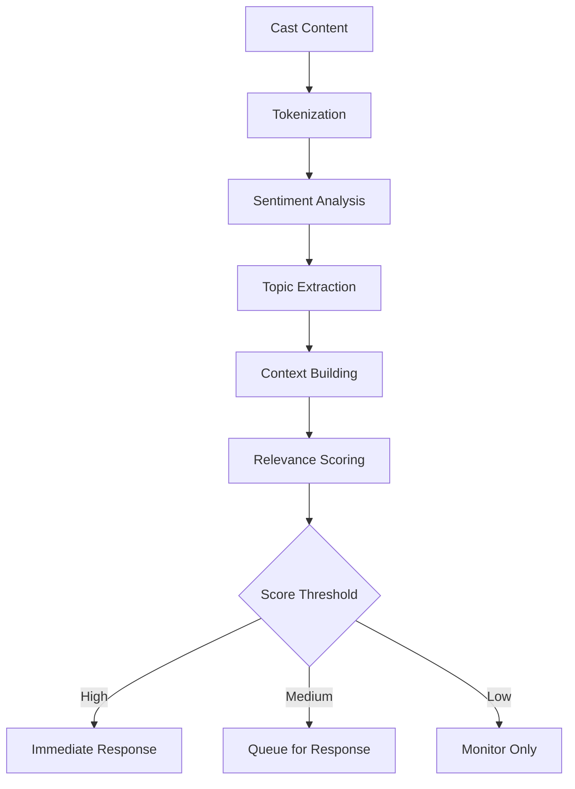

### 4. Response Decision Tree

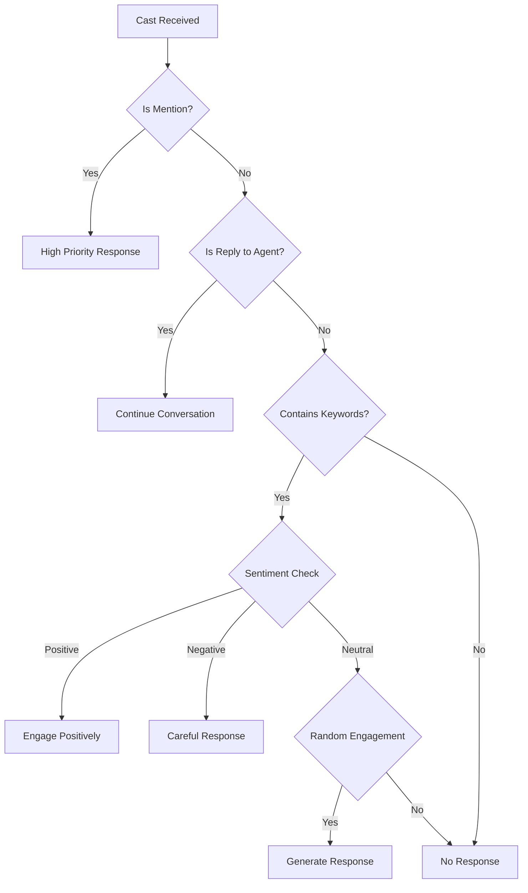

### 5. Response Generation

The response generation process:

```typescript
async function generateResponse(context: CastContext): Promise<string> {
  // 1. Build conversation history
  const thread = await getThreadContext(context.parentHash);
  
  // 2. Extract key topics
  const topics = extractTopics(context.text);
  
  // 3. Generate appropriate response
  const response = await llm.generate({
    system: character.personality,
    context: thread,
    topics: topics,
    maxLength: 320
  });
  
  // 4. Validate and format
  return formatCast(response);
}
```

### 6. Cast Composition

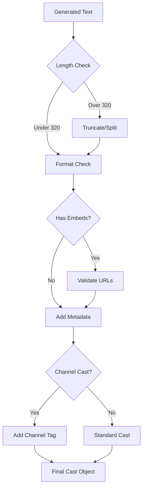

### 7. Cast Publishing via Neynar

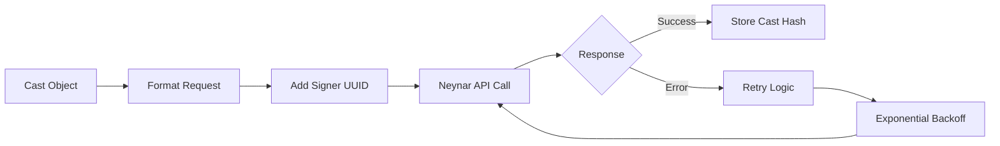

## Interaction Patterns

### Reply Chains

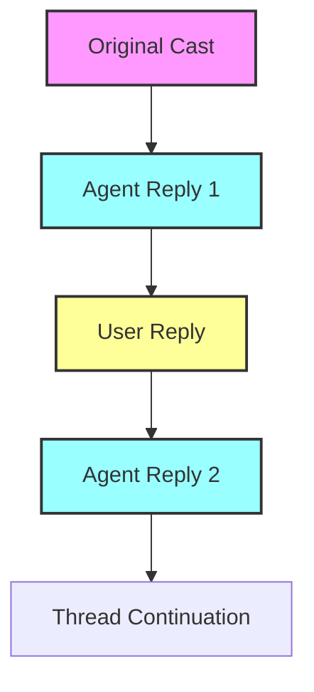

### Channel Participation

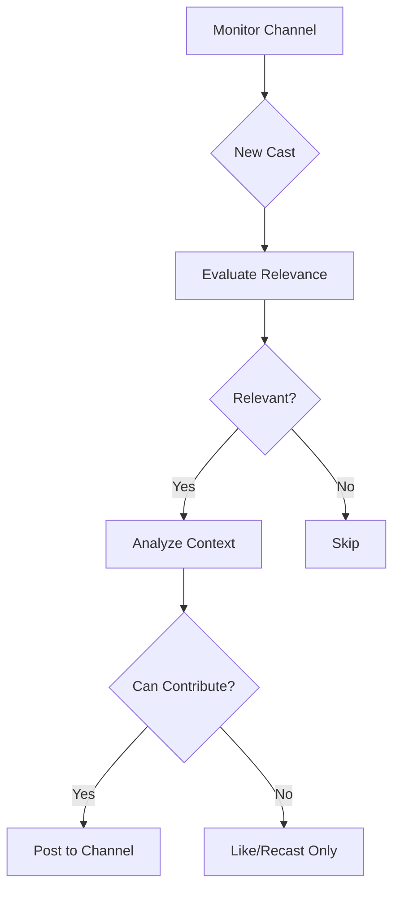

## Rate Limiting & Throttling

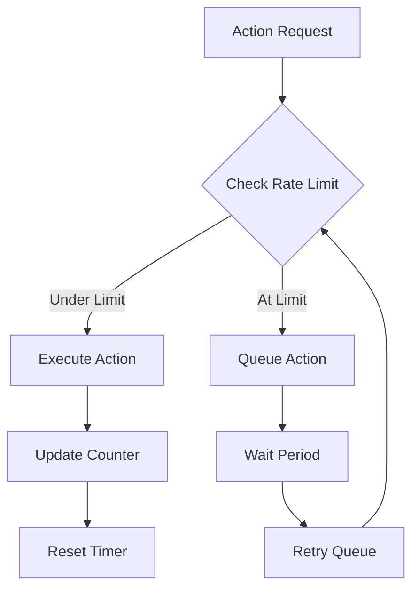

## Error Handling Flow

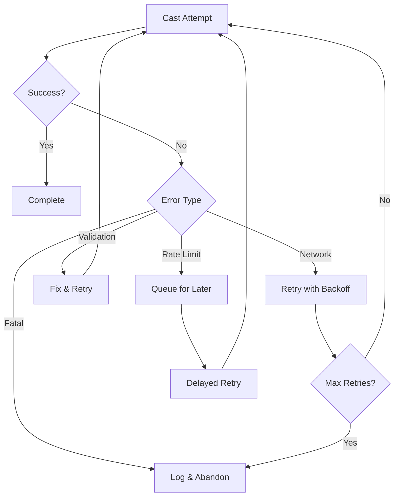

## Performance Metrics

### Processing Times

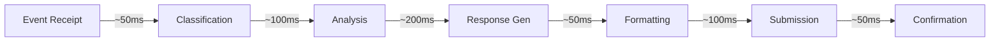

### Throughput Management

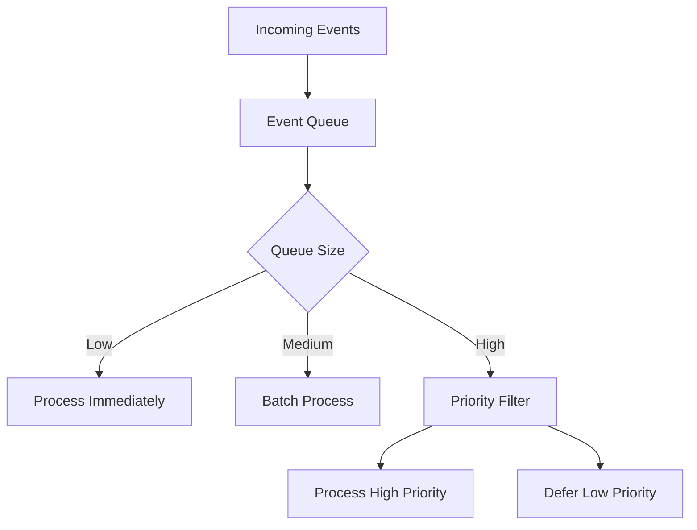

## State Management

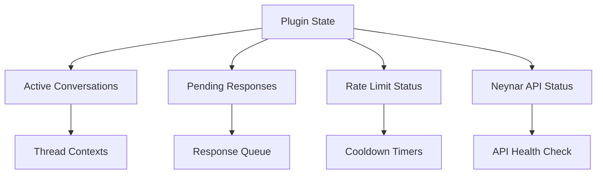

## Monitoring & Observability

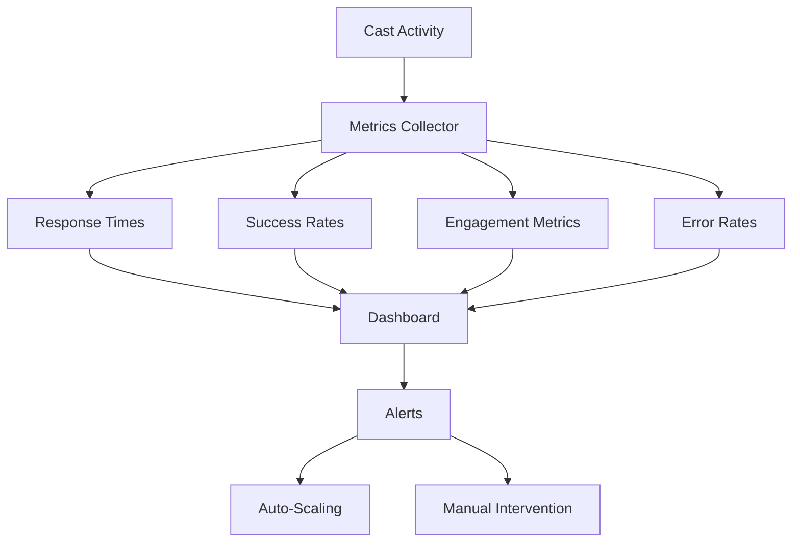

## Best Practices

1. **Efficient Polling**: Use appropriate intervals to balance responsiveness and API rate limits
2. **Smart Caching**: Cache user profiles and recent casts to reduce Neynar API calls
3. **Graceful Degradation**: Handle API failures without losing queued responses
4. **Context Awareness**: Maintain conversation context across reply chains
5. **Rate Limit Respect**: Implement proper backoff strategies for Neynar API limits

## Debugging Cast Flow

Enable detailed logging to trace cast processing:

```typescript
// Enable debug mode
process.env.FARCASTER_DEBUG = 'true';

// Log each stage
runtime.on('farcaster:event', (event) => {
  console.log(`[${event.stage}]`, event.data);
});
```

## Summary

The Farcaster cast flow is designed to be:
- **Responsive**: Quick reaction to mentions and replies
- **Intelligent**: Context-aware response generation
- **Reliable**: Robust error handling and retry logic
- **Scalable**: Efficient queue management and rate limiting
- **Observable**: Comprehensive metrics and logging
