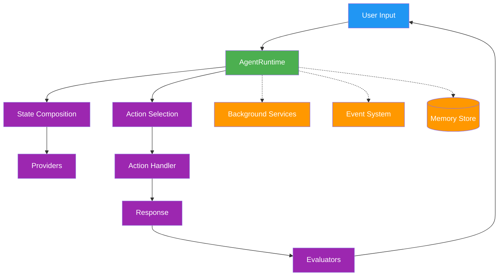
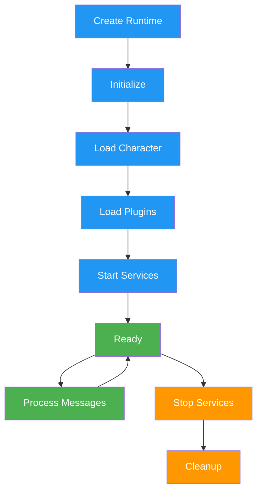
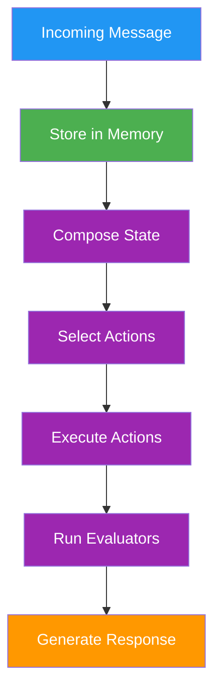

## The Problem

Building production AI agents is hard. You're juggling:

- **Plugin management** across multiple providers and capabilities
- **State persistence** that doesn't break between restarts
- **Multi-agent orchestration** without race conditions
- **Deployment complexity** from local dev to serverless edge

Most frameworks give you primitives. You still wire everything together yourself.

<Tip>
  **5 minutes to your first agent.** No infrastructure setup, no config files to
  manage. Just code in your preferred language.
</Tip>

## Quick Start

The runtime handles configuration, plugin resolution, and message processing automatically. Available in TypeScript, Python, and Rust with identical APIs.

<Tabs>
  <Tab title="TypeScript">
```typescript
import { AgentRuntime } from '@elizaos/core';
import { openaiPlugin } from '@elizaos/plugin-openai';
import { plugin as sqlPlugin } from '@elizaos/plugin-sql';

// Create runtime with character and plugins
const runtime = new AgentRuntime({
character: {
name: 'Assistant',
bio: 'A helpful AI assistant',
system: 'You are a helpful assistant.',
},
plugins: [sqlPlugin, openaiPlugin],
});

// Initialize
await runtime.initialize();

// Handle messages
const result = await runtime.messageService!.handleMessage(
runtime,
message,
async (content) => {
console.log(content.text);
return [];
}
);

````
  </Tab>
  <Tab title="Python">
```python
from elizaos import AgentRuntime, Character
from elizaos_plugin_openai import get_openai_plugin

# Create runtime with character and plugins
runtime = AgentRuntime(
    character=Character(
        name="Assistant",
        bio="A helpful AI assistant",
        system="You are a helpful assistant.",
    ),
    plugins=[get_openai_plugin()],
)

# Initialize
await runtime.initialize()

# Handle messages
result = await runtime.message_service.handle_message(runtime, message)
print(result.response_content.text)
````

  </Tab>
  <Tab title="Rust">
```rust
use elizaos::{AgentRuntime, RuntimeOptions, parse_character};
use elizaos_plugin_openai::create_openai_plugin;

// Create runtime with character and plugins
let character = parse_character(r#"{
"name": "Assistant",
"bio": "A helpful AI assistant",
"system": "You are a helpful assistant."
}"#)?;

let runtime = AgentRuntime::new(RuntimeOptions {
character: Some(character),
plugins: vec![create_openai_plugin()?],
..Default::default()
}).await?;

// Initialize
runtime.initialize().await?;

// Handle messages
let result = runtime.message_service()
.handle_message(&runtime, &mut message, None, None)
.await?;

````
  </Tab>
</Tabs>

## API Comparison

| Operation | TypeScript | Python | Rust |
|-----------|------------|--------|------|
| Create runtime | `new AgentRuntime({...})` | `AgentRuntime(...)` | `AgentRuntime::new(...)` |
| Initialize | `await runtime.initialize()` | `await runtime.initialize()` | `runtime.initialize().await` |
| Use model | `runtime.useModel(type, params)` | `runtime.use_model(type, params)` | `runtime.use_model(type, params).await` |
| Get service | `runtime.getService(name)` | `runtime.get_service(name)` | `runtime.get_service(name)` |
| Stop | `await runtime.stop()` | `await runtime.stop()` | `runtime.stop().await` |

<CardGroup cols={2}>
  <Card title="Add Capabilities" icon="puzzle-piece" href="/plugins/components">
    Actions, Providers, and Evaluators
  </Card>
  <Card title="Define Personality" icon="user" href="/agents/character-interface">
    Character configuration
  </Card>
  <Card title="Deploy Anywhere" icon="cloud" href="/guides/deploy-a-project">
    Local, Docker, Serverless, Edge
  </Card>
  <Card title="Connect Platforms" icon="plug" href="/plugin-registry/overview">
    Discord, Telegram, X, and more
  </Card>
</CardGroup>

---

## Deployment Patterns

### Serverless / Edge Deployment

For serverless environments, use ephemeral mode:

```typescript
// Ephemeral mode - runtime not stored in registry
const [runtime] = await elizaOS.addAgents([{
  character,
  plugins,
  databaseAdapter: cachedAdapter, // Pre-initialized DB
}], {
  ephemeral: true,
  skipMigrations: true,
  autoStart: true,
  returnRuntimes: true,
});

// Use runtime directly (no registry lookup)
const result = await elizaOS.handleMessage(runtime, {
  entityId: userId,
  roomId: roomId,
  content: { text: 'Hello!', source: 'lambda' }
});
````

### Async Mode with Callbacks

For WebSocket or streaming scenarios:

```typescript
await elizaOS.handleMessage(agentId, message, {
  onResponse: async (content) => {
    await socket.emit("message", content.text);
  },
  onStreamChunk: async (chunk, messageId) => {
    await socket.emit("chunk", { chunk, messageId });
  },
  onError: async (error) => {
    console.error("Agent error:", error);
  },
  onComplete: async () => {
    console.log("Processing complete");
  },
});
```

### Multi-Agent Communication

Send messages to multiple agents in parallel:

```typescript
const results = await elizaOS.handleMessages([
  {
    agentId: researchAgent,
    message: {
      entityId,
      roomId,
      content: { text: "Research topic X", source: "internal" },
    },
  },
  {
    agentId: writerAgent,
    message: {
      entityId,
      roomId,
      content: { text: "Prepare outline", source: "internal" },
    },
  },
]);
```

### Agent Discovery

```typescript
// By ID
const agent = elizaOS.getAgent(agentId);

// By name
const assistant = elizaOS.getAgentByName("Assistant");

// All agents
const allAgents = elizaOS.getAgents();

// Multiple by IDs
const selected = elizaOS.getAgentsByIds([id1, id2]);

// Multiple by names
const team = elizaOS.getAgentsByNames(["Researcher", "Writer"]);
```

### Events

ElizaOS extends `EventTarget` for lifecycle events:

```typescript
elizaOS.addEventListener("agent:started", (e) => {
  console.log(`Agent ${e.detail.agentId} started`);
});

elizaOS.addEventListener("message:sent", (e) => {
  console.log(`Message ${e.detail.messageId} sent in ${e.detail.mode} mode`);
});

// Available events:
// agent:added, agent:started, agent:stopped, agent:deleted
// agents:added, agents:started, agents:stopped, agents:deleted
// agent:registered, agent:updated
// message:sent, messages:sent
// mode:editable
```

### Health Monitoring

```typescript
// Check agent health
const health = await elizaOS.healthCheck();
// Map<UUID, { alive: boolean, responsive: boolean, memoryUsage?: number, uptime?: number }>

// Validate API keys
const keyStatus = await elizaOS.validateApiKeys();
// Map<UUID, boolean>
```

---

## What You Get

| Feature                  | Without ElizaOS                   | With ElizaOS                        |
| ------------------------ | --------------------------------- | ----------------------------------- |
| **Plugin resolution**    | Manual imports, version conflicts | Auto-discovery, dependency ordering |
| **Database setup**       | 50+ lines boilerplate             | Zero-config SQLite or Postgres      |
| **Multi-agent**          | Build coordination from scratch   | `handleMessages([...])`             |
| **Streaming**            | Implement SSE/WebSocket yourself  | Built-in with callbacks             |
| **State management**     | Manual context threading          | Automatic composition               |
| **Platform integration** | Custom adapters per platform      | Plugin ecosystem                    |

---

## System Architecture

The elizaOS runtime follows a modular, plugin-based architecture that orchestrates all agent functionality. For lifecycle details, see [Runtime and Lifecycle](/agents/runtime-and-lifecycle). For extension architecture, see [Plugin Architecture](/plugins/architecture).



### Core Components

The runtime orchestrates these essential components:

- **AgentRuntime**: Central orchestrator managing agent lifecycle
- **Plugin System**: Extends functionality through modular components
- **Memory System**: Hierarchical storage for conversations and knowledge
- **State Management**: Aggregates context from multiple sources
- **Service Layer**: Background processes and integrations

For related documentation, see [Plugin Architecture](/plugins/architecture), [Memory](/runtime/memory), and [Services](/runtime/services).

## AgentRuntime Class

The `AgentRuntime` class is the central engine that manages agent lifecycle, processes messages, and coordinates all system components. The interface is identical across TypeScript, Python, and Rust.

### Core Interface

<Tabs>
  <Tab title="TypeScript">
```typescript
interface IAgentRuntime extends IDatabaseAdapter {
  // Core properties
  agentId: UUID;
  character: Character;
  providers: Provider[];
  actions: Action[];
  evaluators: Evaluator[];
  services: Service[];
  
  // Action processing
  processActions(message: Memory, responses: Memory[], state?: State): Promise<void>;
  composeState(message: Memory, state?: State): Promise<State>;
  evaluate(message: Memory, state?: State): Promise<void>;
  
  // Component registration
  registerAction(action: Action): void;
  registerProvider(provider: Provider): void;
  registerEvaluator(evaluator: Evaluator): void;
  registerService(service: Service): void;
  
  // Service management
  getService<T>(name: ServiceType): T;
  stop(): Promise<void>;
  
  // Model management
  useModel<T>(modelType: T, params: ModelParams): Promise<ModelResult>;
  registerModel(modelType: ModelTypeName, handler: ModelHandler): void;
  getModel(modelType: ModelTypeName): ModelHandler | undefined;
  
  // Event system
  emit(eventType: EventType, data: EventPayload): Promise<void>;
  on(eventType: EventType, handler: EventHandler): void;
}
```
  </Tab>
  <Tab title="Python">
```python
class AgentRuntime:
    # Core properties
    agent_id: UUID
    character: Character
    providers: list[Provider]
    actions: list[Action]
    evaluators: list[Evaluator]
    services: list[Service]
    
    # Action processing
    async def process_actions(self, message: Memory, responses: list[Memory], state: State = None) -> None: ...
    async def compose_state(self, message: Memory, state: State = None) -> State: ...
    async def evaluate(self, message: Memory, state: State = None) -> None: ...
    
    # Component registration
    def register_action(self, action: Action) -> None: ...
    def register_provider(self, provider: Provider) -> None: ...
    def register_evaluator(self, evaluator: Evaluator) -> None: ...
    def register_service(self, service: Service) -> None: ...
    
    # Service management
    def get_service(self, name: str) -> Service: ...
    async def stop(self) -> None: ...
    
    # Model management
    async def use_model(self, model_type: str, params: dict) -> Any: ...
    def register_model(self, model_type: str, handler: Callable) -> None: ...
    def get_model(self, model_type: str) -> Callable | None: ...
```
  </Tab>
  <Tab title="Rust">
```rust
pub struct AgentRuntime {
    pub agent_id: UUID,
    pub character: Character,
    pub providers: Vec<Provider>,
    pub actions: Vec<Action>,
    pub evaluators: Vec<Evaluator>,
    pub services: Vec<Service>,
}

impl AgentRuntime {
// Action processing
pub async fn process_actions(&self, message: &Memory, responses: &[Memory], state: Option<&State>) -> Result<()>;
pub async fn compose_state(&self, message: &Memory, state: Option<&State>) -> Result<State>;
pub async fn evaluate(&self, message: &Memory, state: Option<&State>) -> Result<()>;

    // Component registration
    pub fn register_action(&mut self, action: Action);
    pub fn register_provider(&mut self, provider: Provider);
    pub fn register_evaluator(&mut self, evaluator: Evaluator);
    pub fn register_service(&mut self, service: Service);

    // Service management
    pub fn get_service<T>(&self, name: &str) -> Option<&T>;
    pub async fn stop(&self) -> Result<()>;

    // Model management
    pub async fn use_model<T>(&self, model_type: &str, params: ModelParams) -> Result<T>;
    pub fn register_model(&mut self, model_type: &str, handler: ModelHandler);
    pub fn get_model(&self, model_type: &str) -> Option<&ModelHandler>;

}

````
  </Tab>
</Tabs>

### Key Responsibilities

#### 1. Action Processing

The runtime orchestrates action selection and execution:

```typescript
async processActions(message: Memory, responses: Memory[], state?: State): Promise<void> {
  // Select and execute actions based on context
  const actions = await this.selectActions(message, state);

  for (const action of actions) {
    await action.handler(this, message, state);
  }

  // Run evaluators on results
  await this.evaluate(message, state);
}
````

#### 2. State Composition

Builds comprehensive context by aggregating data from providers:

```typescript
async composeState(message: Memory): Promise<State> {
  const state = {};

  for (const provider of this.providers) {
    const data = await provider.get(this, message, state);
    Object.assign(state, data);
  }

  return state;
}
```

#### 3. Plugin Management

Registers and initializes plugin components:

```typescript
async registerPlugin(plugin: Plugin) {
  // Register components
  plugin.actions?.forEach(a => this.registerAction(a));
  plugin.providers?.forEach(p => this.registerProvider(p));
  plugin.evaluators?.forEach(e => this.registerEvaluator(e));
  plugin.services?.forEach(s => this.registerService(s));

  // Initialize plugin
  await plugin.init?.(this.config, this);
}
```

## Runtime Lifecycle



### Initialization Sequence

1. **Runtime Creation**: Instantiate with character and configuration
2. **Character Loading**: Load agent personality and settings
3. **Plugin Loading**: Register plugins in dependency order
4. **Service Startup**: Initialize background services
5. **Ready State**: Agent ready to process messages

### Plugin Loading Order

```typescript
// Plugin priority determines load order
const pluginLoadOrder = [
  databases, // Priority: -100
  modelProviders, // Priority: -50
  corePlugins, // Priority: 0
  features, // Priority: 50
  platforms, // Priority: 100
];
```

## Configuration

### Runtime Configuration

The runtime accepts configuration through multiple sources:

```typescript
interface RuntimeConfig {
  character: Character;
  plugins: Plugin[];
  database?: DatabaseConfig;
  models?: ModelConfig;
  services?: ServiceConfig;
  environment?: EnvironmentConfig;
}
```

### Environment Variables

Core runtime environment variables:

- `NODE_ENV` - Runtime environment (development/production)
- `LOG_LEVEL` - Logging verbosity
- `DATABASE_URL` - Database connection string
- `API_PORT` - Server port for API endpoints
- `AGENT_ID` - Unique agent identifier

### Settings Management

Access configuration through the runtime:

```typescript
// Get setting with fallback
const apiKey = runtime.getSetting("API_KEY");

// Check if setting exists
if (runtime.hasSetting("FEATURE_FLAG")) {
  // Feature is enabled
}
```

## Database Abstraction

The runtime implements `IDatabaseAdapter` for data persistence:

```typescript
interface IDatabaseAdapter {
  // Memory operations
  createMemory(memory: Memory): Promise<void>;
  searchMemories(query: string, limit?: number): Promise<Memory[]>;
  getMemoryById(id: UUID): Promise<Memory | null>;

  // Entity management
  createEntity(entity: Entity): Promise<void>;
  updateEntity(entity: Entity): Promise<void>;
  getEntity(id: UUID): Promise<Entity | null>;

  // Relationships
  createRelationship(rel: Relationship): Promise<void>;
  getRelationships(entityId: UUID): Promise<Relationship[]>;

  // Facts and knowledge
  createFact(fact: Fact): Promise<void>;
  searchFacts(query: string): Promise<Fact[]>;
}
```

### Memory Operations

```typescript
// Store a message
await runtime.createMemory({
  type: MemoryType.MESSAGE,
  content: { text: "User message" },
  roomId: message.roomId,
  userId: message.userId,
});

// Search memories
const memories = await runtime.searchMemories(
  "previous conversation",
  10, // limit
);

// Get specific memory
const memory = await runtime.getMemoryById(memoryId);
```

## Message Processing Pipeline

The runtime processes messages through a defined pipeline:



### Processing Steps

1. **Message Receipt**: Receive and validate incoming message
2. **Memory Storage**: Persist message to database
3. **State Composition**: Build context from providers
4. **Action Selection**: Choose appropriate actions
5. **Action Execution**: Run selected action handlers
6. **Evaluation**: Post-process results
7. **Response Generation**: Create and send response

## Error Handling

The runtime implements comprehensive error handling:

```typescript
try {
  await runtime.processActions(message, responses, state);
} catch (error) {
  if (error instanceof ActionError) {
    // Handle action-specific errors
    runtime.logger.error("Action failed:", error);
  } else if (error instanceof StateError) {
    // Handle state composition errors
    runtime.logger.error("State error:", error);
  } else {
    // Handle unexpected errors
    runtime.logger.error("Unexpected error:", error);
    // Optionally trigger recovery
  }
}
```

## Performance Considerations

### State Caching

The runtime caches composed state for performance:

```typescript
// State is cached by message ID
const state = await runtime.composeState(message);
// Subsequent calls use cache
const cachedState = await runtime.composeState(message);
```

### Service Pooling

Services are singleton instances shared across the runtime:

```typescript
// Services are created once and reused
const service = runtime.getService(ServiceType.DATABASE);
// Same instance returned
const sameService = runtime.getService(ServiceType.DATABASE);
```

## Best Practices

### Runtime Initialization

- Initialize plugins in dependency order
- Start services after all plugins are loaded
- Verify character configuration before starting
- Set up error handlers before processing

### Resource Management

- Clean up services on shutdown
- Clear state cache periodically
- Monitor memory usage
- Implement connection pooling

### Error Recovery

- Implement retry logic for transient failures
- Log errors with context
- Gracefully degrade functionality
- Maintain audit trail

## Integration Points

The runtime provides multiple integration points:

- **Plugins**: Extend functionality through the plugin system
- **Events**: React to runtime events
- **Services**: Add background processes
- **Models**: Integrate AI providers
- **Database**: Custom database adapters
- **API**: HTTP endpoints through routes

## Advanced Runtime Methods

Beyond the core interface, the runtime exposes additional methods for advanced use cases.

### Run Tracking

Track agent execution runs for debugging, analytics, and action chaining:

```typescript
interface IAgentRuntime {
  // Create a unique run identifier
  createRunId(): UUID;

  // Start a run (optionally scoped to a room)
  startRun(roomId?: UUID): UUID;

  // End the current run
  endRun(): void;

  // Get the current active run ID
  getCurrentRunId(): UUID;
}
```

**Usage:**

```typescript
// Start tracking a run
const runId = runtime.startRun(roomId);

try {
  // Process messages, actions execute within this run
  await runtime.processActions(message, responses, state);

  // Get results from actions executed in this run
  const results = runtime.getActionResults(message.id);
} finally {
  // Always end the run
  runtime.endRun();
}
```

### Action Results

Retrieve results from executed actions for action chaining:

```typescript
// Get all action results for a specific message
getActionResults(messageId: UUID): ActionResult[];
```

**Example - Action chaining:**

```typescript
// First action generates data
const results = runtime.getActionResults(message.id);

// Second action uses results from first
const previousData = results.find((r) => r.action === "SEARCH_WEB");
if (previousData?.success) {
  // Use previousData.data in next action
}
```

### Embedding Generation

Queue memories for async embedding generation:

```typescript
// Non-blocking - queues for background processing
queueEmbeddingGeneration(
  memory: Memory,
  priority?: 'high' | 'normal' | 'low'
): Promise<void>;

// Blocking - adds embedding synchronously
addEmbeddingToMemory(memory: Memory): Promise<Memory>;
```

**Priority levels:**

- `high` - Immediate processing (user queries)
- `normal` - Default priority (conversations)
- `low` - Background processing (bulk imports)

```typescript
// Queue high-priority embedding for user query
await runtime.queueEmbeddingGeneration(userMessage, "high");

// Queue low-priority for background knowledge
await runtime.queueEmbeddingGeneration(knowledgeDoc, "low");
```

### Conversation Length

Get the current conversation length setting:

```typescript
getConversationLength(): number;
```

Returns the configured maximum conversation length from character settings.

### Service Management

Advanced service discovery and management:

```typescript
interface IAgentRuntime {
  // Get all registered services by type
  getAllServices(): Map<ServiceTypeName, Service[]>;

  // Get all registered service type names
  getRegisteredServiceTypes(): ServiceTypeName[];

  // Get multiple services of the same type
  getServicesByType<T extends Service>(type: ServiceTypeName): T[];

  // Wait for a service to finish loading
  getServiceLoadPromise(serviceType: ServiceTypeName): Promise<Service>;

  // Check if service exists
  hasService(serviceType: ServiceTypeName): boolean;
}
```

**Example - Wait for service:**

```typescript
// Wait for database service to be ready
const dbService = await runtime.getServiceLoadPromise(ServiceType.DATABASE);

// Get all speech services
const speechServices = runtime.getServicesByType(ServiceType.SPEECH);

// Check available service types
const types = runtime.getRegisteredServiceTypes();
// ['DATABASE', 'SPEECH', 'VIDEO', 'TRANSCRIPTION', ...]
```

### ElizaOS Type Guard

Check if the runtime has an ElizaOS instance attached:

```typescript
hasElizaOS(): this is IAgentRuntime & { elizaOS: IElizaOS };
```

**Usage:**

```typescript
if (runtime.hasElizaOS()) {
  // TypeScript knows runtime.elizaOS is defined here
  const elizaOS = runtime.elizaOS;

  // Send message to another agent
  await elizaOS.handleMessage(otherAgentId, {
    entityId: message.entityId,
    roomId: message.roomId,
    content: { text: "Forwarded message", source: "internal" },
  });
}
```

### Connection Management

Batch setup of entities, rooms, and connections:

```typescript
// Setup multiple connections at once
ensureConnections(
  entities: Entity[],
  rooms: Room[],
  source: string,
  world: World
): Promise<void>;

// Setup single connection with full options
ensureConnection({
  entityId: UUID;
  roomId: UUID;
  userName?: string;
  name?: string;
  worldName?: string;
  source?: string;
  channelId?: string;
  messageServerId?: UUID;
  type?: ChannelType | string;
  worldId: UUID;
  userId?: UUID;
  metadata?: Record<string, unknown>;
}): Promise<void>;
```

**Example - Platform integration:**

```typescript
// Setup Discord server connection
await runtime.ensureConnection({
  entityId: discordUserId,
  roomId: channelRoomId,
  userName: "user#1234",
  source: "discord",
  channelId: discordChannelId,
  type: ChannelType.GROUP,
  worldId: serverWorldId,
  metadata: { roles: ["member", "admin"] },
});
```

### World Management

Update world configuration:

```typescript
updateWorld(world: World): Promise<void>;
```

```typescript
// Update world settings
await runtime.updateWorld({
  id: worldId,
  name: "Updated Server Name",
  metadata: {
    settings: { allowBots: true },
    features: ["voice", "threads"],
  },
});
```

### Message Routing

Register custom message handlers for different platforms:

```typescript
// Register a send handler for a platform
registerSendHandler(source: string, handler: SendHandlerFunction): void;

// Send message to a specific target
sendMessageToTarget(target: TargetInfo, content: Content): Promise<void>;
```

```typescript
// Register Discord message handler
// Handler signature: (runtime, target, content) => Promise<void>
runtime.registerSendHandler("discord", async (runtime, target, content) => {
  const channel = await discordClient.channels.fetch(target.channelId);
  await channel.send(content.text);
});

// Send message to target
await runtime.sendMessageToTarget(
  { source: "discord", channelId: "123456", roomId },
  { text: "Hello from agent!" },
);
```

## See Also

<CardGroup cols={2}>
  <Card title="Memory System" icon="brain" href="/runtime/memory">
    Learn about the fundamental storage layer
  </Card>

<Card title="Events" icon="bolt" href="/runtime/events">
  Understand the communication backbone
</Card>

<Card title="Providers" icon="database" href="/runtime/providers">
  Explore how to supply data to the runtime
</Card>

<Card title="Models" icon="robot" href="/runtime/models">
  Discover AI model management
</Card>

<Card
  title="Streaming Responses"
  icon="wave-pulse"
  href="/guides/streaming-responses"
>
  Implement real-time streaming with SSE/WebSocket
</Card>

<Card title="Action Planning" icon="list-check" href="/guides/action-planning">
  Build multi-step action workflows
</Card>

<Card title="Background Tasks" icon="clock" href="/guides/background-tasks">
  Run async operations with task workers
</Card>

  <Card title="Deploy to Cloud" icon="cloud" href="/guides/deploy-to-cloud">
    Ship your agent to production in minutes
  </Card>
</CardGroup>
