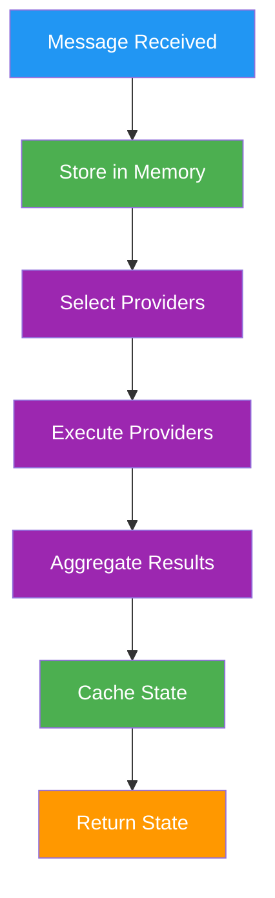

## Why Memory Matters

An AI without memory is like a goldfish - every conversation starts from zero. Your users expect agents that:

- **Remember context** - "As we discussed yesterday..."
- **Learn preferences** - "You mentioned you prefer TypeScript..."
- **Build knowledge** - Facts extracted from conversations persist

<Tip>
  **Memory is your agent's brain.** Messages, facts, relationships, goals - all
  stored, indexed, and searchable through embeddings.
</Tip>

## Memory System

The memory system provides hierarchical storage for conversations, knowledge, and agent state. It enables agents to maintain context, learn from interactions, and build persistent knowledge.

<CardGroup cols={2}>
  <Card
    title="Conceptual Overview"
    icon="brain"
    href="/agents/memory-and-state"
  >
    Understanding memory architecture
  </Card>
  <Card title="Runtime Core" icon="microchip" href="/runtime/core">
    How memory integrates with the runtime
  </Card>
</CardGroup>

## Memory Types

### Core Memory Types

```typescript
enum MemoryType {
  MESSAGE = "message", // Conversation messages
  FACT = "fact", // Extracted knowledge
  DOCUMENT = "document", // Document storage
  RELATIONSHIP = "relationship", // Entity relationships
  GOAL = "goal", // Agent goals
  TASK = "task", // Scheduled tasks
  ACTION = "action", // Action execution records
}
```

### Memory Interface

```typescript
interface Memory {
  id: UUID;
  type: MemoryType;
  roomId: UUID;
  userId?: UUID;
  agentId?: UUID;
  content: {
    text: string;
    [key: string]: unknown;
  };
  embedding?: number[];
  createdAt: Date;
  updatedAt?: Date;
  metadata?: Record<string, unknown>;
}
```

## State Management

### State Structure

State represents the agent's current understanding of context:

```typescript
interface State {
  // Key-value pairs for template access
  values: Record<string, unknown>;

  // Structured data from providers
  data: Record<string, unknown>;

  // Concatenated textual context
  text: string;
}
```

### State Composition Pipeline



## Memory Operations

### Creating Memories

```typescript
// Store a message
await runtime.createMemory({
  type: MemoryType.MESSAGE,
  content: {
    text: "User message",
    role: "user",
    name: "John",
  },
  roomId: message.roomId,
  userId: message.userId,
  metadata: {
    platform: "discord",
    channelId: "12345",
  },
});

// Store a fact
await runtime.createMemory({
  type: MemoryType.FACT,
  content: {
    text: "The user's favorite color is blue",
    subject: "user",
    predicate: "favorite_color",
    object: "blue",
  },
  roomId: message.roomId,
});

// Store an action result
await runtime.createMemory({
  type: MemoryType.ACTION,
  content: {
    text: "Generated image of a sunset",
    action: "IMAGE_GENERATION",
    result: { url: "https://..." },
  },
  roomId: message.roomId,
  agentId: runtime.agentId,
});
```

### Searching Memories

```typescript
// Text search with embeddings
const memories = await runtime.searchMemories(
  "previous conversation about colors",
  10, // limit
);

// Search with filters
const facts = await runtime.searchMemories({
  query: "user preferences",
  type: MemoryType.FACT,
  roomId: currentRoom.id,
  limit: 5,
});

// Search by time range
const recentMessages = await runtime.searchMemories({
  type: MemoryType.MESSAGE,
  roomId: currentRoom.id,
  after: new Date(Date.now() - 3600000), // Last hour
  limit: 20,
});
```

### Memory Retrieval

```typescript
// Get specific memory
const memory = await runtime.getMemoryById(memoryId);

// Get memories by room
const roomMemories = await runtime.getMemoriesByRoom(roomId, {
  type: MemoryType.MESSAGE,
  limit: 50,
});

// Get user memories
const userMemories = await runtime.getMemoriesByUser(userId, {
  type: MemoryType.FACT,
});
```

## Embeddings and Similarity

### Creating Embeddings

```typescript
// Generate embedding for text
const embedding = await runtime.useModel(ModelType.TEXT_EMBEDDING, {
  input: "Text to embed",
});

// Store with embedding
await runtime.createMemory({
  type: MemoryType.MESSAGE,
  content: { text: "Important message" },
  embedding: embedding,
  roomId: message.roomId,
});
```

### Similarity Search

```typescript
// Search by semantic similarity
const similarMemories = await runtime.searchMemoriesBySimilarity(embedding, {
  threshold: 0.8, // Similarity threshold (0-1)
  limit: 10,
  type: MemoryType.MESSAGE,
});

// Find related facts
const queryEmbedding = await runtime.useModel(ModelType.TEXT_EMBEDDING, {
  input: "What does the user like?",
});

const relatedFacts = await runtime.searchMemoriesBySimilarity(queryEmbedding, {
  type: MemoryType.FACT,
  threshold: 0.7,
  limit: 5,
});
```

## Facts and Knowledge

### Fact Extraction

Facts are automatically extracted from conversations:

```typescript
interface Fact extends Memory {
  type: MemoryType.FACT;
  content: {
    text: string;
    subject?: string; // Entity the fact is about
    predicate?: string; // Relationship or property
    object?: string; // Value or related entity
    confidence?: number; // Extraction confidence
    source?: string; // Source message ID
  };
}
```

### Fact Management

```typescript
// Create a fact
await runtime.createFact({
  subject: "user",
  predicate: "works_at",
  object: "TechCorp",
  confidence: 0.95,
  source: message.id,
});

// Query facts
const userFacts = await runtime.getFacts({
  subject: "user",
  limit: 10,
});

// Update fact confidence
await runtime.updateFact(factId, {
  confidence: 0.98,
});
```

## Relationships

### Relationship Storage

```typescript
interface Relationship extends Memory {
  type: MemoryType.RELATIONSHIP;
  userId: UUID;
  targetEntityId: UUID;
  relationshipType: string;
  strength: number;
  metadata?: {
    firstInteraction?: Date;
    lastInteraction?: Date;
    interactionCount?: number;
    sentiment?: number;
  };
}
```

### Managing Relationships

```typescript
// Create relationship
await runtime.createRelationship({
  userId: user.id,
  targetEntityId: otherUser.id,
  relationshipType: "friend",
  strength: 0.8,
});

// Get user relationships
const relationships = await runtime.getRelationships(userId);

// Update relationship strength
await runtime.updateRelationship(relationshipId, {
  strength: 0.9,
  metadata: {
    lastInteraction: new Date(),
    interactionCount: prevCount + 1,
  },
});
```

## State Cache

### Cache Architecture

The runtime maintains an in-memory cache for composed states:

```typescript
class StateCache {
  private cache: Map<UUID, State>;
  private timestamps: Map<UUID, number>;
  private maxSize: number;
  private ttl: number;

  constructor(maxSize = 1000, ttl = 300000) {
    // 5 min TTL
    this.cache = new Map();
    this.timestamps = new Map();
    this.maxSize = maxSize;
    this.ttl = ttl;
  }

  set(messageId: UUID, state: State): void {
    // Evict oldest if at capacity
    if (this.cache.size >= this.maxSize) {
      const oldest = this.getOldestEntry();
      if (oldest) {
        this.cache.delete(oldest);
        this.timestamps.delete(oldest);
      }
    }

    this.cache.set(messageId, state);
    this.timestamps.set(messageId, Date.now());
  }

  get(messageId: UUID): State | undefined {
    const timestamp = this.timestamps.get(messageId);

    // Check if expired
    if (timestamp && Date.now() - timestamp > this.ttl) {
      this.cache.delete(messageId);
      this.timestamps.delete(messageId);
      return undefined;
    }

    return this.cache.get(messageId);
  }
}
```

### Cache Management

```typescript
// Clear old cache entries
function cleanupCache(runtime: IAgentRuntime) {
  const now = Date.now();
  const maxAge = 5 * 60 * 1000; // 5 minutes

  for (const [messageId, timestamp] of runtime.stateCache.timestamps) {
    if (now - timestamp > maxAge) {
      runtime.stateCache.delete(messageId);
    }
  }
}

// Schedule periodic cleanup
setInterval(() => cleanupCache(runtime), 60000);
```

## Document Storage

### Document Memory

```typescript
interface DocumentMemory extends Memory {
  type: MemoryType.DOCUMENT;
  content: {
    text: string;
    title?: string;
    source?: string;
    chunks?: string[];
    summary?: string;
  };
  embedding?: number[];
  metadata?: {
    mimeType?: string;
    size?: number;
    hash?: string;
    tags?: string[];
  };
}
```

### Document Operations

```typescript
// Store document
await runtime.createDocument({
  title: "User Manual",
  content: documentText,
  source: "https://example.com/manual.pdf",
  chunks: splitIntoChunks(documentText),
  metadata: {
    mimeType: "application/pdf",
    size: 1024000,
    tags: ["manual", "reference"],
  },
});

// Search documents
const relevantDocs = await runtime.searchDocuments(
  "how to configure settings",
  { limit: 5 },
);

// Get document chunks
const chunks = await runtime.getDocumentChunks(documentId, {
  relevant_to: "specific query",
});
```

## Memory Cleanup

### Automatic Cleanup

```typescript
class MemoryCleanupService {
  private readonly MAX_MESSAGE_AGE = 30 * 24 * 60 * 60 * 1000; // 30 days
  private readonly MAX_FACTS_PER_ROOM = 1000;

  async cleanup(runtime: IAgentRuntime) {
    // Remove old messages
    await this.cleanupOldMessages(runtime);

    // Consolidate facts
    await this.consolidateFacts(runtime);

    // Remove orphaned relationships
    await this.cleanupOrphanedRelationships(runtime);
  }

  private async cleanupOldMessages(runtime: IAgentRuntime) {
    const cutoffDate = new Date(Date.now() - this.MAX_MESSAGE_AGE);

    await runtime.deleteMemories({
      type: MemoryType.MESSAGE,
      before: cutoffDate,
    });
  }

  private async consolidateFacts(runtime: IAgentRuntime) {
    const rooms = await runtime.getAllRooms();

    for (const room of rooms) {
      const facts = await runtime.getFacts({ roomId: room.id });

      if (facts.length > this.MAX_FACTS_PER_ROOM) {
        // Keep only high-confidence recent facts
        const toKeep = facts
          .sort((a, b) => {
            const scoreA = a.confidence * (1 / (Date.now() - a.createdAt));
            const scoreB = b.confidence * (1 / (Date.now() - b.createdAt));
            return scoreB - scoreA;
          })
          .slice(0, this.MAX_FACTS_PER_ROOM);

        const toDelete = facts.filter((f) => !toKeep.includes(f));
        for (const fact of toDelete) {
          await runtime.deleteMemory(fact.id);
        }
      }
    }
  }
}
```

### Manual Cleanup

```typescript
// Delete specific memories
await runtime.deleteMemory(memoryId);

// Bulk delete
await runtime.deleteMemories({
  type: MemoryType.MESSAGE,
  roomId: roomId,
  before: cutoffDate,
});

// Clear room memories
await runtime.clearRoomMemories(roomId);
```

## Memory Optimization

### Indexing Strategies

```typescript
// Database indexes for performance
CREATE INDEX idx_memories_room_type ON memories(roomId, type);
CREATE INDEX idx_memories_user_created ON memories(userId, createdAt);
CREATE INDEX idx_memories_embedding ON memories USING ivfflat (embedding);
CREATE INDEX idx_facts_subject_predicate ON facts(subject, predicate);
```

### Batch Operations

```typescript
// Batch insert memories
await runtime.createMemoriesBatch([
  { type: MemoryType.MESSAGE, content: { text: "Message 1" }, roomId },
  { type: MemoryType.MESSAGE, content: { text: "Message 2" }, roomId },
  // ... more memories
]);

// Batch embedding generation
const texts = memories.map((m) => m.content.text);
const embeddings = await runtime.useModel(ModelType.TEXT_EMBEDDING, {
  input: texts,
  batch: true,
});
```

### Memory Compression

```typescript
// Compress old memories
async function compressMemories(runtime: IAgentRuntime, roomId: UUID) {
  const messages = await runtime.getMemories({
    type: MemoryType.MESSAGE,
    roomId,
    before: new Date(Date.now() - 7 * 24 * 60 * 60 * 1000), // 7 days
  });

  // Generate summary
  const summary = await runtime.useModel(ModelType.TEXT_LARGE, {
    prompt: `Summarize these messages: ${messages.map((m) => m.content.text).join("\n")}`,
    maxTokens: 500,
  });

  // Store summary
  await runtime.createMemory({
    type: MemoryType.DOCUMENT,
    content: {
      text: summary,
      title: "Conversation Summary",
      source: "compressed_messages",
    },
    roomId,
    metadata: {
      originalCount: messages.length,
      dateRange: {
        start: messages[0].createdAt,
        end: messages[messages.length - 1].createdAt,
      },
    },
  });

  // Delete original messages
  for (const message of messages) {
    await runtime.deleteMemory(message.id);
  }
}
```

## Best Practices

### Memory Design

- **Type Selection**: Use appropriate memory types for different data
- **Embedding Strategy**: Generate embeddings for searchable content
- **Metadata Usage**: Store relevant metadata for filtering
- **Relationship Tracking**: Maintain entity relationships
- **Fact Extraction**: Extract and store facts from conversations

### Performance

- **Indexing**: Create appropriate database indexes
- **Batch Operations**: Use batch operations for multiple items
- **Caching**: Cache frequently accessed memories
- **Cleanup**: Implement regular cleanup routines
- **Compression**: Compress old data to save space

### Data Integrity

- **Validation**: Validate memory content before storage
- **Deduplication**: Prevent duplicate facts and relationships
- **Consistency**: Maintain referential integrity
- **Versioning**: Track memory updates and changes
- **Backup**: Regular backup of critical memories

## See Also

<CardGroup cols={2}>
  <Card title="Events" icon="bolt" href="/runtime/events">
    Learn about the communication system
  </Card>

<Card title="Providers" icon="database" href="/runtime/providers">
  Understand how providers use memory
</Card>

<Card title="Models" icon="robot" href="/runtime/models">
  Explore AI model integration
</Card>

  <Card title="Services" icon="server" href="/runtime/services">
    Build services that manage memory
  </Card>
</CardGroup>
