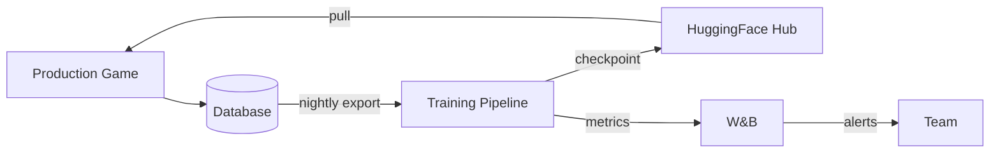
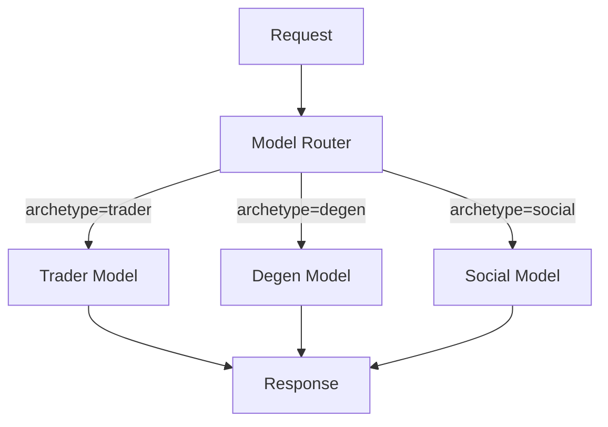

# Roadmap

Current status and planned improvements for the training pipeline.

> **Note**: This section is a placeholder for tracking project roadmap. Update as issues are resolved and new priorities emerge.

## Current Status

### What Works ✅

- **Data Generation**: TypeScript simulation generates trajectories
- **JSON Mode**: Training works with JSON file trajectories
- **Database Mode**: Training works with PostgreSQL trajectories
- **Tier 1-4 Tests**: All testing tiers pass
- **GPU Profiles**: Configurations for 12GB to 192GB
- **Archetype System**: 12 archetypes with rubrics and weights
- **Deterministic Scoring**: Python judge for fast training
- **W&B Integration**: Optional experiment tracking

### In Progress 🔄

- Production database connectivity
- Continuous training loop
- Model deployment pipeline
- Online training mode

### Planned 📋

- Multi-model orchestration
- A/B testing framework
- Automatic checkpoint deployment
- Archetype-specific model variants

## Issue Tracking

Issues are tracked in Linear. Key issue categories:

### Infrastructure (BAB-70 series)

| Issue | Title | Status |
|-------|-------|--------|
| BAB-70 | Staging DB access for training | Pending |
| BAB-71 | Production deployment pipeline | Planned |
| BAB-72 | CI/CD for training | Planned |

### Training Pipeline (BAB-73 series)

| Issue | Title | Status |
|-------|-------|--------|
| BAB-73 | Online training mode | In Progress |
| BAB-74 | Hybrid training | In Progress |
| BAB-75 | Multi-GPU optimization | Planned |

### Model Deployment (BAB-76 series)

| Issue | Title | Status |
|-------|-------|--------|
| BAB-76 | HuggingFace deployment | Planned |
| BAB-77 | Model versioning | Planned |
| BAB-78 | A/B testing in production | Planned |

## Near-Term Priorities

### 1. Database Connectivity

**Goal**: Connect to staging/production database for training.

**Blockers**:
- Need read-only DB credentials
- Network access from training environment (local/RunPod)

**Workaround**: Export trajectories from production, import locally.

### 2. Continuous Training Loop

**Goal**: Regularly retrain on new data and deploy improvements.

**Components**:
1. Scheduled data export from production
2. Automated training runs
3. Evaluation against baseline
4. Conditional deployment

### 3. Model Deployment

**Goal**: Automate moving trained models to production.

**Steps**:
1. Push checkpoint to HuggingFace
2. Notify production system of new model
3. A/B test new vs old
4. Roll out if metrics improve

## Architecture Evolution

### Current Architecture

```text
Simulation → DB → Training → Manual Deploy
```

### Target Architecture



### Future: Multi-Model



Each archetype could have its own fine-tuned model variant.

## Contribution Guide

### Adding Features

1. Check Linear for existing issues
2. Discuss approach in team chat
3. Implement with tests
4. Update documentation
5. Submit PR

### Reporting Issues

Include:
- What you were trying to do
- What happened
- What you expected
- Environment details (GPU, Python version)
- Steps to reproduce

### Documentation Updates

This book is in `packages/training/book/`. To update:

```bash
cd packages/training/book

# Edit files in src/
vim src/section/page.md

# Preview locally
mdbook serve

# Changes auto-build when merged
```

## Version History

| Version | Date | Changes |
|---------|------|---------|
| 1.0 | Jan 2025 | Initial documentation |

## Contact

- **RL Workstream Lead**: @revlentless
- **Linear Project**: Babylon → RL Training
- **Slack Channel**: #babylon-training

