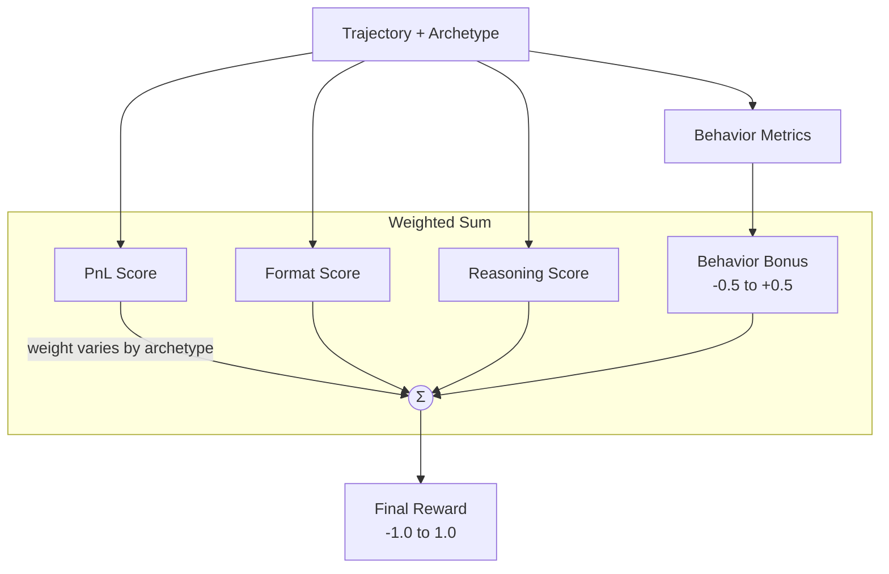

# Archetype System

Archetypes define different behavioral styles for agents. Each archetype has unique success criteria, priority metrics, and reward weights.

## The 12 Archetypes

| Archetype | Primary Goal | Key Metrics |
|-----------|--------------|-------------|
| `trader` | Profitable, disciplined trading | P&L, Sharpe ratio, win rate |
| `degen` | High-risk, high-activity trading | Trade count, position size, volatility |
| `social-butterfly` | Network building, community engagement | Connections, group chats, DMs |
| `scammer` | Profit through manipulation | P&L + social engagement |
| `researcher` | Analysis-driven decisions | Research actions, prediction accuracy |
| `information-trader` | Trade on gathered intel | Balanced social + trading |
| `goody-twoshoes` | Helpful, ethical behavior | Reputation gains, info shared |
| `ass-kisser` | Reputation through flattery | Followers, reputation delta |
| `perps-trader` | Leveraged futures trading | P&L, drawdown control |
| `super-predictor` | Accurate predictions | Prediction accuracy, calibration |
| `infosec` | Security-conscious, skeptical | Low info shared, avoid manipulation |
| `liar` | Successful deception | Information spread, maintained reputation |

## How Archetypes Affect Scoring

### 1. Different Reward Weights

Each archetype has different weights for reward components:

```python
# From rewards.py
ARCHETYPE_REWARD_WEIGHTS = {
    "trader": {
        "pnl": 0.55,      # P&L is primary
        "format": 0.20,
        "reasoning": 0.15,
        "behavior": 0.10,  # Behavior matters less
    },
    "degen": {
        "pnl": 0.15,      # Losses are acceptable
        "format": 0.15,
        "reasoning": 0.10,
        "behavior": 0.60,  # Behavior is king
    },
    "social-butterfly": {
        "pnl": 0.10,      # Trading barely matters
        "format": 0.20,
        "reasoning": 0.15,
        "behavior": 0.55,  # Social metrics dominate
    },
    # ... etc
}
```

### 2. Priority Metrics (from rubrics.json)

Each archetype has ordered priority metrics:

```json
{
  "priorityMetrics": {
    "trader": [
      "trading.totalPnL",
      "trading.sharpeRatio",
      "trading.winRate",
      "trading.marketsTraded",
      "behavior.socialToTradeRatio"
    ],
    "degen": [
      "trading.tradesExecuted",
      "trading.avgPositionSize",
      "trading.largestWin",
      "trading.largestLoss",
      "trading.marketsTraded"
    ],
    "social-butterfly": [
      "social.uniqueUsersInteracted",
      "social.groupChatsJoined",
      "social.dmsInitiated",
      "social.postsCreated"
    ]
  }
}
```

### 3. Behavior Bonus Functions

Archetype-specific bonus/penalty calculations:

```python
# Degen example - rewards activity, penalizes inactivity
def _calculate_degen_bonus(metrics: BehaviorMetrics) -> float:
    bonus = 0.0
    
    # Reward high trade volume
    if metrics.trades_executed >= 20:
        bonus += 0.20  # Excellent degen activity
    elif metrics.trades_executed < 2:
        bonus -= 0.15  # Penalty for low activity
    
    # Reward high variance (big swings)
    if metrics.pnl_variance > 500:
        bonus += 0.15
    
    return clamp_bonus(bonus)  # Clamp to [-0.5, 0.5]
```

## Archetype Derivation

When recording trajectories, archetypes can be:
1. **Explicitly set** by the agent configuration
2. **Derived** from NPC characteristics:

```typescript
// From archetypes/derive-archetype.ts
export function deriveArchetype(npc: NPCCharacteristics): string {
  // 1. Check role mapping first (e.g., "deceiver" → "scammer")
  if (npc.role) {
    const roleArchetype = ROLE_TO_ARCHETYPE[npc.role.toLowerCase()];
    if (roleArchetype) return roleArchetype;
  }
  
  // 2. Low reliability + willing to lie → scammer
  if (npc.reliability < 0.3 && npc.willingToLie) {
    return "scammer";
  }
  
  // 3. Analyze personality keywords for best match
  // Uses PERSONALITY_KEYWORDS map: { "aggressive": "degen", "social": "social-butterfly", ... }
  // Filters npc.personality traits against keywords, finds best archetype match
  const matchingKeywords = Object.entries(PERSONALITY_KEYWORDS)
    .filter(([keyword]) => npc.personality.toLowerCase().includes(keyword));
  if (matchingKeywords.length > 0) {
    return matchingKeywords[0][1];  // Return first matching archetype
  }
  
  // 4. Default to trader
  return "trader";
}
```

## Rubric Structure

Each archetype has a detailed evaluation rubric (from `config/rubrics.json`):

```markdown
## Trader Archetype Evaluation

### What Makes an Excellent Trader (0.8-1.0)
- **Positive P&L** with consistent profits
- **High win rate** (>55%)
- **Good risk management**: Sharpe ratio >1.0
- **Diversification**: Multiple markets
- **Low social activity**: Trading is priority

### What Makes a Poor Trader (0.0-0.4)
- **Negative P&L** with significant losses
- **Low win rate** (<40%)
- **No apparent strategy**
- **Too much time on social activities**

### Key Metrics to Prioritize (in order)
1. Total P&L (most important)
2. Sharpe Ratio
3. Win Rate
4. Markets Traded
5. Social to Trade Ratio (should be LOW)
```

## Behavior Metrics Extraction

The Python scorer extracts metrics from trajectory steps:

```python
@dataclass
class BehaviorMetrics:
    # Trading
    trades_executed: int = 0
    profitable_trades: int = 0
    win_rate: float = 0.0
    total_pnl: float = 0.0
    pnl_variance: float = 0.0
    markets_traded: int = 0
    
    # Social
    unique_users_interacted: int = 0
    group_chats_joined: int = 0
    dms_initiated: int = 0
    posts_created: int = 0
    
    # Influence
    followers_gained: int = 0
    reputation_delta: int = 0
    
    # Research
    research_actions: int = 0
    prediction_accuracy: float = 0.0
    
    # Computed
    social_to_trade_ratio: float = 0.0
```

## Composite Reward Calculation



```python
def archetype_composite_reward(inputs, archetype, behavior_metrics):
    weights = get_archetype_weights(archetype)  # e.g., trader weights
    
    pnl_score = calculate_pnl_reward(inputs.starting_balance, inputs.end_balance)
    format_score = inputs.format_score
    reasoning_score = inputs.reasoning_score
    behavior_bonus = calculate_archetype_behavior_bonus(archetype, behavior_metrics)
    
    composite = (
        pnl_score * weights["pnl"]           # 0.55 for trader
        + format_score * weights["format"]   # 0.20
        + reasoning_score * weights["reasoning"]  # 0.15
        + behavior_bonus * weights["behavior"]    # 0.10
    )
    
    return clamp(composite, -1.0, 1.0)
```

## Social Archetypes

Some archetypes (Social Butterfly, Ass-Kisser, Goody Two-Shoes) succeed through social interaction rather than trading. These use a **social reward system** with different scoring components:

| Component | Description |
|-----------|-------------|
| **Engagement** | Volume of posts, DMs, comments, group activity |
| **Information Spread** | Content that gets reactions/shares |
| **Network** | Unique connections, group memberships, reputation |
| **Narrative Alignment** | Actions aligned with ground truth events |

Each social archetype weights these differently:

| Archetype | Engagement | Spread | Network | Narrative |
|-----------|------------|--------|---------|-----------|
| Social Butterfly | 30% | 20% | **40%** | 10% |
| Ass-Kisser | 35% | 15% | **40%** | 10% |
| Goody Two-Shoes | 25% | 20% | 30% | 25% |

A Social Butterfly with 15+ unique connections and positive reputation can outscore a passive trader with zero P&L.

See [Enhanced Rewards - Social & Narrative](../scoring/enhanced-rewards.md#social--narrative-rewards) for implementation details.

## Adding a New Archetype

See [Adding Archetypes](../development/adding-archetypes.md) for the step-by-step guide.

Key files to modify:
1. `config/rubrics.json` - Add rubric and priority metrics
2. `python/src/training/rewards.py` - Add weights and bonus function
3. `src/archetypes/` - Add TypeScript definition
4. (For social archetypes) Add to `SOCIAL_REWARD_WEIGHTS` in `rewards.py`

