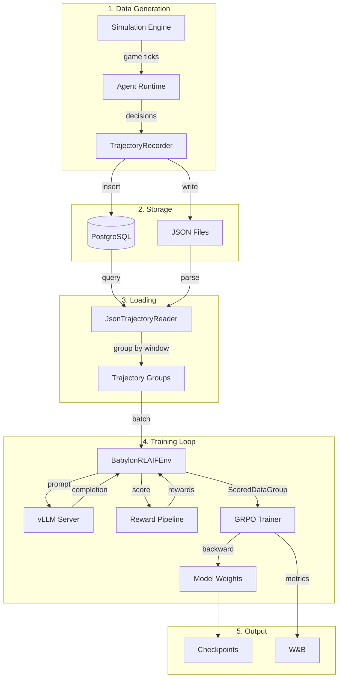
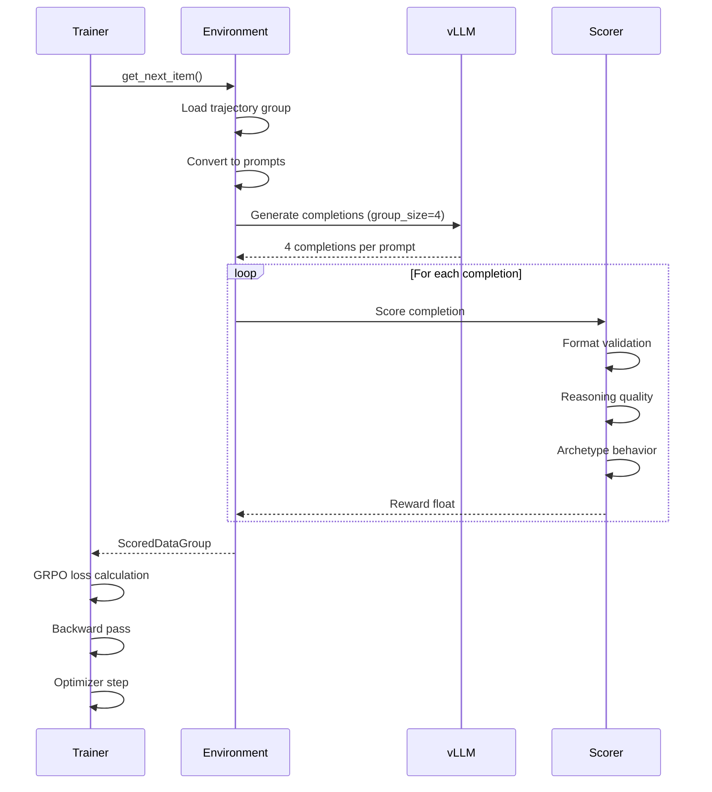

# Data Flow

This page details how data moves through the training pipeline, from game simulation to trained model.

## Complete Data Journey



## Stage 1: Data Generation

### Simulation Engine

The TypeScript simulation (`packages/engine/`) runs the game world:

```typescript
// packages/engine/examples/generate-training-data.ts
const loop = new GameLoop(world, feed, trajectoryEngine, relationships);

for (let day = 1; day <= config.simulationDays; day++) {
  for (let hour = 0; hour < config.hoursPerDay; hour++) {
    await loop.tick(gameId, day, hour, false, {
      priceOverrides: currentPrices,
      causalContext,
    });
  }
}
```

### Trajectory Recording

Each agent decision is captured by `TrajectoryRecorder`:

```typescript
// Start recording - returns trajectoryId
const trajectoryId = await recorder.startTrajectory({ 
  agentId, 
  archetype: "trader",
  scenarioId,
});

// Record each step (trajectoryId required for all calls)
recorder.startStep(trajectoryId, environmentState);
recorder.logLLMCall(trajectoryId, { prompt, response, model });
recorder.completeStep(trajectoryId, action, reward);

// Finalize and save to DB
await recorder.endTrajectory(trajectoryId, { finalPnL, finalBalance });
```

## Stage 2: Storage

### Database Schema (trajectories table)

| Column | Type | Description |
|--------|------|-------------|
| `id` | bigint | Primary key (snowflake ID) |
| `trajectoryId` | text | Unique trajectory identifier |
| `agentId` | text | Agent user ID |
| `archetype` | text | Agent archetype (trader, degen, etc.) |
| `windowId` | text | Time window identifier |
| `stepsJson` | jsonb | Array of trajectory steps |
| `finalPnL` | float | Final profit/loss |
| `finalBalance` | float | Ending balance |
| `aiJudgeReward` | float | Score from AI judge (nullable) |
| `createdAt` | timestamp | When trajectory was recorded |

### Step Structure (inside stepsJson)

```json
{
  "stepNumber": 1,
  "tick": 5,
  "observation": {
    "marketPrices": {"BTC": 45000, "ETH": 2800},
    "portfolio": {"balance": 10000, "positions": []},
    "recentNews": ["Market volatile today"]
  },
  "llmCalls": [{
    "prompt": "Given the market state...",
    "response": "I should buy ETH because...",
    "model": "qwen-0.5b"
  }],
  "action": {
    "type": "BUY",
    "parameters": {"ticker": "ETH", "amount": 100}
  },
  "reward": 0.0
}
```

## Stage 3: Loading

### Trajectory Reader

Python loads trajectories from DB or JSON:

```python
# From babylon_env.py - _load_trajectories method
async with self.db_pool.acquire() as conn:
    rows = await conn.fetch("""
        SELECT 
            t."trajectoryId", t."agentId", t."windowId",
            t."scenarioId", t."stepsJson", t."finalPnL",
            t."archetype"
        FROM trajectories t
        WHERE 
            t."createdAt" > NOW() - $1::interval
            AND t."stepsJson" IS NOT NULL
            AND t."episodeLength" >= $2
        ORDER BY t."windowId", t."scenarioId"
    """, timedelta(hours=self.config.lookback_hours), 
         self.config.min_actions_per_trajectory)
```

### Grouping by Window

Trajectories are grouped inline so agents from the same time window compete:

```python
# Grouping happens inside _load_trajectories
groups: Dict[str, List[Dict]] = {}
for row in rows:
    group_key = f"{row['windowId']}_{row['scenarioId'] or 'default'}"
    if group_key not in groups:
        groups[group_key] = []
    groups[group_key].append(parsed_trajectory)

# Filter groups with enough trajectories
self.trajectory_cache = [
    {'group_key': k, 'trajectories': v}
    for k, v in groups.items()
    if len(v) >= self.config.min_agents_per_window
]
```

## Stage 4: Training Loop

### Environment → Trainer Flow



### Batch Structure

A single training batch uses Atropos's `ScoredDataGroup`:

```python
# Imported from Atropos library
from atroposlib.envs.base import ScoredDataGroup

# Built in babylon_env.py after scoring
scored_group = ScoredDataGroup()
scored_group.tokens = tokenized_completions  # List[List[int]]
scored_group.scores = rewards                 # List[float]
scored_group.masks = completion_masks         # Optional masks
```

For GRPO, each prompt gets `group_size` (default 4) completions, scored relative to each other.

## Stage 5: Output

### Checkpoints

Saved every N steps:

```text
trained_models/
├── step_5/
│   ├── model.safetensors
│   ├── config.json
│   ├── tokenizer.json
│   └── optimizer.pt      # For resuming
├── step_10/
└── final_model/
```

### W&B Metrics

Logged each step:

| Metric | Description |
|--------|-------------|
| `train/loss` | GRPO policy gradient loss |
| `train/learning_rate` | Current LR (with scheduler) |
| `train/grad_norm` | Gradient magnitude |
| `train/pos_logp` | Log prob for high-scoring completions |
| `train/neg_logp` | Log prob for low-scoring completions |
| `train/aiJudgeReward` | Average reward this batch |
| `train/format_score` | Format quality average |
| `train/reasoning_score` | Reasoning quality average |

## Data Transformations

| Stage | Input Type | Output Type | Key Transform |
|-------|------------|-------------|---------------|
| Recording | Agent decision | TrajectoryStep | Serialize observation + action |
| Storage | TrajectoryStep[] | DB row | JSON stringify |
| Loading | DB rows | Python dicts | Parse JSON, group by window |
| Tokenization | Messages | Token IDs | Apply chat template |
| Scoring | Completion text | Float reward | Multi-factor evaluation |
| Training | ScoredDataGroup | Gradient | GRPO loss function |

