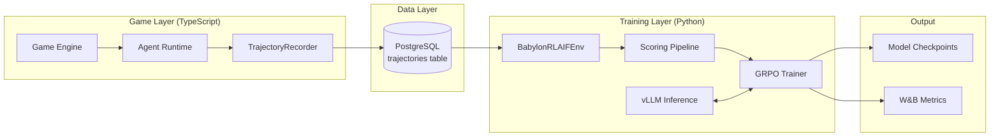
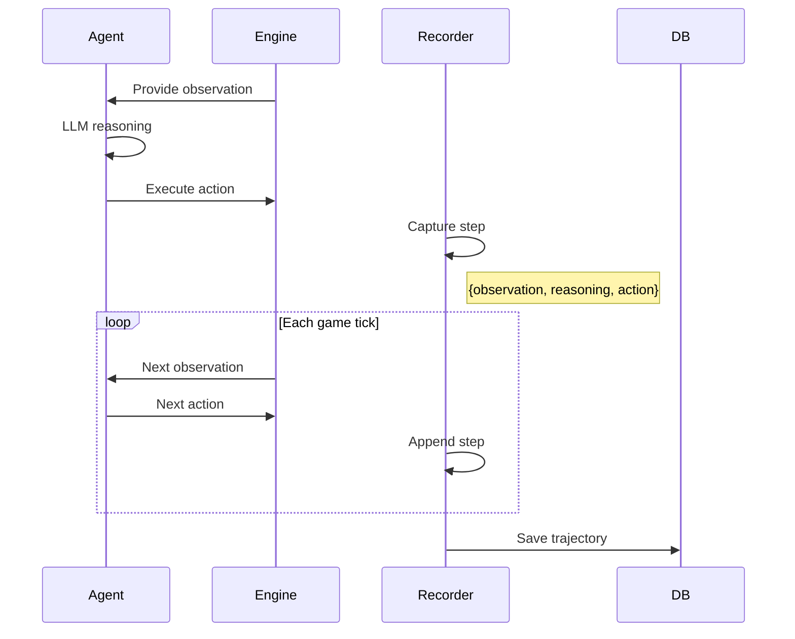
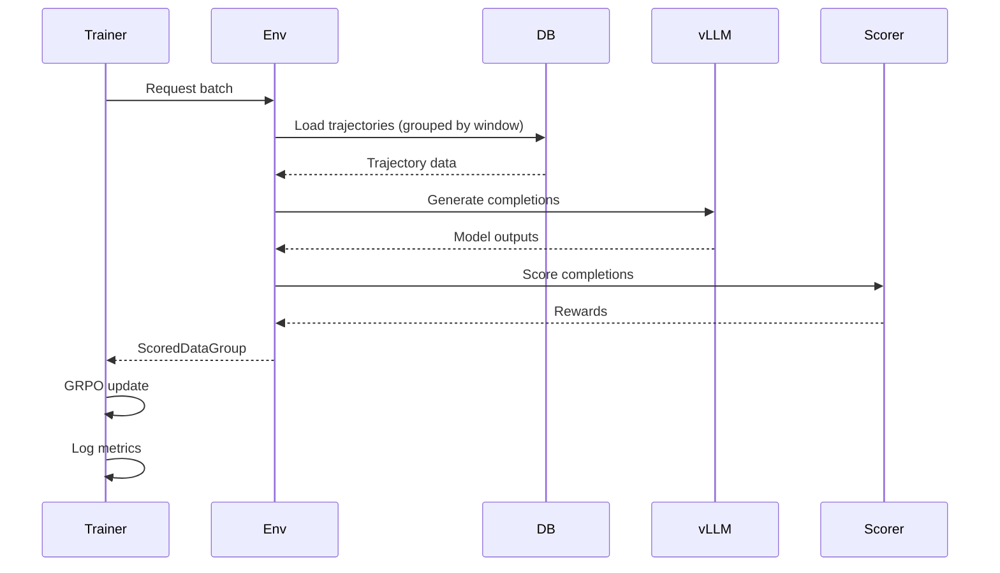

# System Overview

The Babylon RL training pipeline is a dual-language system: TypeScript for game simulation and trajectory recording, Python for ML training.

## High-Level Architecture



## Key Components

### TypeScript Side (`packages/training/src/`)

| Component | File | Purpose |
|-----------|------|---------|
| TrajectoryRecorder | `training/TrajectoryRecorder.ts` | Records agent decisions to DB/JSON |
| ArchetypeScoringService | `scoring/ArchetypeScoringService.ts` | LLM-as-judge scoring (optional) |
| Archetype Definitions | `archetypes/` | TypeScript archetype configs |
| Benchmark Generator | `benchmark/BenchmarkDataGenerator.ts` | Synthetic scenario generation |
| Scenario Loader | `benchmark/ScenarioLoader.ts` | Load fixed benchmark scenarios |
| Archetype Fit Calculator | `benchmark/ArchetypeFitCalculator.ts` | Measure archetype alignment |
| Stakeholder Report | `benchmark/StakeholderReport.ts` | Generate benchmark reports |

### Python Side (`packages/training/python/`)

| Component | File | Purpose |
|-----------|------|---------|
| BabylonRLAIFEnv | `src/training/babylon_env.py` | Atropos environment, loads trajectories, scores them |
| AtroposTrainer | `src/training/atropos_trainer.py` | GRPO training loop |
| Reward Functions | `src/training/rewards.py` | Archetype-aware reward computation |
| Run Training | `scripts/run_training.py` | Orchestrates full pipeline |
| Data Bridge | `src/data_bridge/reader.py` | Reads trajectories from DB/JSON |

## Component Interactions

### 1. Recording Phase



### 2. Training Phase



## Data Flow Summary

| Stage | Input | Output | Location |
|-------|-------|--------|----------|
| Simulation | Game state | Agent actions | `packages/engine/` |
| Recording | Agent decisions | Trajectories | `TrajectoryRecorder.ts` |
| Storage | Trajectories | DB rows | PostgreSQL |
| Loading | DB query | Trajectory objects | `babylon_env.py` |
| Scoring | Trajectory + completion | Reward float | `rewards.py` |
| Training | Scored batches | Model update | `atropos_trainer.py` |

## Separation of Concerns

### Why Two Languages?

| Concern | Language | Reason |
|---------|----------|--------|
| Game simulation | TypeScript | Same language as production game |
| Trajectory recording | TypeScript | Integrated with game engine |
| ML training | Python | PyTorch ecosystem, HuggingFace, vLLM |
| Scoring | Python | Needs to be in training loop |

### The Bridge

The languages communicate through:

1. **PostgreSQL** - Trajectories written by TS, read by Python
2. **JSON files** - For local development without DB
3. **HTTP API** (future) - Simulation bridge for online training

## File System Layout

```text
packages/training/
├── src/                    # TypeScript source
│   ├── training/           # TrajectoryRecorder
│   ├── scoring/            # LLM-as-judge (optional)
│   ├── archetypes/         # Archetype definitions
│   └── benchmark/          # Data generation
│
├── python/                 # Python source
│   ├── src/
│   │   ├── training/       # Core training modules
│   │   ├── data_bridge/    # DB/JSON readers
│   │   └── models.py       # Pydantic models
│   ├── scripts/            # Runnable scripts
│   ├── config/             # Atropos config, GPU profiles
│   └── tests/              # Python tests
│
├── config/                 # Shared config
│   └── rubrics.json        # Archetype rubrics
│
├── Makefile               # Developer commands
├── Dockerfile             # Cloud deployment
└── README.md              # Quick reference
```

