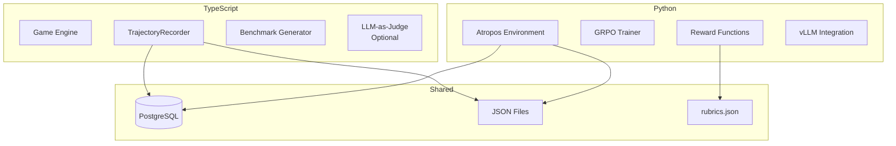

# Tech Stack

The training pipeline uses TypeScript for simulation/recording and Python for ML training.

## Language Split



## TypeScript Stack

| Component | Library | Purpose |
|-----------|---------|---------|
| Runtime | Bun | Fast JS/TS runtime |
| Database | Drizzle ORM | Type-safe DB access |
| LLM Client | BabylonLLMClient | Multi-provider (Groq, OpenAI, Anthropic) |
| Testing | Vitest | Unit/integration tests |
| Build | tsup | TypeScript bundling |

### Key TypeScript Files

```text
packages/training/src/
├── training/
│   ├── TrajectoryRecorder.ts   # Core recording logic
│   ├── window-utils.ts          # Time window handling
│   └── types.ts                 # Trajectory types
├── scoring/
│   ├── ArchetypeScoringService.ts  # LLM-as-judge
│   └── JudgePromptBuilder.ts
├── archetypes/
│   ├── derive-archetype.ts      # Archetype derivation
│   ├── ArchetypeConfigService.ts
│   └── index.ts                 # Exports
├── benchmark/
│   ├── BenchmarkDataGenerator.ts  # Synthetic data generation
│   ├── BenchmarkRunner.ts         # Run model against scenarios
│   ├── ScenarioLoader.ts          # Load fixed scenarios
│   ├── ArchetypeFitCalculator.ts  # Archetype alignment scoring
│   ├── StakeholderReport.ts       # Generate HTML/JSON/text reports
│   └── SimulationEngine.ts        # Run simulations
└── index.ts                       # Public exports
```

## Python Stack

| Component | Library | Purpose |
|-----------|---------|---------|
| Runtime | Python 3.10+ | Required for CUDA |
| RL Framework | Atropos | GRPO training loop |
| Model Loading | HuggingFace Transformers | Model weights |
| Inference | vLLM | Fast batched generation |
| Tokenization | Tiktoken / HF Tokenizers | Chat templates |
| Database | asyncpg | Async PostgreSQL |
| Config | Pydantic | Typed configurations |
| Logging | W&B (optional) | Experiment tracking |
| Testing | pytest | Test framework |

### Key Python Files

```text
packages/training/python/
├── src/
│   ├── training/
│   │   ├── babylon_env.py      # Atropos environment
│   │   ├── atropos_trainer.py  # GRPO training loop
│   │   ├── rewards.py          # Reward functions
│   │   ├── rubric_loader.py    # Load rubrics.json
│   │   ├── format_validator.py # Response format checking
│   │   ├── quality_scorer.py   # Reasoning quality
│   │   └── tokenization_utils.py
│   ├── data_bridge/
│   │   └── reader.py           # Load trajectories
│   └── models.py               # Pydantic models
├── scripts/
│   ├── run_training.py         # Full pipeline
│   ├── import_json_trajectories.py
│   └── train_local.py          # Local training
├── config/
│   ├── babylon_atropos.yaml    # Atropos config
│   └── profiles/               # GPU profiles
└── tests/
    ├── test_rewards.py
    └── integration/
```

## External Dependencies

### Atropos Framework

We build on [Atropos](https://github.com/NousResearch/atropos) by Nous Research:

- `BaseEnv` - Abstract environment class we extend
- `run-api` - HTTP server for env/trainer communication
- GRPO implementation - Policy gradient algorithm

### vLLM

[vLLM](https://docs.vllm.ai/) provides fast inference:

- Paged attention for memory efficiency
- Continuous batching for throughput
- OpenAI-compatible API server

Started automatically by `run_training.py`:

```python
vllm_cmd = [
    "python", "-m", "vllm.entrypoints.openai.api_server",
    "--model", self.model,
    "--port", str(self.vllm_port),
    "--gpu-memory-utilization", str(self.vllm_gpu_memory),
]
```

### PostgreSQL

Trajectory storage using the main Babylon database:

```sql
-- Simplified schema
CREATE TABLE trajectories (
    id BIGINT PRIMARY KEY,
    "trajectoryId" TEXT UNIQUE,
    "agentId" TEXT,
    archetype TEXT,
    "windowId" TEXT,
    "stepsJson" JSONB,
    "finalPnL" FLOAT,
    "aiJudgeReward" FLOAT,
    "createdAt" TIMESTAMPTZ
);
```

## GPU Requirements

| Profile | VRAM | Model | Notes |
|---------|------|-------|-------|
| 12gb | 12GB | Qwen 0.5B | RTX 3060, 4070 |
| 16gb | 16GB | Qwen 1.5B | RTX 4080 |
| 24gb | 24GB | Qwen 3B | RTX 4090 |
| l40 | 48GB | Qwen 7B | L40, A6000 |
| l40-2gpu | 96GB | Qwen 14B | 2x L40 |
| l40-4gpu | 192GB | Qwen 30B | 4x L40 |

## Version Requirements

### Python

```toml
# pyproject.toml
[project]
requires-python = ">=3.10"

dependencies = [
    "atroposlib>=0.1.0",
    "asyncpg>=0.29.0",
    "pydantic>=2.0.0",
    "vllm>=0.4.0",
    "transformers>=4.40.0",
    "openai>=1.0.0",
    "litellm>=1.0.0",
]
```

### Node/Bun

```json
{
  "engines": {
    "bun": ">=1.1"
  }
}
```

## Environment Variables

See [Environment Variables](../appendix/env-vars.md) for complete list.

Key variables:

| Variable | Required | Description |
|----------|----------|-------------|
| `DATABASE_URL` | Yes* | PostgreSQL connection |
| `OPENAI_API_KEY` | No | For LLM-as-judge |
| `WANDB_API_KEY` | No | For experiment logging |
| `CUDA_VISIBLE_DEVICES` | No | GPU selection |

*Not required in JSON mode for development.

## Build & Install

### Python Environment

```bash
cd packages/training
make venv  # Creates python/venv/
```

This runs:
```bash
python3 -m venv venv
pip install -r requirements.txt
pip install -e .
```

### TypeScript Build

```bash
bun install
bun run typecheck
```

