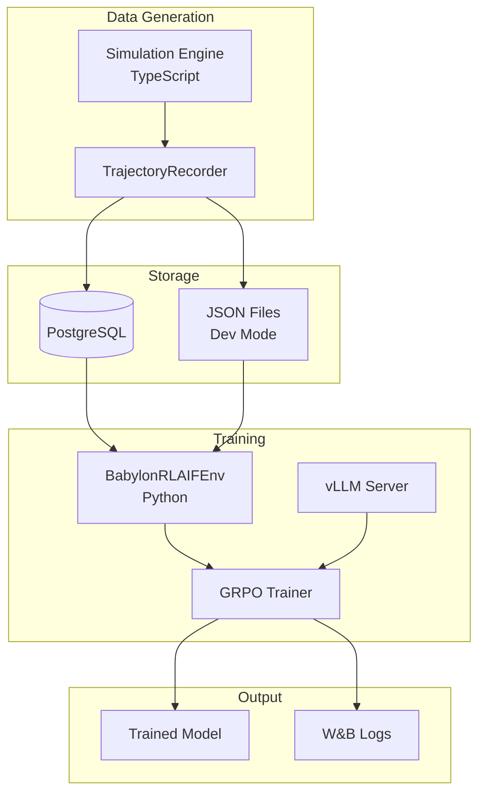

# Babylon RL Training Pipeline

This book documents the reinforcement learning (RL) training system for Babylon agents. The pipeline trains language models to play the Babylon social trading game by learning from agent trajectories.

## What This System Does

1. **Records agent behavior** - Captures every decision an agent makes: observations, reasoning, and actions
2. **Scores trajectories** - Evaluates behavior against archetype-specific rubrics (a "trader" is scored differently than a "degen")
3. **Trains models** - Uses GRPO (Group Relative Policy Optimization) to improve the base model
4. **Deploys improvements** - Produces checkpoints that can be deployed as new agent models

## Core Concepts

| Term | Definition |
|------|------------|
| **Trajectory** | A complete record of one agent's behavior over a time window |
| **Archetype** | A behavioral style (trader, degen, social-butterfly, etc.) with unique success criteria |
| **GRPO** | Training algorithm that learns from relative comparisons between trajectories |
| **Atropos** | The RL framework we build on (by Nous Research) |
| **Window** | A time slice of the game (e.g., one hour) during which trajectories are grouped |

## System Components



## Quick Start

### Prerequisites

- Python 3.11+
- CUDA-capable GPU (12GB+ VRAM)
- PostgreSQL (for production) or JSON mode (for development)

### Run Training

```bash
cd packages/training

# Setup Python environment
make venv

# Run all tests first
make tier1  # Unit tests
make tier2  # JSON mode integration

# Start training (12GB GPU)
make train-12gb
```

### Generate Training Data

```bash
# Generate trajectories with the simulation engine
bun run packages/engine/examples/generate-training-data.ts --causal --hours 2

# Import to database
python packages/training/python/scripts/import_json_trajectories.py --source ./training-data-output
```

## Who This Book Is For

- **RL Workstream Lead** - Architecture decisions, system design, roadmap
- **Contributors** - How to add archetypes, run training, debug issues
- **Operators** - How to deploy training to cloud, monitor with W&B

## Code Locations

| Component | Path |
|-----------|------|
| TypeScript Source | `packages/training/src/` |
| Python Source | `packages/training/python/src/` |
| Training Scripts | `packages/training/python/scripts/` |
| GPU Profiles | `packages/training/python/config/profiles/` |
| Rubrics | `packages/training/config/rubrics.json` |
| Makefile | `packages/training/Makefile` |
