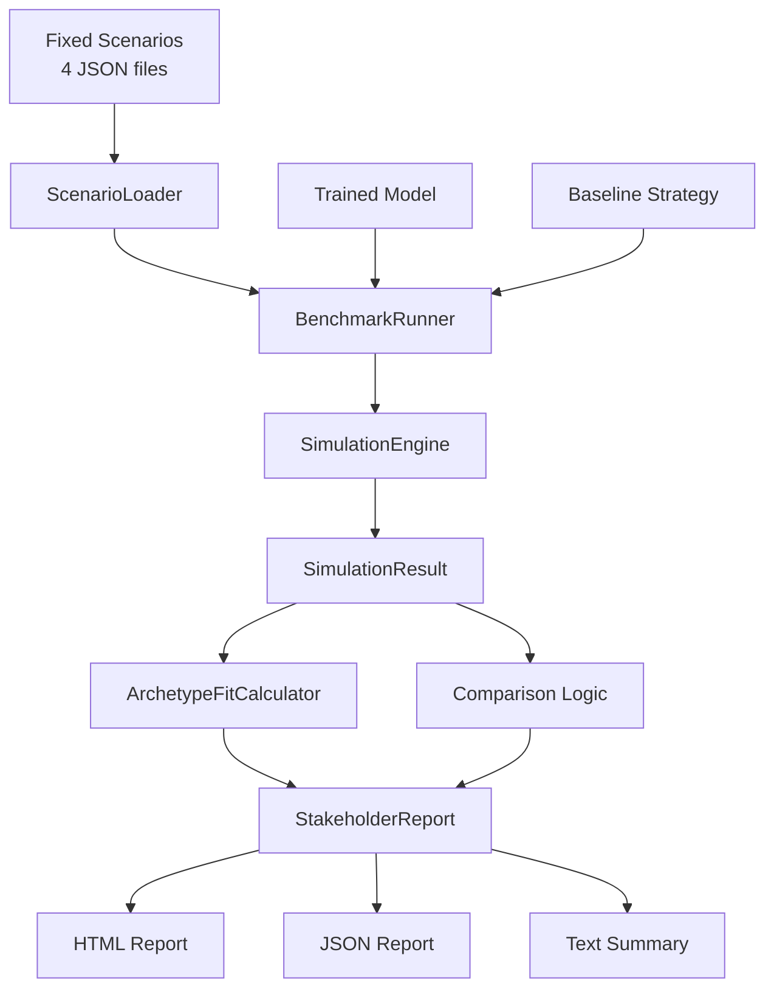

# Benchmarking

The benchmark suite evaluates trained models against fixed scenarios, comparing them to baseline strategies.

## Quick Start

```bash
# Run full benchmark suite (all 4 scenarios)
bun run benchmark

# Quick mode (7-day scenarios instead of 22-day)
bun run benchmark:quick

# Specific scenario
bun run benchmark -- --scenario bear-market

# With trained model
bun run benchmark -- --model ./trained_models/step_100
```

## Fixed Scenarios

The benchmark suite includes four pre-generated, deterministic scenarios:

| Scenario | Duration | Description | Tests |
|----------|----------|-------------|-------|
| `bull-market` | 22 days | Steady uptrend | Basic competence, trend following |
| `bear-market` | 22 days | 40% crash at day 10, recovery | Capital protection, risk management |
| `scandal-unfolds` | 22 days | Hidden scandal revealed through leaks | Information processing, early warning detection |
| `pump-and-dump` | 22 days | Coordinated market manipulation | Skepticism, avoiding FOMO |

### Causal Scenarios

`scandal-unfolds` and `pump-and-dump` use **causal simulation**, where hidden narrative facts are revealed over time and affect market prices. This tests an agent's ability to:

- Process incomplete information
- Recognize warning signals
- React appropriately to new information

## CLI Options

```bash
bun run benchmark [options]
```

| Option | Description | Default |
|--------|-------------|---------|
| `--scenario <id>` | Run specific scenario (bull-market, bear-market, scandal-unfolds, pump-and-dump) | all |
| `--model <path>` | Path to trained model or HuggingFace ID | momentum strategy |
| `--baseline <type>` | Baseline strategy: `random`, `momentum` | `random` |
| `--archetype <type>` | Archetype to test (trader, degen, scammer, social-butterfly) | `trader` |
| `--quick` | Quick mode (7-day scenarios) | `false` |
| `--output <dir>` | Output directory for reports | auto-generated |
| `--json` | Output JSON only (no HTML) | `false` |

## Output Reports

The benchmark suite generates three report formats:

### 1. HTML Report

Stakeholder-friendly visualization with:
- Executive summary
- Per-scenario comparison charts
- Winner/loser analysis
- Recommendations

### 2. JSON Report

Machine-readable data for dashboards:

```json
{
  "generatedAt": "2026-01-15T10:00:00.000Z",
  "modelVersion": "step_100",
  "baselineDescription": "random strategy",
  "scenarios": [...],
  "summary": {
    "scenariosWon": 3,
    "scenariosLost": 1,
    "scenariosTied": 0,
    "totalAlpha": 1250.50,
    "avgPnlImprovement": 12.5,
    "avgFitScoreImprovement": 0.05,
    "overallVerdict": "deploy",
    "verdictExplanation": "Model won 3/4 scenarios..."
  },
  "recommendations": [...]
}
```

### 3. Text Summary

Terminal-friendly output for logs:

```text
═══════════════════════════════════════════════════════════════
                    BENCHMARK REPORT SUMMARY
═══════════════════════════════════════════════════════════════

Model: step_100
Baseline: random

✅ VERDICT: DEPLOY
Model won 3/4 scenarios with $1250.50 total alpha.

📊 SUMMARY
───────────────────────────────────────────────────────────────
Scenarios Won:        3/4
Total Alpha:          $1250.50
Avg P&L Improvement:  +12.5%
```

## Archetype Fit Scoring

Beyond P&L comparison, the benchmark suite measures **archetype alignment**:

```typescript
interface ArchetypeFitScore {
  archetype: string;
  fitScore: number;  // 0-1
  components: {
    actionDistribution: number;  // Trading vs posting vs research
    riskBehavior: number;        // Leverage, position sizing
    socialBehavior: number;      // Post frequency, engagement style
    activityLevel: number;       // Actions per day
  };
  observations: string[];
}
```

### Fit Score Components

| Component | Description |
|-----------|-------------|
| Action Distribution | Does the agent's action mix match the archetype? (trader = mostly trades, scammer = mostly posts) |
| Risk Behavior | Does leverage and position sizing match expectations? |
| Social Behavior | Post frequency and engagement style alignment |
| Activity Level | Is the agent active enough for its archetype? |

## Success Criteria

Each scenario defines success criteria per archetype:

```json
{
  "traderMinPnlRatio": -0.5,    // Lose less than 50% of baseline loss
  "scammerMinAlpha": 200,       // Extract at least $200 alpha
  "degenMinTrades": 10          // Complete at least 10 trades
}
```

### Per-Scenario Expectations

| Scenario | Trader | Degen | Scammer |
|----------|--------|-------|---------|
| bull-market | Profit with market | High activity | Pump & hype |
| bear-market | Protect capital | Stay active despite losses | Spread FUD |
| scandal-unfolds | Exit early | May get caught | Exploit info asymmetry |
| pump-and-dump | Avoid FOMO | May fall for it | Coordinate pump |

## Verdicts

The benchmark suite issues one of three verdicts:

| Verdict | Condition | Meaning |
|---------|-----------|---------|
| `deploy` | Won ≥3 scenarios AND positive alpha | Model ready for production |
| `regression` | Lost ≥3 scenarios OR alpha < -$500 | Training regressed |
| `keep_training` | Neither above | Continue training |

## Regenerating Scenarios

If you need to regenerate the fixed benchmark scenarios:

```bash
bun run benchmark:scenarios
```

This runs `scripts/generate-benchmark-scenarios.ts` which creates deterministic scenarios using seeded random generators.

## CI Integration

Benchmarks run automatically via GitHub Actions:

```yaml
# .github/workflows/benchmark-suite.yml
on:
  workflow_run:
    workflows: ["RL Training"]
    types: [completed]
  schedule:
    - cron: '0 3 * * *'  # 3 AM UTC daily
  workflow_dispatch:  # Manual trigger
```

### Artifacts

CI runs upload benchmark reports as artifacts, accessible from the Actions tab.

## Architecture



### Key Components

| Component | File | Purpose |
|-----------|------|---------|
| ScenarioLoader | `src/benchmark/ScenarioLoader.ts` | Load and validate fixed scenarios |
| ArchetypeFitCalculator | `src/benchmark/ArchetypeFitCalculator.ts` | Calculate archetype alignment |
| StakeholderReport | `src/benchmark/StakeholderReport.ts` | Generate reports |
| BenchmarkRunner | `src/benchmark/BenchmarkRunner.ts` | Orchestrate simulations |
| SimulationEngine | `src/benchmark/SimulationEngine.ts` | Run agent in scenario |

## Scenario Files

Located in `data/benchmarks/scenarios/`:

```text
packages/training/data/benchmarks/scenarios/
├── bull-market.json
├── bear-market.json
├── scandal-unfolds.json
├── pump-and-dump.json
└── README.md
```

Each scenario file contains:

```typescript
interface FixedBenchmarkScenario {
  id: string;
  name: string;
  description: string;
  marketCondition: 'bull' | 'bear' | 'volatile' | 'scandal';
  durationDays: number;
  expectedBehavior: {
    trader: string;
    degen: string;
    scammer: string;
    'social-butterfly': string;
  };
  successCriteria: {
    traderMinPnlRatio: number;
    scammerMinAlpha: number;
    degenMinTrades: number;
  };
  useCausalSimulation: boolean;
  snapshot: BenchmarkGameSnapshot;
}
```

## Next Steps

- [Data Generation](./data-generation.md) - Generate training data
- [Enhanced Rewards](../scoring/enhanced-rewards.md) - Context-aware rewards using market regime
- [Local Training](./local-training.md) - Train models locally

