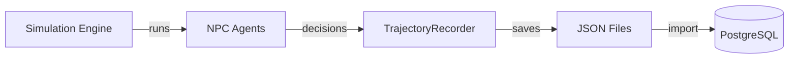

# Data Generation

Generate training trajectories using the simulation engine.

## Overview



## Quick Start

```bash
# Generate 2 hours of simulation data
bun run packages/engine/examples/generate-training-data.ts --hours 2

# Output: ./training-data-output/
```

## Command Options

```bash
bun run packages/engine/examples/generate-training-data.ts [options]
```

| Option | Default | Description |
|--------|---------|-------------|
| `--causal` | false | Enable causal simulation (hidden facts → events) |
| `--days N` | 1 | Number of days to simulate |
| `--hours N` | 24 | Hours per day |
| `--seed N` | timestamp | Random seed for reproducibility |
| `--npcs N` | 10 | Number of NPC agents |
| `--output DIR` | `./training-data-output` | Output directory for JSON artifacts |

### Examples

```bash
# Quick test (1 hour)
bun run packages/engine/examples/generate-training-data.ts --hours 1

# Full day with causal simulation
bun run packages/engine/examples/generate-training-data.ts --causal

# Multi-day reproducible run
bun run packages/engine/examples/generate-training-data.ts --causal --days 3 --seed 12345

# More agents for diversity
bun run packages/engine/examples/generate-training-data.ts --npcs 20 --hours 4
```

## Output Structure

```text
training-data-output/
├── state.json           # Game state snapshot
├── ground-truth.json    # Causal events (if --causal)
└── trajectories/
    ├── traj_abc123.json
    ├── traj_def456.json
    └── ...
```

### Trajectory File Format

```json
{
  "trajectory": {
    "trajectoryId": "traj_abc123",
    "agentId": "npc_001",
    "archetype": "trader",
    "windowId": "2025-01-13-14",
    "stepsJson": [...],
    "finalPnL": 150.50,
    "finalBalance": 10150.50,
    "tradesExecuted": 8,
    "episodeLength": 12,
    "startTime": "2025-01-13T14:00:00Z",
    "endTime": "2025-01-13T15:00:00Z"
  }
}
```

## Causal Simulation Mode

With `--causal`, the simulation includes hidden narrative facts that drive events:

```bash
bun run packages/engine/examples/generate-training-data.ts --causal --seed 42
```

### How It Works

1. **Hidden fact generated**: "Company X will announce partnership"
2. **Events scheduled**: Day 2, Hour 10 - "Partnership announced"
3. **Price impact**: ETH price moves based on event
4. **Agent response**: Agents observe and react

### Ground Truth File

```json
{
  "seed": 42,
  "hiddenNarrativeFacts": [
    {
      "fact": "Major protocol upgrade coming for ETH",
      "affectsTickers": ["ETH"],
      "sentiment": "bullish"
    }
  ],
  "causalEvents": [
    {
      "day": 2,
      "hour": 10,
      "eventType": "PROTOCOL_UPGRADE",
      "description": "Ethereum announces major upgrade",
      "priceChanges": {"ETH": 0.15}
    }
  ]
}
```

This enables training agents that can learn to:
- Anticipate events from subtle signals
- React appropriately to news
- Distinguish signal from noise

### Price Context for Enhanced Rewards

When using `--causal`, the ground truth includes price history that enables [Enhanced Rewards](../scoring/enhanced-rewards.md):

```json
{
  "priceHistory": {
    "BTC": [100000, 102000, 105000, 103000],
    "ETH": [4000, 4100, 4200, 4150]
  },
  "initialPrices": {"BTC": 100000, "ETH": 4000},
  "finalPrices": {"BTC": 103000, "ETH": 4150}
}
```

The import script merges this into trajectory metadata as `price_context`:

```bash
python packages/training/python/scripts/import_json_trajectories.py \
  --source ./training-data-output \
  --inject-ground-truth
```

This enables:
- **Market regime detection** (bull/bear/sideways)
- **Counterfactual alpha** (skill vs luck measurement)
- **Per-market outcome tracking**

## Archetype Distribution

Agents are assigned archetypes based on NPC characteristics:

```typescript
function deriveArchetype(npc: NPCCharacteristics): string {
  if (npc.personality.riskTolerance > 0.8) return "degen";
  if (npc.personality.socialness > 0.8) return "social-butterfly";
  if (npc.willingToLie) return "scammer";
  return "trader";
}
```

### Customize Distribution

Edit `generate-training-data.ts` or use:

```bash
# More NPCs = more archetype variety
bun run packages/engine/examples/generate-training-data.ts --npcs 30
```

## Importing to Database

After generation, import to PostgreSQL (run commands from the repo root):

```bash
# Using Makefile
cd packages/training && make tier4-import

# Or directly
python packages/training/python/scripts/import_json_trajectories.py --source ./training-data-output
```

### Import Options

```bash
python packages/training/python/scripts/import_json_trajectories.py \
  --source ./training-data-output \
  --verbose \
  --dry-run  # Validate without inserting
```

### Import Output

```text
IMPORT SUMMARY
==============
Total files:          150
Valid trajectories:   142
Invalid trajectories: 8
Inserted:             142
Skipped (existing):   0
Failed:               0

Archetypes found:
  - trader: 85
  - degen: 32
  - social-butterfly: 15
  - researcher: 10
```

## Data Quality

### Validation Checks

The importer validates:

| Check | Requirement |
|-------|-------------|
| Required fields | trajectoryId, agentId, windowId |
| Steps present | stepsJson not empty |
| LLM calls present | At least 1 LLM call |
| Valid archetype | Known archetype name |

### Minimum for Training

| Metric | Minimum | Recommended |
|--------|---------|-------------|
| Total trajectories | 50 | 500+ |
| Unique windows | 10 | 50+ |
| Steps per trajectory | 3 | 10+ |
| Archetypes | 1 | All 12 |

## Parallel Generation

For large datasets, run multiple seeds in parallel (run from the repo root and use a unique `--output` per worker to avoid collisions):

```bash
# Terminal 1
bun run packages/engine/examples/generate-training-data.ts --seed 1 --hours 24 --output ./training-data-output/seed_1 &

# Terminal 2
bun run packages/engine/examples/generate-training-data.ts --seed 2 --hours 24 --output ./training-data-output/seed_2 &

# Terminal 3
bun run packages/engine/examples/generate-training-data.ts --seed 3 --hours 24 --output ./training-data-output/seed_3 &
```

Or use the shell script:

```bash
./packages/training/scripts/generate_dataset.sh 24 4
```

## LLM Provider

Generation requires an LLM for agent decisions. Supported:

| Provider | Env Var | Model |
|----------|---------|-------|
| Groq | `GROQ_API_KEY` | qwen/qwen3-32b |
| OpenAI | `OPENAI_API_KEY` | gpt-5-mini-2025-08-07 |
| Anthropic | `ANTHROPIC_API_KEY` | claude-sonnet-4-5-20250929 |

```bash
# Use Groq (fastest, free tier available)
export GROQ_API_KEY=your_key
bun run packages/engine/examples/generate-training-data.ts --hours 2
```

## Long-Running Simulations (24+ Hours)

For generating large training datasets, you'll want to run simulations for extended periods. This section covers running simulations that survive SSH disconnects.

### Recommended: tmux (Reattachable Sessions)

`tmux` lets you detach from a running process and reattach later, even after SSH disconnect.

**Start the simulation:**

```bash
# Create a named tmux session
tmux new -s training

# Inside tmux, run the simulation (no nohup needed)
bun run packages/engine/examples/generate-training-data.ts \
  --causal \
  --days 60 \
  --npcs 15 \
  --seed 20250114 \
  2>&1 | tee training-generation.log
```

**Detach from session:**

Press `Ctrl+B`, then `D` to detach. The simulation continues running.

**After SSH reconnect:**

```bash
# Reattach to see live output
tmux attach -t training

# List all sessions
tmux ls

# Kill session when done
tmux kill-session -t training
```

**tmux navigation:**

| Command | Action |
|---------|--------|
| `Ctrl+B, D` | Detach |
| `Ctrl+B, [` | Scroll mode (arrows to scroll, `q` to exit) |
| `Ctrl+B, c` | New window |
| `Ctrl+B, n` | Next window |
| `Ctrl+B, p` | Previous window |

### Alternative: nohup (Fire and Forget)

If you don't need to reattach:

```bash
nohup bun run packages/engine/examples/generate-training-data.ts \
  --causal \
  --days 60 \
  --npcs 15 \
  --seed 20250114 \
  > training-generation.log 2>&1 &

# Save the PID for later
echo $! > training.pid
echo "Started with PID: $(cat training.pid)"
```

**Monitor progress:**

```bash
# Watch log in real-time
tail -f training-generation.log

# Check if still running
ps aux | grep $(cat training.pid)

# Count completed ticks
grep -c "Tick " training-generation.log
```

### Recommended Parameters for 24-Hour Run

Based on typical LLM latency (~30-60 seconds per tick):

| Duration | Days | Hours/Day | Total Ticks | Estimated Time |
|----------|------|-----------|-------------|----------------|
| 12 hours | 30 | 24 | 720 | ~12h @ 60s/tick |
| 24 hours | 60 | 24 | 1440 | ~24h @ 60s/tick |
| 48 hours | 120 | 24 | 2880 | ~48h @ 60s/tick |

**24-hour command (copy-paste ready):**

```bash
tmux new -s training -d "bun run packages/engine/examples/generate-training-data.ts --causal --days 60 --npcs 15 --seed 20250114 2>&1 | tee training-generation.log"

# Attach to see progress
tmux attach -t training
```

### After Completion

```bash
# Check output
ls -la training-data-output/

# Count trajectories
ls training-data-output/trajectories/ | wc -l

# Import to database
cd packages/training && make tier4-import

# Or directly
python packages/training/python/scripts/import_json_trajectories.py --source ./training-data-output
```

### Recovery if Interrupted

If the simulation crashes or you kill it early:

1. **Data is preserved**: Trajectories are saved per-tick to `./training-data-output/trajectories/`
2. **Resume not supported**: You'll need to restart, but existing files won't be overwritten
3. **Import what you have**: Run the import on partial data

```bash
# Check what you got
find training-data-output/trajectories -name "*.json" | wc -l

# Import anyway
cd packages/training && make tier4-import
```

## Troubleshooting

### No API Key

```text
Error: No API keys found. Set GROQ_API_KEY, OPENAI_API_KEY, or ANTHROPIC_API_KEY
```

**Fix**: Set an API key in environment.

### Empty Trajectories

Some agents may produce empty trajectories if:
- LLM returns invalid actions
- Simulation errors

**Fix**: These are filtered out during import. Generate more data.

### Slow Generation

Simulation speed depends on:
- LLM API latency
- Number of NPCs
- Hours simulated

**Tip**: Use Groq (faster) or reduce NPCs for testing.

### Duplicate Trajectories

```
Skipped (existing): 50
```

This is normal - the importer skips already-imported trajectories by ID.
