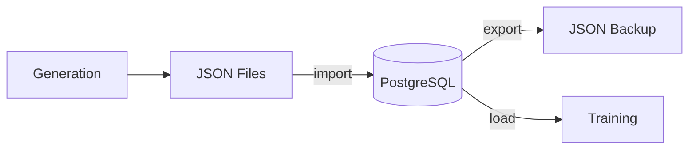

# Data Management

Manage training data: check availability, import, export, and maintain quality.

## Data Flow



## Checking Data

### Database Query

```sql
-- Total trajectories
SELECT COUNT(*) FROM trajectories;

-- Recent trajectories (last 7 days)
SELECT COUNT(*) FROM trajectories 
WHERE "createdAt" > NOW() - INTERVAL '7 days';

-- By archetype
SELECT archetype, COUNT(*) 
FROM trajectories 
WHERE archetype IS NOT NULL
GROUP BY archetype;

-- Unscored
SELECT COUNT(*) FROM trajectories 
WHERE "aiJudgeReward" IS NULL;
```

### Python Script

```python
#!/usr/bin/env python3
"""check_trajectories.py - Quick data availability check"""

import asyncio
import asyncpg
import os

async def main():
    conn = await asyncpg.connect(os.environ['DATABASE_URL'])
    
    total = await conn.fetchval('SELECT COUNT(*) FROM trajectories')
    print(f"Total trajectories: {total}")
    
    recent = await conn.fetchval('''
        SELECT COUNT(*) FROM trajectories 
        WHERE "createdAt" > NOW() - INTERVAL '7 days'
    ''')
    print(f"Last 7 days: {recent}")
    
    archetypes = await conn.fetch('''
        SELECT archetype, COUNT(*) as count 
        FROM trajectories 
        WHERE archetype IS NOT NULL
        GROUP BY archetype
    ''')
    print("\nBy archetype:")
    for row in archetypes:
        print(f"  {row['archetype']}: {row['count']}")
    
    await conn.close()

asyncio.run(main())
```

## Importing Data

### From JSON Files

```bash
# Import from default location (./training-data-output)
python packages/training/python/scripts/import_json_trajectories.py

# Import from custom location
python packages/training/python/scripts/import_json_trajectories.py --source /path/to/trajectories

# Dry run (validate only)
python packages/training/python/scripts/import_json_trajectories.py --dry-run --verbose
```

### Import Validation

The importer checks:

1. **Required fields**: trajectoryId, agentId, windowId
2. **Steps data**: stepsJson not empty, has LLM calls
3. **Archetype validity**: Known archetype name
4. **Duplicates**: Skips existing trajectoryIds

### Import Script Details

```python
# import_json_trajectories.py key functions

def validate_trajectory(traj_data: dict) -> tuple[bool, list[str]]:
    """Validate trajectory data before import."""
    issues = []
    
    required = ["trajectoryId", "agentId", "windowId"]
    for field in required:
        if not traj_data.get(field):
            issues.append(f"Missing: {field}")
    
    steps = traj_data.get("stepsJson", [])
    if len(steps) == 0:
        issues.append("No steps in trajectory")
    
    return len(issues) == 0, issues


def extract_archetype_from_trajectory(traj_data: dict) -> str:
    """Extract archetype, with fallback to 'trader'."""
    archetype = traj_data.get("archetype")
    if archetype:
        return normalize_archetype(archetype)
    
    # Check steps for archetype in action parameters
    for step in traj_data.get("stepsJson", []):
        params = step.get("action", {}).get("parameters", {})
        if params.get("archetype"):
            return normalize_archetype(params["archetype"])
    
    return "trader"
```

## Exporting Data

### To JSON Files

```python
#!/usr/bin/env python3
"""export_trajectories.py - Export DB to JSON"""

import json
import os
import psycopg2
from pathlib import Path

def export_trajectories(output_dir: Path):
    conn = psycopg2.connect(os.environ['DATABASE_URL'])
    cur = conn.cursor()
    
    cur.execute('SELECT * FROM trajectories WHERE "stepsJson" IS NOT NULL')
    columns = [desc[0] for desc in cur.description]
    
    output_dir.mkdir(parents=True, exist_ok=True)
    
    for row in cur:
        data = dict(zip(columns, row))
        traj_id = data['trajectoryId']
        
        with open(output_dir / f"{traj_id}.json", 'w') as f:
            json.dump({"trajectory": data}, f, indent=2, default=str)
    
    conn.close()

export_trajectories(Path("./exported-trajectories"))
```

### Selective Export

```python
# Export only recent, unscored trajectories
cur.execute('''
    SELECT * FROM trajectories 
    WHERE "createdAt" > NOW() - INTERVAL '24 hours'
    AND "aiJudgeReward" IS NULL
    AND "stepsJson" IS NOT NULL
''')
```

## Data Quality

### Quality Metrics

| Metric | Check | Target |
|--------|-------|--------|
| Steps per trajectory | `avg(jsonb_array_length("stepsJson"))` | > 5 |
| LLM calls present | Each step has llmCalls | 100% |
| Actions valid | action.actionType not null | > 95% |
| Balance reasonable | finalBalance > 0 | > 90% |

### Quality Query

```sql
SELECT 
    archetype,
    COUNT(*) as total,
    AVG(jsonb_array_length("stepsJson"::jsonb)) as avg_steps,
    AVG("finalPnL") as avg_pnl,
    SUM(CASE WHEN "finalBalance" > 0 THEN 1 ELSE 0 END)::float / COUNT(*) as survival_rate
FROM trajectories
WHERE archetype IS NOT NULL
GROUP BY archetype;
```

### Cleaning Bad Data

```sql
-- Delete trajectories with no steps
DELETE FROM trajectories 
WHERE "stepsJson" IS NULL 
   OR jsonb_array_length("stepsJson"::jsonb) = 0;

-- Delete very short trajectories
DELETE FROM trajectories 
WHERE jsonb_array_length("stepsJson"::jsonb) < 3;

-- Delete old unscored data
DELETE FROM trajectories 
WHERE "createdAt" < NOW() - INTERVAL '30 days'
  AND "aiJudgeReward" IS NULL;
```

## Database Maintenance

### Check Table Size

```sql
SELECT pg_size_pretty(pg_table_size('trajectories')) as table_size,
       pg_size_pretty(pg_indexes_size('trajectories')) as indexes_size;
```

### Useful Indexes

```sql
-- Speed up window-based queries
CREATE INDEX IF NOT EXISTS idx_trajectories_window 
ON trajectories ("windowId");

-- Speed up archetype filtering
CREATE INDEX IF NOT EXISTS idx_trajectories_archetype 
ON trajectories (archetype);

-- Speed up recent data queries
CREATE INDEX IF NOT EXISTS idx_trajectories_created 
ON trajectories ("createdAt" DESC);
```

### Vacuum and Analyze

```sql
-- After large deletes
VACUUM ANALYZE trajectories;
```

## Backup and Restore

### Backup

```bash
# Full table backup
pg_dump -t trajectories $DATABASE_URL > trajectories_backup.sql

# Compressed
pg_dump -t trajectories $DATABASE_URL | gzip > trajectories_backup.sql.gz
```

### Restore

```bash
# Restore from backup
psql $DATABASE_URL < trajectories_backup.sql

# From compressed
gunzip -c trajectories_backup.sql.gz | psql $DATABASE_URL
```

## Data for Specific Training Runs

### Filter by Time

```python
# Last 24 hours only
query = '''
    SELECT * FROM trajectories
    WHERE "createdAt" > NOW() - INTERVAL '24 hours'
'''
```

### Filter by Archetype

```python
# Only trader archetypes
query = '''
    SELECT * FROM trajectories
    WHERE archetype = 'trader'
'''
```

### Filter by Quality

```python
# Only "good" trajectories
query = '''
    SELECT * FROM trajectories
    WHERE "finalPnL" > 0
    AND jsonb_array_length("stepsJson"::jsonb) >= 5
'''
```

## Shared Dataset

For reproducible research, consider:

1. **Export with fixed seed**: Same data across runs
2. **Version datasets**: `trajectories_v1.json`, `trajectories_v2.json`
3. **Document generation params**: Seed, hours, NPC count

```json
{
  "dataset_version": "v1",
  "generation_params": {
    "seed": 42,
    "days": 3,
    "npcs": 20,
    "causal": true
  },
  "stats": {
    "total_trajectories": 500,
    "archetypes": {"trader": 200, "degen": 150, ...}
  },
  "trajectories": [...]
}
```
