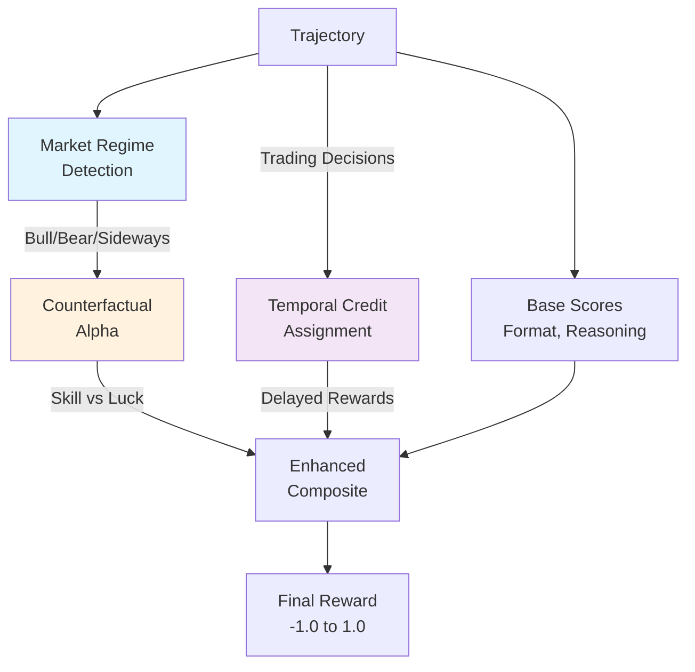

# Enhanced Reward Signals

The enhanced reward system adds **context-aware** reward calculation that distinguishes skill from luck by comparing agent performance against market conditions.

## Why Enhanced Rewards?

The basic reward system has a fundamental problem: it can't tell if a profitable trade was skill or luck.

```
Agent A: Made +$500 in a bull market (+10% overall)
Agent B: Made +$500 in a bear market (-10% overall)
```

With basic rewards, both get the same score. But Agent B clearly demonstrated more skill - they profited despite adverse conditions.

## Architecture



## Market Regime Detection

Classifies market conditions from price data:

```python
from training.market_regime import detect_market_regime

price_data = {
    "BTC": [100000, 110000],  # +10%
    "ETH": [4000, 4400],       # +10%
}

regime = detect_market_regime(price_data)
# regime.overall = "bull"
# regime.volatility = 0.3
# regime.per_ticker = {"BTC": "up", "ETH": "up"}
```

### Regime Classification

| Regime | Condition | Expected Return |
|--------|-----------|-----------------|
| Bull | Avg change > +5% | +5% |
| Bear | Avg change < -5% | -5% |
| Sideways | Between -5% and +5% | 0% |

### Per-Ticker Trends

Individual assets are classified:

| Trend | Condition |
|-------|-----------|
| Up | > +5% change |
| Down | < -5% change |
| Flat | Between -5% and +5% |

### Volatility

Normalized to [0, 1] range:

```python
def calculate_volatility(changes: List[float]) -> float:
    std_dev = np.std(changes)
    # Normalize: 2% = low, 15% = high
    normalized = (std_dev - 2.0) / (15.0 - 2.0)
    return max(0.0, min(1.0, normalized))
```

## Counterfactual Rewards (Alpha)

Measures **skill** by comparing actual performance against expected performance for the market regime.

```python
from training.rewards import compute_counterfactual

result = compute_counterfactual(
    actual_pnl=300,
    starting_balance=10000,
    regime_overall="bull",
    regime_expected_return=0.05,  # +5% expected
)

# result.benchmark_pnl = 500 (5% of 10k)
# result.alpha = -200 (underperformed by $200)
```

### Alpha Calculation

```
Alpha = Actual P&L - (Starting Balance × Expected Return)
```

| Scenario | Actual | Expected | Alpha | Interpretation |
|----------|--------|----------|-------|----------------|
| Bull market, +3% | +300 | +500 | -200 | Underperformed |
| Bear market, -2% | -200 | -500 | +300 | Outperformed |
| Sideways, +5% | +500 | 0 | +500 | Added value |

### Regime-Adjusted PnL Reward

Adjusts the PnL reward based on regime context:

```python
def regime_adjusted_pnl_reward(
    actual_pnl: float,
    starting_balance: float,
    regime_overall: str,
    regime_volatility: float,
    regime_expected_return: float,
) -> float:
    # Calculate adjusted return (actual - expected)
    actual_return = actual_pnl / starting_balance
    adjusted_return = actual_return - regime_expected_return
    
    # Scale to [-1, 1] (10% adjusted return = 1.0)
    base_reward = adjusted_return * 10.0
    
    # Dampen by volatility (high vol = less certain signal)
    dampening = 1.0 - (regime_volatility * 0.5)
    
    return max(-1.0, min(1.0, base_reward * dampening))
```

### Alpha Reward

Converts alpha to a reward signal:

```python
def calculate_alpha_reward(alpha: float, starting_balance: float) -> float:
    # 5% alpha = 1.0 reward
    alpha_pct = alpha / starting_balance
    scaled = alpha_pct * 20.0  # 5% -> 1.0
    return max(-1.0, min(1.0, scaled))
```

## Temporal Credit Assignment

Trading decisions have **delayed outcomes**. A buy decision at step 1 might not have P&L until the position closes at step 10.

Temporal credit assigns rewards back to the decisions that caused them.

```python
from training.temporal_credit import attribute_temporal_credit

steps = [
    {"action": {"actionType": "buy", "parameters": {"marketId": "BTC"}}},   # Step 0
    {"action": {"actionType": "research", "parameters": {}}},               # Step 1
    {"action": {"actionType": "sell", "parameters": {"marketId": "BTC"}}},  # Step 2
]

credits = attribute_temporal_credit(steps, final_pnl=100)
# credits[0]: decision_step=0, credit_weight=0.81, outcome_pnl=45
# credits[1]: decision_step=2, credit_weight=0.90, outcome_pnl=55
```

### Exponential Decay

Decisions closer to the outcome get more credit:

```python
def calculate_credit_weight(decision_step: int, outcome_step: int) -> float:
    distance = outcome_step - decision_step
    decay_rate = 0.9  # Configurable
    return decay_rate ** distance
```

| Distance | Weight (decay=0.9) |
|----------|-------------------|
| 0 steps | 1.00 |
| 1 step | 0.90 |
| 2 steps | 0.81 |
| 5 steps | 0.59 |
| 10 steps | 0.35 |

### Per-Market Attribution

When outcome data is available per-market, credit is assigned specifically:

```python
outcome_data = {"BTC": 100, "ETH": -50}
credits = attribute_temporal_credit(steps, final_pnl=50, outcome_data=outcome_data)

# BTC trades get credited with BTC's P&L
# ETH trades get credited with ETH's P&L
```

### Trading Action Types

Actions that receive temporal credit:

- `buy`, `sell`
- `buy_prediction`, `sell_prediction`
- `open_perp`, `close_perp`
- `open_long`, `open_short`, `close_long`, `close_short`
- Any action containing "buy", "sell", "trade", "open", "close"

## Enhanced Composite Reward

Combines all signals into the final reward:

```python
def enhanced_composite_reward(
    inputs: TrajectoryRewardInputs,
    archetype: str,
    regime_overall: str,
    regime_volatility: float,
    regime_expected_return: float,
    counterfactual_alpha: float,
    temporal_credits: List[TemporalCredit],
) -> float:
    weights = get_reward_weights("default")
    
    # 1. Regime-adjusted PnL
    regime_pnl = regime_adjusted_pnl_reward(...)
    
    # 2. Skill alpha
    alpha_score = calculate_alpha_reward(alpha, starting_balance)
    
    # 3. Temporal credit bonus
    temporal_bonus = calculate_temporal_credit_bonus(credits, starting_balance)
    
    # 4. Format score
    format_score = inputs.format_score
    
    # 5. Reasoning score
    reasoning_score = inputs.reasoning_score
    
    # 6. Behavior bonus
    behavior_bonus = calculate_archetype_behavior_bonus(archetype, metrics)
    
    # Weighted combination
    composite = (
        regime_pnl * weights["regime_pnl"]
        + alpha_score * weights["skill_alpha"]
        + temporal_bonus * weights["temporal_bonus"]
        + format_score * weights["format"]
        + reasoning_score * weights["reasoning"]
        + behavior_bonus * weights["behavior"]
    )
    
    return max(-1.0, min(1.0, composite))
```

### Default Weight Profile

| Component | Weight | Purpose |
|-----------|--------|---------|
| regime_pnl | 0.30 | Context-adjusted financial performance |
| skill_alpha | 0.20 | Outperformance vs market benchmark |
| temporal_bonus | 0.10 | Credit for delayed outcomes |
| format | 0.15 | Valid response structure |
| reasoning | 0.10 | Quality of thought process |
| behavior | 0.15 | Archetype alignment |

### Backward Compatibility

If no regime data is available, falls back to basic archetype reward:

```python
if regime_overall is None:
    return archetype_composite_reward(inputs, archetype, behavior_metrics)
```

## Reward Weight Configuration

Weights are configurable via YAML without code changes:

```yaml
# config/reward_weights.yaml

default:
  regime_pnl: 0.30
  skill_alpha: 0.20
  temporal_bonus: 0.10
  format: 0.15
  reasoning: 0.10
  behavior: 0.15

skill_focused:
  regime_pnl: 0.20
  skill_alpha: 0.35
  temporal_bonus: 0.15
  format: 0.10
  reasoning: 0.10
  behavior: 0.10

risk_averse:
  regime_pnl: 0.35
  skill_alpha: 0.15
  temporal_bonus: 0.05
  format: 0.20
  reasoning: 0.15
  behavior: 0.10
```

### Available Profiles

| Profile | Focus |
|---------|-------|
| `default` | Balanced across all components |
| `skill_focused` | Emphasizes alpha over raw P&L |
| `behavior_focused` | Prioritizes archetype alignment |
| `temporal_focused` | Weights delayed reward attribution |
| `risk_averse` | Penalizes volatility, rewards stability |
| `risk_seeking` | Rewards high-variance outcomes |

### Loading Profiles

```python
from training.reward_config import get_reward_weights

weights = get_reward_weights("skill_focused")
# {"regime_pnl": 0.20, "skill_alpha": 0.35, ...}
```

## Enabling Enhanced Rewards

### 1. Generate Causal Trajectories

Use the `--causal` flag to include price context:

```bash
bun run packages/engine/examples/generate-training-data.ts \
  --causal \
  --hours 24 \
  --output ./training-data-output
```

This generates `ground-truth.json` with price history.

### 2. Import with Price Context

The import script merges price data into trajectory metadata:

```bash
python packages/training/python/scripts/import_json_trajectories.py \
  --source ./training-data-output \
  --inject-ground-truth
```

### 3. Train with Enhanced Rewards

The training env automatically uses enhanced rewards when `price_context` is present:

```python
# In babylon_env.py
regime = extract_regime_from_trajectory(trajectory)

if regime is not None:
    # Use enhanced reward
    reward = enhanced_composite_reward(...)
else:
    # Fall back to basic reward
    reward = archetype_composite_reward(...)
```

## W&B Metrics

Enhanced rewards log additional metrics:

| Metric | Description |
|--------|-------------|
| `train/regime_bull_count` | Trajectories in bull market |
| `train/regime_bear_count` | Trajectories in bear market |
| `train/regime_sideways_count` | Trajectories in sideways market |
| `train/alpha_mean` | Average counterfactual alpha |
| `train/alpha_std` | Alpha variance |
| `train/volatility_mean` | Average market volatility |
| `train/temporal_bonus_mean` | Average temporal credit bonus |

## Example: Full Pipeline

```python
# 1. Extract regime from trajectory
regime = extract_regime_from_trajectory(trajectory)
# MarketRegime(overall="bear", volatility=0.6, per_ticker={"BTC": "down"})

# 2. Compute counterfactual
expected_return = get_regime_expected_return(regime.overall)  # -0.05
counterfactual = compute_counterfactual(
    actual_pnl=-200,  # Lost 2%
    starting_balance=10000,
    regime_overall=regime.overall,
    regime_expected_return=expected_return,
)
# counterfactual.alpha = +300 (beat benchmark by 3%)

# 3. Compute temporal credits
credits = attribute_temporal_credit(trajectory["steps"], final_pnl=-200)

# 4. Calculate enhanced reward
reward = enhanced_composite_reward(
    inputs=TrajectoryRewardInputs(
        final_pnl=-200,
        starting_balance=10000,
        end_balance=9800,
        format_score=0.8,
        reasoning_score=0.7,
    ),
    archetype="trader",
    regime_overall=regime.overall,
    regime_volatility=regime.volatility,
    regime_expected_return=expected_return,
    counterfactual_alpha=counterfactual.alpha,
    temporal_credits=credits,
)
# reward > 0 (positive despite negative P&L due to outperformance)
```

## Social & Narrative Rewards

For non-trading archetypes like **Social Butterfly** and **Information Trader**, financial performance is not the primary success metric. The social reward system provides PnL-independent scoring based on:

### Components

| Component | Description | Key Metrics |
|-----------|-------------|-------------|
| **Engagement** | Volume and diversity of social activity | Posts, comments, DMs, group chats |
| **Information Spread** | Content that reaches and engages others | Reactions, shares, spread count |
| **Network** | Building connections and reputation | Unique users, follower gains, reputation |
| **Narrative Alignment** | Actions aligned with ground truth events | Prediction accuracy, timing |

### Archetype-Specific Weights

Different archetypes weight these components differently:

| Archetype | Engagement | Spread | Network | Narrative |
|-----------|------------|--------|---------|-----------|
| Social Butterfly | 30% | 20% | **40%** | 10% |
| Information Trader | 15% | 25% | 20% | **40%** |
| Scammer/Liar | 20% | **40%** | 25% | 15% |
| Goody Two-Shoes | 25% | 20% | 30% | 25% |
| Ass-Kisser | 35% | 15% | **40%** | 10% |

### Usage

```python
from training.rewards import calculate_social_reward, social_only_composite_reward

# Get component breakdown
result = calculate_social_reward(metrics, "social-butterfly")
print(result.engagement_score)      # 0.85
print(result.network_score)         # 0.92
print(result.total_score)           # 0.78

# Use social-focused composite reward
reward = social_only_composite_reward(
    inputs=trajectory_inputs,
    archetype="social-butterfly",
    behavior_metrics=metrics,
)
# Social Butterfly with $0 PnL but great social metrics can score > 0.6
```

### Key Insight

A Social Butterfly with no trading but 15+ unique connections, 5+ group chats, and positive reputation can **outscore** a passive trader who just holds their balance. This enables training agents specialized in community building rather than trading.

### W&B Metrics

| Metric | Description |
|--------|-------------|
| `train/social_reward_mean` | Average total social reward |
| `train/social_engagement_mean` | Average engagement score |
| `train/social_spread_mean` | Average information spread score |
| `train/social_network_mean` | Average network score |
| `train/social_narrative_mean` | Average narrative alignment score |

## Next Steps

- [Reward System](./reward-system.md) - Basic reward components
- [Archetype Rubrics](./rubrics.md) - Per-archetype scoring
- [Data Generation](../operations/data-generation.md) - Generating causal trajectories
