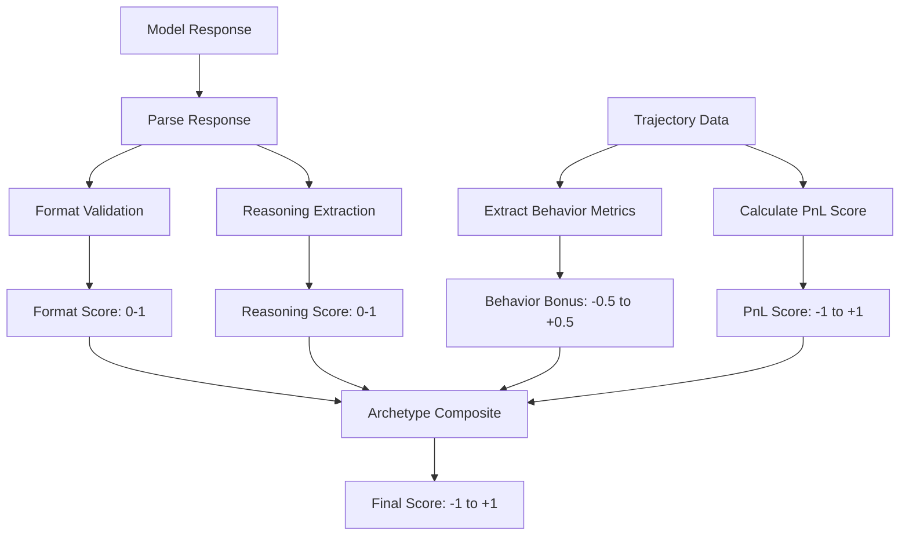

# Deterministic Python Judge

The primary scoring method is a deterministic Python judge that runs inside the training loop.

## Why Deterministic?

| Aspect | LLM Judge | Python Judge |
|--------|-----------|--------------|
| Latency | ~500ms per call | <1ms |
| Cost | API charges | Free |
| Reproducibility | Varies | Deterministic |
| Batch-able | Limited | Fully |
| Debug-able | Hard | Easy |

The Python judge is the default for training. LLM-as-judge is available for evaluation and comparison.

## Scoring Pipeline



## Implementation

Located in `python/src/training/babylon_env.py`:

```python
def _score_with_judge(
    self,
    trajectory: dict,
    generated_response: str,
    archetype: str,
) -> float:
    """
    Deterministic Python scoring of a generated response.
    """
    
    # 1. Format validation
    format_validation = validate_response_format(generated_response)
    format_score = self._calculate_format_score(format_validation)
    
    # 2. Reasoning quality
    reasoning_score = score_response(generated_response)
    
    # 3. Extract behavior metrics
    behavior_metrics = self._extract_behavior_metrics(trajectory)
    
    # 4. Build reward inputs
    inputs = TrajectoryRewardInputs(
        final_pnl=trajectory.get("finalPnL", 0.0),
        starting_balance=10000.0,
        end_balance=10000.0 + trajectory.get("finalPnL", 0.0),
        format_score=format_score,
        reasoning_score=reasoning_score,
        trades_executed=trajectory.get("tradesExecuted", 0),
    )
    
    # 5. Archetype-aware composite
    base_score = archetype_composite_reward(inputs, archetype, behavior_metrics)
    
    # 6. Action quality bonus
    action_quality = self._score_action_quality(format_validation, archetype)
    
    # 7. GRPO blend: base + action quality
    # Action quality is PRIMARY differentiator for same-prompt completions
    final_score = base_score * 0.4 + action_quality * 0.6
    
    # 8. Add tiebreaker epsilon
    final_score = self._add_tiebreaker(final_score, generated_response, format_validation)
    
    return final_score
```

## Format Validation

Checks that the response has valid structure:

```python
@dataclass
class FormatValidationResult:
    has_valid_json: bool
    action: ActionInfo
    errors: list[str]

@dataclass
class ActionInfo:
    action_type: Optional[str]
    has_required_params: bool
    parameters: dict

def validate_response_format(response: str) -> FormatValidationResult:
    # Try to extract JSON action block
    json_match = re.search(r'```json\s*(.*?)\s*```', response, re.DOTALL)
    
    if not json_match:
        return FormatValidationResult(
            has_valid_json=False,
            action=ActionInfo(None, False, {}),
            errors=["No JSON block found"]
        )
    
    try:
        action_data = json.loads(json_match.group(1))
        action_type = action_data.get("action") or action_data.get("type")
        
        return FormatValidationResult(
            has_valid_json=True,
            action=ActionInfo(
                action_type=action_type,
                has_required_params=_check_params(action_type, action_data),
                parameters=action_data
            ),
            errors=[]
        )
    except json.JSONDecodeError as e:
        return FormatValidationResult(
            has_valid_json=False,
            action=ActionInfo(None, False, {}),
            errors=[f"Invalid JSON: {e}"]
        )
```

## Reasoning Scoring

Evaluates the quality of agent reasoning:

```python
def score_response(response: str) -> float:
    """Score reasoning quality 0.0 to 1.0"""
    
    # Extract thinking content
    thinking_match = re.search(r'<thinking>(.*?)</thinking>', response, re.DOTALL)
    
    if not thinking_match:
        return 0.3  # Minimal score for no reasoning
    
    thinking = thinking_match.group(1).strip()
    
    score = 0.5  # Base for having reasoning
    
    # Length check (substance)
    if len(thinking) > 50:
        score += 0.1
    if len(thinking) > 150:
        score += 0.1
    
    # Market analysis terms
    market_terms = ['price', 'volume', 'trend', 'support', 'resistance', 
                    'bullish', 'bearish', 'position', 'risk']
    term_count = sum(1 for term in market_terms if term in thinking.lower())
    score += min(0.15, term_count * 0.03)
    
    # Decision clarity
    decision_markers = ['therefore', 'so i will', 'my decision', 'i should', 'i will']
    if any(marker in thinking.lower() for marker in decision_markers):
        score += 0.15
    
    return min(1.0, score)
```

## Behavior Metrics Extraction

Pulls metrics from trajectory steps:

```python
def _extract_behavior_metrics(self, trajectory: dict) -> BehaviorMetrics:
    steps = trajectory.get("stepsJson", [])
    
    metrics = BehaviorMetrics()
    
    trades = []
    social_actions = 0
    
    for step in steps:
        action = step.get("action", {})
        action_type = action.get("actionType", "").upper()
        
        # Count trades
        if action_type in ("BUY", "SELL", "LONG", "SHORT"):
            trades.append(action)
            if action.get("success"):
                metrics.profitable_trades += 1
        
        # Count social
        elif action_type in ("POST", "COMMENT", "DM", "JOIN_GROUP"):
            social_actions += 1
            if action_type == "DM":
                metrics.dms_initiated += 1
            if action_type == "POST":
                metrics.posts_created += 1
    
    metrics.trades_executed = len(trades)
    metrics.win_rate = metrics.profitable_trades / max(1, len(trades))
    metrics.total_pnl = trajectory.get("finalPnL", 0)
    
    # Social to trade ratio
    if metrics.trades_executed > 0:
        metrics.social_to_trade_ratio = social_actions / metrics.trades_executed
    
    return metrics
```

## Action Quality Scoring

The critical differentiator for GRPO:

```python
def _score_action_quality(
    self, 
    format_result: FormatValidationResult,
    archetype: str
) -> float:
    """Score the quality of the proposed action."""
    
    if not format_result.has_valid_json:
        return 0.2  # Penalty for bad format
    
    action_type = format_result.action.action_type
    if not action_type:
        return 0.3
    
    score = 0.5  # Base for valid action
    
    # Action-type appropriateness for archetype
    if archetype == "trader":
        if action_type in ("BUY", "SELL"):
            score += 0.3
        elif action_type in ("POST", "DM"):
            score -= 0.1  # Traders should trade
    
    elif archetype == "social-butterfly":
        if action_type in ("POST", "DM", "COMMENT"):
            score += 0.3
        elif action_type in ("BUY", "SELL"):
            score -= 0.1  # Should be socializing
    
    elif archetype == "degen":
        if action_type in ("BUY", "SELL", "LONG", "SHORT"):
            score += 0.2
            # Bonus for larger positions
            params = format_result.action.parameters
            if params.get("amount", 0) > 1000:
                score += 0.15
    
    # ... similar for other archetypes
    
    return max(0.0, min(1.0, score))
```

## Tiebreaker System

Ensures score variance for GRPO:

```python
def _add_tiebreaker(
    self, 
    score: float, 
    response: str,
    format_result: FormatValidationResult
) -> float:
    epsilon = 0.0
    
    # Response length variance
    epsilon += (len(response) % 100) * 0.0001
    
    # Content hash
    if len(response) >= 50:
        content_hash = sum(ord(c) for c in response[:50]) % 1000
        epsilon += content_hash * 0.00001
    
    # Action type hash
    if format_result.action.action_type:
        type_hash = sum(ord(c) for c in format_result.action.action_type) % 100
        epsilon += type_hash * 0.0001
    
    return score + epsilon
```

## Debugging the Judge

### Enable Verbose Logging

```python
# In babylon_env.py
logger.setLevel(logging.DEBUG)

# Will show:
# DEBUG: Format validation: valid=True, action=BUY
# DEBUG: Reasoning score: 0.72
# DEBUG: Behavior bonus: 0.15 (trader)
# DEBUG: Final score: 0.68
```

### Test Scoring Standalone

```python
from training.babylon_env import BabylonRLAIFEnv

# Create mock trajectory
trajectory = {
    "finalPnL": 150,
    "tradesExecuted": 5,
    "stepsJson": [...]
}

# Test response
response = """
<thinking>
ETH showing bullish momentum. Volume increasing.
I should buy with 10% of portfolio.
</thinking>

```json
{"action": "BUY", "ticker": "ETH", "amount": 1000}
```
"""

# Score it
env = BabylonRLAIFEnv(config)
score = env._score_with_judge(trajectory, response, "trader")
print(f"Score: {score}")  # e.g., 0.73
```

