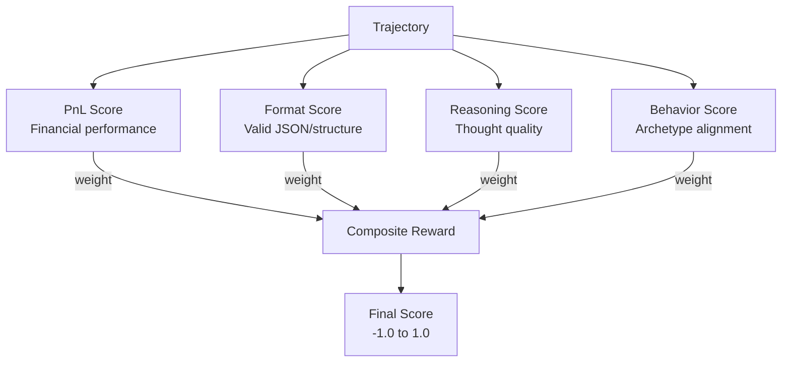

# Reward System

The reward system converts trajectory data into training signals for GRPO.

## Reward Components



## Component Details

### 1. PnL Score

Financial performance relative to starting balance:

```python
def calculate_pnl_reward(start_balance: float, end_balance: float) -> float:
    # Bankruptcy = hard penalty
    if end_balance <= 0:
        return -10.0
    
    if start_balance <= 0:
        return 0.0
    
    pnl = end_balance - start_balance
    return_pct = pnl / start_balance
    
    # Scale: 10% return = 1.0 reward
    scaled = return_pct * 10.0
    
    return max(-1.0, min(1.0, scaled))
```

| Return | Score |
|--------|-------|
| +10% | 1.0 |
| +5% | 0.5 |
| 0% | 0.0 |
| -5% | -0.5 |
| -10% | -1.0 |
| Bankrupt | -10.0 |

### 2. Format Score

Valid response structure:

```python
def score_format(response: str) -> float:
    result = validate_response_format(response)
    
    score = 0.0
    
    # Has valid JSON action
    if result.has_valid_json:
        score += 0.4
    
    # Action type is recognized
    if result.action.action_type in VALID_ACTION_TYPES:
        score += 0.3
    
    # Required parameters present
    if result.action.has_required_params:
        score += 0.3
    
    return score
```

### 3. Reasoning Score

Quality of thought process (extracted from `<thinking>` tags):

```python
def score_reasoning(response: str) -> float:
    # Extract thinking content
    thinking = extract_thinking_tags(response)
    
    if not thinking:
        return 0.3  # Some agents skip thinking
    
    score = 0.5  # Base for having reasoning
    
    # Length bonus (substance, not fluff)
    if len(thinking) > 100:
        score += 0.2
    
    # Market terms present
    if has_market_analysis(thinking):
        score += 0.15
    
    # Decision clarity
    if has_clear_conclusion(thinking):
        score += 0.15
    
    return min(1.0, score)
```

### 4. Behavior Score

Archetype-specific behavior bonus/penalty (-0.5 to +0.5):

```python
def calculate_archetype_behavior_bonus(archetype: str, metrics: BehaviorMetrics) -> float:
    if archetype == "degen":
        return _calculate_degen_bonus(metrics)
    elif archetype == "trader":
        return _calculate_trader_bonus(metrics)
    # ... etc
```

See [Archetype System](../architecture/archetype-system.md) for per-archetype bonus functions.

## Composite Reward

Components are weighted by archetype:

```python
def archetype_composite_reward(inputs, archetype, behavior_metrics):
    weights = ARCHETYPE_REWARD_WEIGHTS[archetype]
    
    pnl = calculate_pnl_reward(inputs.starting_balance, inputs.end_balance)
    fmt = inputs.format_score
    rsn = inputs.reasoning_score
    bhv = calculate_archetype_behavior_bonus(archetype, behavior_metrics)
    
    # Risk penalty (except degens)
    if archetype != "degen" and inputs.risky_actions_count > 0:
        pnl -= inputs.risky_actions_count * 0.3
    
    composite = (
        pnl * weights["pnl"]
        + fmt * weights["format"]
        + rsn * weights["reasoning"]
        + bhv * weights["behavior"]
    )
    
    return max(-1.0, min(1.0, composite))
```

## Archetype Weights

Different archetypes prioritize different components:

| Archetype | PnL | Format | Reasoning | Behavior |
|-----------|-----|--------|-----------|----------|
| trader | 0.55 | 0.20 | 0.15 | 0.10 |
| degen | 0.15 | 0.15 | 0.10 | **0.60** |
| social-butterfly | 0.10 | 0.20 | 0.15 | **0.55** |
| researcher | 0.25 | 0.25 | **0.30** | 0.20 |
| scammer | 0.35 | 0.15 | 0.20 | 0.30 |
| information-trader | 0.35 | 0.20 | 0.20 | 0.25 |
| goody-twoshoes | 0.15 | 0.25 | 0.20 | **0.40** |
| ass-kisser | 0.10 | 0.20 | 0.15 | **0.55** |
| perps-trader | **0.50** | 0.15 | 0.20 | 0.15 |
| super-predictor | 0.30 | 0.20 | 0.25 | 0.25 |
| infosec | 0.25 | 0.25 | **0.30** | 0.20 |
| liar | 0.20 | 0.15 | 0.25 | **0.40** |

All weights sum to 1.0 (validated at module load time).

## Score Variance (Critical)

GRPO requires different scores within a group to compute gradients.

We add small deterministic tiebreakers:

```python
# From babylon_env.py
def _add_tiebreaker(score: float, response: str, action_type: str) -> float:
    epsilon = 0.0
    
    # Length-based (scaled down to avoid dominating real differences)
    epsilon += (len(response) % 100) * 0.000001
    
    # Content-based (deterministic, tiny contribution)
    content_hash = sum(ord(c) for c in response[:50]) % 1000
    epsilon += content_hash * 0.0000001
    
    # Action-based
    if action_type:
        type_hash = sum(ord(c) for c in action_type) % 100
        epsilon += type_hash * 0.000001
    
    # Clamp to ensure tiebreaker never exceeds 1e-3
    epsilon = min(epsilon, 1e-3)
    return score + epsilon
```

This ensures:
- Near-identical responses get slightly different scores
- GRPO always has gradient signal
- Tiebreakers are reproducible (same input = same output)

## Normalization

### Within-Group Normalization

GRPO normalizes scores within each group (batch):

```python
# Inside GRPO loss
 scores = scores.view(-1, group_size)  # [batch, group_size]
 mean = scores.mean(dim=1, keepdim=True)
 std = scores.std(dim=1, keepdim=True) + 1e-8
 advantages = (scores - mean) / std
```

### Historical Normalization

Optional running normalization across training:

```python
class RewardNormalizer:
    def __init__(self):
        self.mean = 0.0
        self.m2 = 0.0  # Sum of squared differences (not variance)
        self.count = 0
    
    def update(self, reward: float):
        # Welford's online algorithm
        self.count += 1
        delta = reward - self.mean
        self.mean += delta / self.count
        delta2 = reward - self.mean
        self.m2 += delta * delta2  # Accumulate M2
    
    def normalize(self, reward: float) -> float:
        if self.count < 2:
            return reward
        std = math.sqrt(self.m2 / (self.count - 1) + 1e-8)
        return (reward - self.mean) / std
```

## Debugging Rewards

### Check Score Distribution

In W&B, look for:
- `train/score_mean` - Should be around 0.5
- `train/score_std` - Should be > 0.1
- `train/score_min/max` - Should span range

### Common Issues

| Symptom | Cause | Fix |
|---------|-------|-----|
| All scores = 0.5 | Scoring not running | Check scorer imports |
| No variance | All same format/content | Add tiebreakers |
| All negative | Bankrupt trajectories | Filter bad data |
| All positive | Only good trajectories | Need more variety |

### Logging Scores

```python
# In babylon_env.py
logger.info(f"Batch scores: {scores}")
logger.info(f"  Mean: {np.mean(scores):.3f}")
logger.info(f"  Std:  {np.std(scores):.3f}")
logger.info(f"  Components: pnl={pnl:.3f}, fmt={fmt:.3f}, rsn={rsn:.3f}")
```

## Social Rewards

For non-trading archetypes (Social Butterfly, Ass-Kisser, Goody Two-Shoes), financial performance is not the primary goal. These archetypes use **social reward scoring** via `SOCIAL_COMPOSITE_WEIGHTS` in `rewards.py`:

```python
# Social Butterfly (most social-focused)
"social-butterfly": {"social": 0.55, "format": 0.20, "reasoning": 0.15, "pnl": 0.10}

# Ass-Kisser and Goody Two-Shoes (slightly more balanced)
"ass-kisser":       {"social": 0.50, "format": 0.25, "reasoning": 0.15, "pnl": 0.10}
"goody-twoshoes":   {"social": 0.50, "format": 0.25, "reasoning": 0.15, "pnl": 0.10}
```

This allows a Social Butterfly with zero P&L but strong network building to score higher than a passive trader.

See [Enhanced Rewards - Social & Narrative](./enhanced-rewards.md#social--narrative-rewards) for details.

## Enhanced Rewards

For more sophisticated reward calculation that accounts for market conditions, see [Enhanced Rewards](./enhanced-rewards.md):

- **Market Regime Detection** - Classify bull/bear/sideways conditions
- **Counterfactual Alpha** - Measure skill vs luck
- **Temporal Credit** - Attribute delayed outcomes to decisions
- **Social & Narrative Rewards** - PnL-independent scoring for social archetypes
- **Configurable Weights** - YAML-based weight profiles
