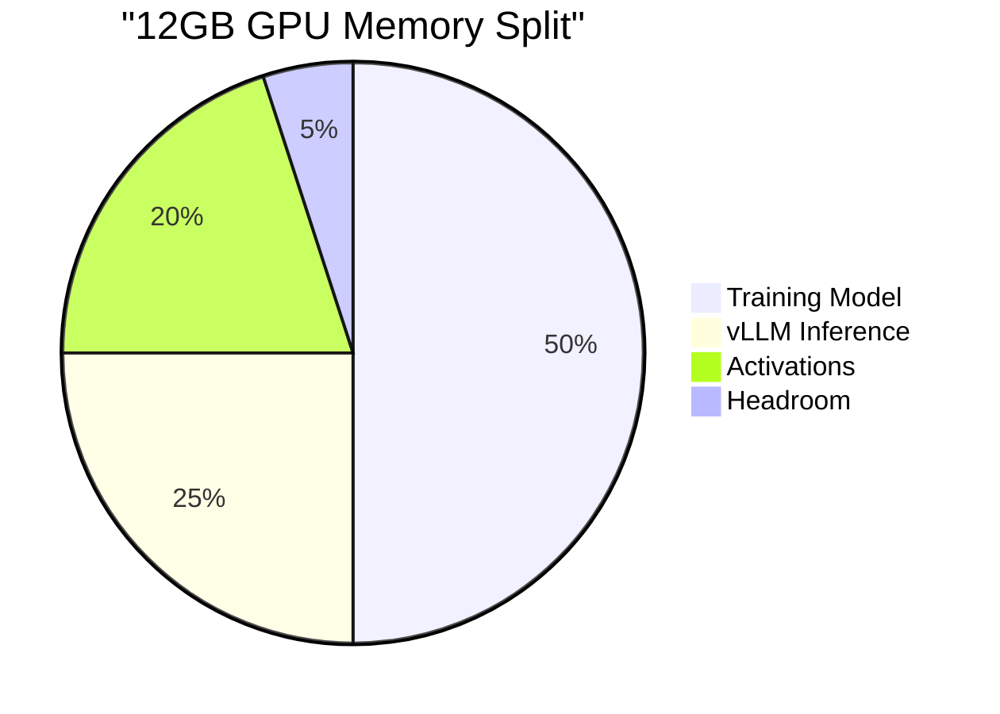

# GPU Profiles

GPU profiles configure the training pipeline for different hardware configurations.

## Available Profiles

| Profile | VRAM | Model | Batch | vLLM Memory |
|---------|------|-------|-------|-------------|
| `12gb` | 12GB | Qwen 0.5B | 1 | 25% |
| `16gb` | 16GB | Qwen 1.5B | 2 | 35% |
| `24gb` | 24GB | Qwen 3B | 4 | 40% |
| `48gb` | 48GB | Qwen 7B | 8 | 45% |
| `l40` | 48GB | Qwen 7B | 8 | 45% |
| `l40-2gpu` | 96GB | Qwen 14B | 4 | 85% |
| `l40-4gpu` | 192GB | Qwen 30B | 16 | 45% |
| `cpu` | N/A | Qwen 0.5B | 1 | N/A |

## Profile Structure

Each profile is a JSON file in `python/config/profiles/`:

```json
{
  "name": "12GB GPU (RTX 3060/4070)",
  "description": "Optimized for 12GB VRAM - uses 0.5B model with minimal vLLM memory",
  "model": "Qwen/Qwen2.5-0.5B-Instruct",
  "vllm_gpu_memory": 0.25,
  "batch_size": 1,
  "max_token_length": 2048,
  "group_size": 4,
  "notes": "Training uses ~6GB, vLLM uses ~1.5GB, leaving headroom for activations"
}
```

## Profile Fields

| Field | Type | Description |
|-------|------|-------------|
| `name` | string | Human-readable name |
| `description` | string | Usage description |
| `model` | string | HuggingFace model ID |
| `vllm_gpu_memory` | float | Fraction of VRAM for vLLM (0.0-1.0) |
| `batch_size` | int | Training batch size |
| `max_token_length` | int | Max sequence length |
| `group_size` | int | Completions per prompt for GRPO |
| `tensor_parallel` | int | Number of GPUs for tensor parallelism |
| `notes` | string | Additional notes |

## Memory Layout

Training requires splitting GPU memory between:

1. **Model weights** (training) - ~50% of VRAM
2. **vLLM inference** - 25-50% of VRAM
3. **Activations/gradients** - Remaining



## Using Profiles

### Via Makefile

```bash
# Use named shortcuts
make train-12gb
make train-24gb
make train-l40

# Or specify profile
make train PROFILE=16gb
```

### Via CLI

```bash
# List available profiles
python scripts/run_training.py --list-profiles

# Use specific profile
python scripts/run_training.py --profile 12gb --steps 100

# Override profile settings
python scripts/run_training.py --profile 12gb --batch-size 2
```

## Common Hardware Configurations

### Consumer GPUs

| GPU | VRAM | Profile | Notes |
|-----|------|---------|-------|
| RTX 3060 | 12GB | `12gb` | Entry level |
| RTX 4070 | 12GB | `12gb` | Faster than 3060 |
| RTX 4080 | 16GB | `16gb` | Good mid-range |
| RTX 3090 | 24GB | `24gb` | Great for development |
| RTX 4090 | 24GB | `24gb` | Best consumer |

### Cloud GPUs (RunPod, Lambda, etc.)

| GPU | VRAM | Profile | Approx Cost |
|-----|------|---------|-------------|
| A4000 | 16GB | `16gb` | ~$0.30/hr |
| A5000 | 24GB | `24gb` | ~$0.50/hr |
| A40 | 48GB | `48gb` | ~$0.80/hr |
| L40 | 48GB | `l40` | ~$1.00/hr |
| 2x L40 | 96GB | `l40-2gpu` | ~$2.00/hr |
| 4x L40 | 192GB | `l40-4gpu` | ~$4.00/hr |

## Multi-GPU Training

For profiles with `tensor_parallel > 1`:

```json
{
  "name": "2x L40 (96GB)",
  "model": "Qwen/Qwen2.5-14B-Instruct",
  "tensor_parallel": 2,
  "vllm_gpu_memory": 0.45,
  "batch_size": 16
}
```

vLLM handles tensor parallelism automatically:

```python
vllm_cmd = [
    "python", "-m", "vllm.entrypoints.openai.api_server",
    "--model", profile["model"],
    "--tensor-parallel-size", str(profile.get("tensor_parallel", 1)),
    "--gpu-memory-utilization", str(profile["vllm_gpu_memory"]),
]
```

## Creating Custom Profiles

1. Copy an existing profile:

   ```bash
cp python/config/profiles/24gb.json python/config/profiles/my-gpu.json
   ```

2. Adjust settings:

   ```json
{
  "name": "My Custom GPU",
  "model": "Qwen/Qwen2.5-3B-Instruct",
  "vllm_gpu_memory": 0.35,
  "batch_size": 2,
  "max_token_length": 2048,
  "group_size": 4
}
   ```

3. Test it:

   ```bash
   python scripts/run_training.py --profile my-gpu --steps 1
   ```

## Tuning Tips

### OOM Errors

If you get CUDA out-of-memory:

1. **Reduce `vllm_gpu_memory`** - Try 0.05 lower
2. **Reduce `batch_size`** - Half it
3. **Use smaller model** - Drop to lower param count
4. **Reduce `max_token_length`** - Try 1024

### Slow Training

If training is too slow:

1. **Increase `batch_size`** - If VRAM allows
2. **Increase `vllm_gpu_memory`** - Better batching
3. **Use larger model** - If you have headroom

### Checking GPU Usage

```bash
# Real-time monitoring
watch -n 1 nvidia-smi

# During training, check both processes:
# - python (training) - should use 40-60%
# - vllm - should use vllm_gpu_memory%
```

## Profile Validation

The training script validates profiles:

```python
def validate_profile(profile: dict) -> list[str]:
    errors = []
    
    required = ["model", "vllm_gpu_memory", "batch_size"]
    for field in required:
        if field not in profile:
            errors.append(f"Missing: {field}")
    
    if profile.get("vllm_gpu_memory", 0) > 0.7:
        errors.append("vllm_gpu_memory too high, training may OOM")
    
    if profile.get("batch_size", 0) < 1:
        errors.append("batch_size must be >= 1")
    
    return errors
```

## CPU Profile

For testing without GPU:

```json
{
  "name": "CPU Only (No GPU)",
  "model": "Qwen/Qwen2.5-0.5B-Instruct",
  "vllm_gpu_memory": 0,
  "batch_size": 1,
  "max_token_length": 1024,
  "skip_vllm": true,
  "notes": "Use external inference server or mock mode"
}
```

Use with:

```bash
CUDA_VISIBLE_DEVICES="" python scripts/run_training.py --profile cpu --steps 1
```

