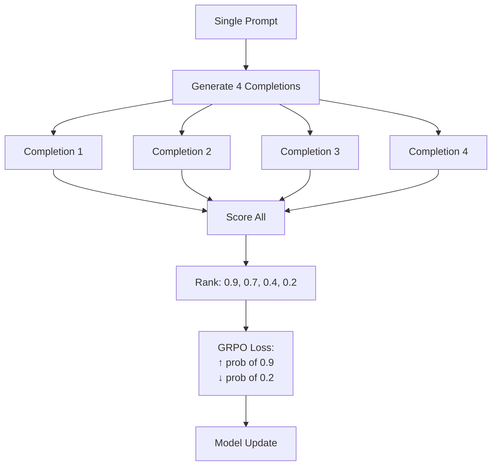
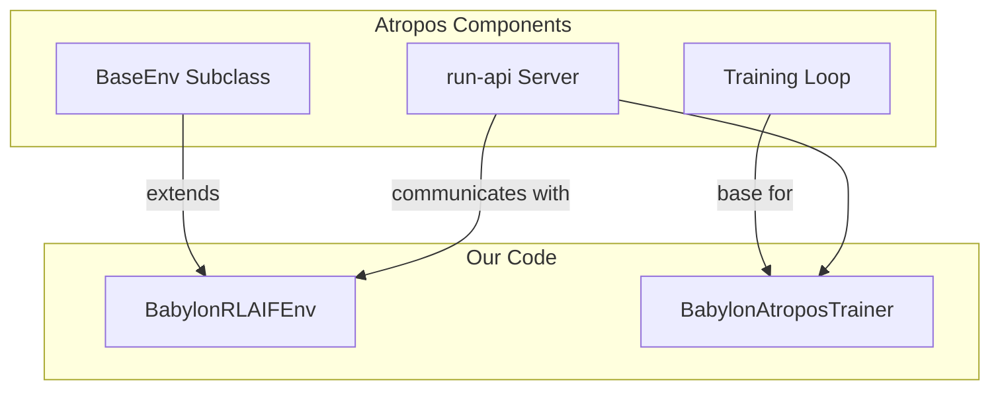
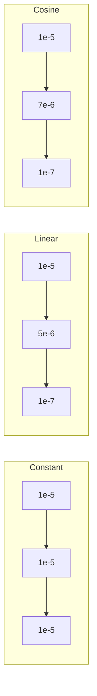
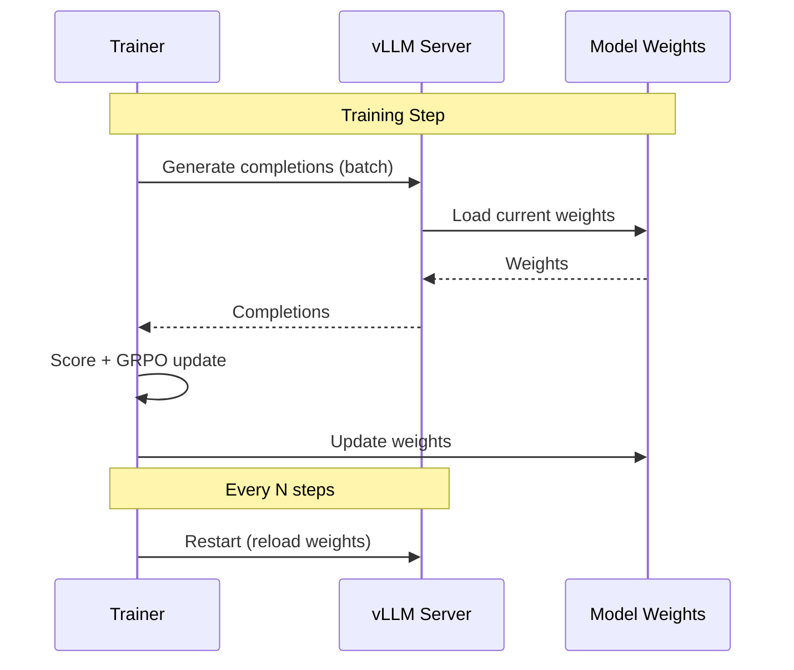

# GRPO & Atropos

We use Group Relative Policy Optimization (GRPO) implemented through the Atropos framework.

## What is GRPO?

GRPO is a policy gradient algorithm for RLHF/RLAIF that:

1. **Generates multiple completions** per prompt (group_size, default 4)
2. **Scores them relatively** within the group
3. **Reinforces better completions** over worse ones
4. **No separate reward model needed** - uses direct scoring



## GRPO vs Other Methods

| Method | Requires | Comparison |
|--------|----------|------------|
| PPO | Reward model + value head | Pairwise |
| DPO | Paired preference data | Pairwise |
| **GRPO** | Just scores | Group-wise |
| SFT | Only positive examples | N/A |

GRPO advantage: No separate reward model training, works with any scoring function.

## Atropos Framework

[Atropos](https://github.com/NousResearch/atropos) provides the infrastructure:



### Key Atropos Classes

| Class | Our Extension | Purpose |
|-------|---------------|---------|
| `BaseEnv` | `BabylonRLAIFEnv` | Provides trajectories and scores |
| `BaseEnvConfig` | `BabylonEnvConfig` | Configuration |
| `ScoredDataGroup` | (used as-is) | Batch of tokens + scores |

## Training Loop

```python
# Simplified from atropos_trainer.py
for step in range(num_steps):
    # 1. Get batch from environment
    batch = await env.get_next_item()
    
    # 2. Compute GRPO loss
    loss = compute_grpo_loss(
        model, 
        batch.tokens, 
        batch.scores,
        group_size=4
    )
    
    # 3. Backward + optimize
    loss.backward()
    optimizer.step()
    scheduler.step()
    
    # 4. Log metrics
    wandb.log({"loss": loss, "lr": scheduler.get_lr()})
    
    # 5. Periodic checkpoint
    if step % save_every == 0:
        save_checkpoint(model, optimizer, step)
```

## GRPO Loss Calculation

The loss pushes probability mass toward higher-scoring completions:

```python
def compute_grpo_loss(model, tokens, scores, group_size):
    # tokens shape: [batch_size * group_size, seq_len]
    # scores shape: [batch_size * group_size]
    
    # Get log probabilities
    logits = model(tokens)
    log_probs = compute_log_probs(logits, tokens)
    
    # Reshape to groups
    log_probs = log_probs.view(-1, group_size)  # [batch, group]
    scores = scores.view(-1, group_size)
    
    # Normalize scores within group (advantages)
    advantages = (scores - scores.mean(dim=1, keepdim=True))
    advantages = advantages / (scores.std(dim=1, keepdim=True) + 1e-8)
    
    # GRPO loss: -log_prob * advantage
    loss = -(log_probs * advantages).mean()
    
    return loss
```

## Configuration

### Atropos Config (babylon_atropos.yaml)

```yaml
env:
  tokenizer_name: Qwen/Qwen2.5-3B-Instruct
  group_size: 4                    # Completions per prompt
  
  # Experiment tracking
  use_wandb: false
  wandb_name: babylon-rlaif
  
  # Worker settings
  max_num_workers: 64
  rollout_server_url: http://localhost:8000
  
  # Database
  database_url: ${DATABASE_URL}
  
  # Trajectory loading (under env:, not separate section)
  lookback_hours: 72
  min_agents_per_window: 2
  min_actions_per_trajectory: 3
  
  # LLM Judge settings
  judge_model: gpt-4o-mini
  judge_temperature: 0.3
```

### Trainer Arguments

| Argument | Default | Description |
|----------|---------|-------------|
| `--steps` | 100 | Training steps |
| `--batch-size` | 4 | Prompts per batch |
| `--lr` | 1e-5 | Initial learning rate |
| `--min-lr` | 1e-7 | Minimum LR |
| `--lr-scheduler` | cosine | constant, linear, or cosine |
| `--warmup-steps` | 10 | LR warmup period |
| `--save-every` | 5 | Checkpoint interval |

## Learning Rate Schedulers



```python
# Scheduler options
if scheduler_type == "constant":
    return lr  # Fixed
elif scheduler_type == "linear":
    progress = step / total_steps
    return lr - (lr - min_lr) * progress
elif scheduler_type == "cosine":
    progress = step / total_steps
    return min_lr + 0.5 * (lr - min_lr) * (1 + cos(pi * progress))
```

## vLLM Integration

vLLM provides fast inference during training:



vLLM is restarted periodically to pick up weight updates. Configure with:

```yaml
# In run_training.py
vllm_restart_interval: 10  # Restart every 10 steps
```

## Resuming Training

Checkpoints save:
- Model weights
- Optimizer state
- Learning rate scheduler state
- Step number

Resume with:

```bash
python scripts/run_training.py --resume ./trained_models/step_50
```

This loads the checkpoint and continues from step 51.

## Score Variance

**Critical**: GRPO skips batches where all scores are identical.

To ensure score variance, we add small tiebreakers:

```python
# From babylon_env.py
epsilon = 0.0
epsilon += (len(generated_response) % 100) * 0.0001  # Response length variance
# Deterministic content-based variance (sum of character codes, not hash for reproducibility)
content_hash = sum(ord(c) for c in generated_response[:50]) % 1000
epsilon += content_hash * 0.00001
final_score += epsilon
```

This ensures:
- Different completions get slightly different scores
- GRPO always has gradient signal
- Tiebreakers are deterministic (reproducible)

## Debugging Training

### Loss Not Decreasing

1. Check scores have variance: `train/score_std > 0`
2. Check learning rate not too low: `train/learning_rate`
3. Check gradients not zero: `train/grad_norm > 0`

### Scores All Same

1. Check scoring pipeline is working
2. Verify format validator isn't failing everything
3. Increase `group_size` for more diversity

### vLLM OOM

1. Reduce `vllm_gpu_memory` in profile
2. Use smaller model
3. Reduce `batch_size`

