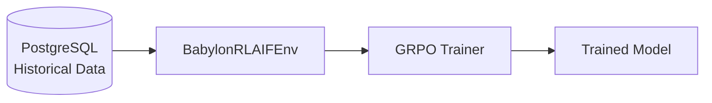
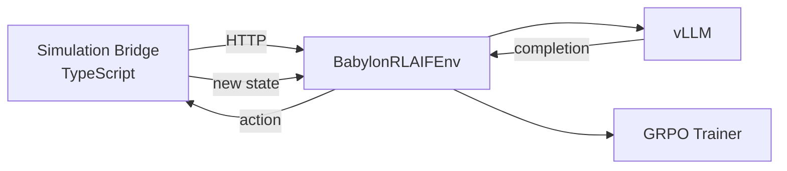
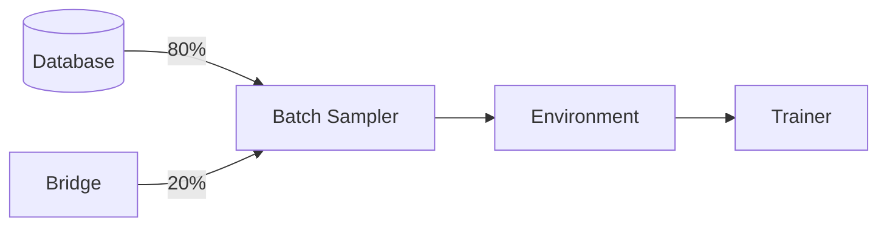

# Training Modes

The pipeline supports three training modes: offline, online, and hybrid.

## Mode Comparison

| Mode | Data Source | Use Case | Requirements |
|------|-------------|----------|--------------|
| **Offline** | Historical trajectories from DB | Most common, production training | PostgreSQL with trajectory data |
| **Online** | Real-time simulation via bridge | Live learning, debugging | Simulation bridge server running |
| **Hybrid** | Mix of DB + live simulation | Balance stability and exploration | Both DB and bridge |

## Offline Training (Default)



### How It Works

1. Load trajectories from database (last N hours)
2. Group by time window
3. For each batch:
   - Convert trajectory to prompt
   - Generate completions with vLLM
   - Score completions
   - Update model

### Running Offline Training

```bash
# Using Makefile
make train-12gb

# Or directly
cd packages/training/python
python scripts/run_training.py --profile 12gb --steps 100
```

### Configuration

```yaml
# babylon_atropos.yaml (under env: section)
env:
  lookback_hours: 72                  # How far back to query
  min_agents_per_window: 2            # Need 2+ agents for comparison
  min_actions_per_trajectory: 3       # Skip short trajectories
  max_steps_per_trajectory: 20        # Truncate long ones
```

## Online Training



### How It Works

1. Simulation bridge provides scenarios
2. Model generates action
3. Bridge executes action, returns outcome
4. Score the result
5. Update model in real-time

### Running Online Training

#### Terminal 1: Start Bridge Server

```bash
make bridge-server
# or: cd packages/engine && bun run src/services/simulation-bridge-server.ts
```

#### Terminal 2: Start Training

```bash
make train-online
# or:
python scripts/run_training.py --profile 12gb --mode online --bridge-url http://localhost:3001
```

### Bridge Server API

The simulation bridge exposes these endpoints:

| Endpoint | Method | Purpose |
|----------|--------|---------|
| `/health` | GET | Health check |
| `/api/scenario` | GET | Get next scenario |
| `/api/action` | POST | Execute action |
| `/api/reset` | POST | Reset simulation |

### Scenario Format

```json
{
  "scenarioId": "sc_123",
  "npcId": "npc_456",
  "archetype": "trader",
  "observation": {
    "marketPrices": {"BTC": 45000},
    "portfolio": {"balance": 10000},
    "recentEvents": []
  },
  "systemPrompt": "You are a trader...",
  "conversationHistory": []
}
```

## Hybrid Training



### How It Works

1. Sample from both sources with configurable ratio
2. Offline data provides stability (known good/bad trajectories)
3. Online data provides exploration (fresh scenarios)
4. Model learns from both

### Running Hybrid Training

```bash
make train-hybrid ONLINE_RATIO=0.2
# 80% offline, 20% online
```

### Configuration

```bash
# Environment variables
HYBRID_ONLINE_RATIO=0.2  # 0.0 = all offline, 1.0 = all online

# Or CLI argument
python scripts/run_training.py --mode hybrid --hybrid-online-ratio 0.3
```

## Mode Selection Guide

### Use Offline When

- You have sufficient historical data (100+ trajectories)
- Training on cloud/cluster (no interactive simulation)
- Reproducible training runs needed
- First pass training before online refinement

### Use Online When

- Debugging model behavior
- Testing new scenarios
- Low historical data
- Need immediate feedback on changes

### Use Hybrid When

- Balancing exploration vs. exploitation
- Incrementally improving a trained model
- Adding new archetypes while maintaining existing behavior

## Data Requirements

### Offline Mode

| Requirement | Minimum | Recommended |
|-------------|---------|-------------|
| Trajectories | 50 | 500+ |
| Unique windows | 10 | 50+ |
| Actions per trajectory | 3 | 10+ |
| Archetypes represented | 1 | All 12 |

Check your data:

```bash
# Query database directly
psql $DATABASE_URL -c "SELECT archetype, COUNT(*) FROM trajectories GROUP BY archetype"

# Check trajectory counts by window
psql $DATABASE_URL -c "SELECT \"windowId\", COUNT(*) FROM trajectories GROUP BY \"windowId\" ORDER BY COUNT(*) DESC LIMIT 10"
```

### Online Mode

| Requirement | Status |
|-------------|--------|
| Simulation bridge running | `make bridge-check` |
| Network connectivity | localhost:3001 |
| Sufficient scenarios defined | Engine configuration |

## Troubleshooting

### Offline: "No trajectories found"

```bash
# Check database has data
psql $DATABASE_URL -c "SELECT COUNT(*) FROM trajectories"

# Adjust lookback window
python scripts/run_training.py --lookback-hours 168  # 1 week
```

### Online: "Bridge not responding"

```bash
# Check if bridge is running
curl http://localhost:3001/health

# Start bridge
make bridge-server
```

### Hybrid: "Ratio imbalance"
The actual ratio may vary per batch. This is normal - it's a target, not a guarantee. Logged in W&B as `train/online_ratio`.

