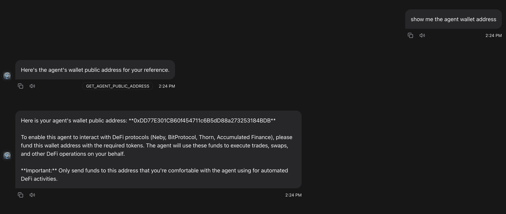

# ROFL Plugin

The ROFL plugin provides integration with the ROFL `appd` service for cryptographic key generation and management. It allows agents to generate various types of cryptographic keys through a Unix domain socket connection to the ROFL service.

## Features

- Generate cryptographic keys with different algorithms:
  - `raw-256`: Generate 256 bits of entropy
  - `raw-384`: Generate 384 bits of entropy
  - `ed25519`: Generate an Ed25519 private key
  - `secp256k1`: Generate a Secp256k1 private key
- Automatic key generation using agent ID
- Secure communication via Unix domain socket

## Configuration

To enable the ROFL plugin, set the following environment variable:

```bash
ROFL_PLUGIN_ENABLED=true
```

The plugin requires the ROFL service to be running and accessible via the Unix domain socket at `/run/rofl-appd.sock`.

## Usage

### As an Action

The plugin provides a `GET_AGENT_PUBLIC_ADDRESS` action that can be used to get the public address of the agent.

```
User: Show me the agent public address
System: Here is the agent public address: <address>
```

### As a Provider

The plugin provides an agent public address generation provider that uses the agent's unique ID to automatically create a secp256k1 private key. This private key forms the basis for establishing an agent wallet client that manages transaction and message signing operations.

## Error Handling

The plugin includes comprehensive error handling:

- Validates socket availability before attempting operations
- Provides detailed error messages for troubleshooting
- Logs errors for monitoring and debugging

## Security Considerations

- All communication with the ROFL service is done through a Unix domain socket
- Keys are generated securely by the ROFL service

## Testing with RealitySpiral Agent UI

This section guides you through testing the RealitySpiral Agent UI with a deployed ROFL application.

### Prerequisites

- A deployed ROFL application on a TDX-enabled server (see [Deployment to TEE environment](/README.md#deployment-to-tee-environment) section above)
- Access to the server's hostname and port 5173

### Steps to Test

1. **Deploy ROFL App**

   - Follow the steps in the [Deployment to TEE environment](/README.md#deployment-to-tee-environment) section to deploy your ROFL application
   - Ensure all environment variables and secrets are properly configured

2. **Access the Agent UI**

   - Wait a few seconds for the application to start up
   - Open your web browser and navigate to:

   ```
   http://HOSTNAME:5173/
   ```

   

3. **Select Agent**

   - From the available agents, select the `StaffEngineer` agent
   - Click the "Chat" button to start a conversation

4. **Display the agent wallet address**

   - In the chat interface, type the following message:

   ```
   Show me the agent wallet address
   ```

   

5. **Using the public address**
   - Copy the generated public address
   - You can fund this address on the Oasis network and utilize other plugins like Accumulated Finance, Bitprotocol, Neby, or Thorn to interact with the agent wallet via the agent UI.
   - Visit [Oasis Explorer](https://explorer.oasis.io/) to get more information about the agent wallet.

### Troubleshooting

If you encounter any issues:

- Ensure the ROFL application is properly deployed and running
- Check that all required environment variables are set
- Verify network connectivity to the server
- Check the application logs for any error messages
