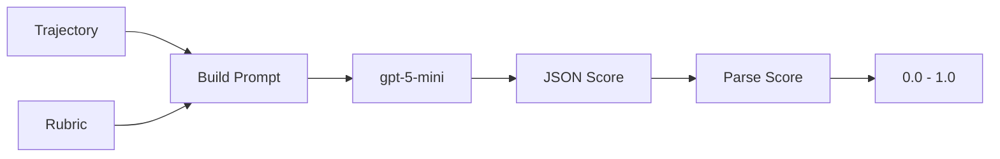

# LLM-as-Judge

An optional scoring method using a language model to evaluate trajectories.

## When to Use LLM Judge

| Use Case | Method |
|----------|--------|
| Training (default) | Python Judge |
| Evaluation | LLM Judge |
| A/B Testing | LLM Judge |
| Debugging rubrics | LLM Judge |
| Offline scoring | LLM Judge |

The LLM judge provides richer feedback but is slower and costs money.

## Architecture



## TypeScript Implementation

Located in `src/scoring/ArchetypeScoringService.ts`:

```typescript
class ArchetypeScoringService {
  async scoreTrajectory(
    trajectory: Trajectory,
    archetype: string
  ): Promise<ScoredTrajectory> {
    const rubric = getRubricForArchetype(archetype);
    const metrics = extractMetrics(trajectory);
    
    const prompt = this.buildJudgePrompt(trajectory, rubric, metrics);
    
    const response = await this.llmClient.complete({
      model: "gpt-5-mini",
      messages: [
        { role: "system", content: JUDGE_SYSTEM_PROMPT },
        { role: "user", content: prompt }
      ],
      temperature: 0.3,
      response_format: { type: "json_object" }
    });
    
    const score = this.parseJudgeResponse(response);
    
    return {
      ...trajectory,
      aiJudgeReward: score.overall,
      judgeReasoning: score.reasoning
    };
  }
}
```

## Judge Prompt Structure

```typescript
function buildJudgePrompt(
  trajectory: Trajectory,
  rubric: string,
  metrics: Metrics
): string {
  return `
# Trajectory Evaluation

## Archetype
${trajectory.archetype}

## Rubric
${rubric}

## Metrics Summary
- Total P&L: $${metrics.totalPnL}
- Trades Executed: ${metrics.tradesExecuted}
- Win Rate: ${(metrics.winRate * 100).toFixed(1)}%
- Unique Users: ${metrics.uniqueUsersInteracted}
- Group Chats: ${metrics.groupChatsJoined}

## Trajectory Steps
${formatSteps(trajectory.stepsJson)}

## Task
Score this trajectory from 0.0 to 1.0 based on the rubric.

Respond with JSON:
{
  "score": <float 0.0-1.0>,
  "reasoning": "<2-3 sentences>",
  "strengths": ["<strength1>", "<strength2>"],
  "weaknesses": ["<weakness1>", "<weakness2>"]
}
`;
}
```

## RULER Comparison Mode

For relative ranking, the judge compares trajectories:

```typescript
async scoreTrajectoryGroup(
  trajectories: Trajectory[],
  archetype: string
): Promise<RankedTrajectories> {
  const rubric = getRubricForArchetype(archetype);
  
  const prompt = `
# Comparative Trajectory Evaluation

## Archetype: ${archetype}

## Rubric
${rubric}

## Trajectories to Compare

${trajectories.map((t, i) => `
### Trajectory ${i + 1}
P&L: $${t.finalPnL}
Steps: ${formatSteps(t.stepsJson).slice(0, 500)}
`).join('\n')}

## Task
Rank these trajectories from best to worst for a ${archetype}.
Score each 0.0 to 1.0, ensuring relative ordering.

Respond with JSON:
{
  "rankings": [
    {"trajectory": 1, "score": 0.85, "reasoning": "..."},
    {"trajectory": 2, "score": 0.65, "reasoning": "..."},
    ...
  ]
}
`;
  
  const response = await this.llmClient.complete({...});
  return this.parseRankings(response);
}
```

## Configuration

### In Python (babylon_env.py)

```python
# BabylonEnvConfig
judge_model: str = "gpt-5-mini"
judge_temperature: float = 0.3
judge_max_tokens: int = 1024
use_llm_judge: bool = False  # Default to Python judge
```

### Environment Variables

```bash
# Required for LLM judge
OPENAI_API_KEY=sk-...

# Optional: use different model
LLM_JUDGE_MODEL=gpt-5.5
```

## Scoring Rubrics

From `config/rubrics.json`, each archetype has detailed rubrics:

```json
{
  "rubrics": {
    "trader": "## Trader Archetype Evaluation\n\n### What Makes an Excellent Trader (0.8-1.0)\n- **Positive P&L**...",
    "degen": "## Degen Archetype Evaluation\n\n### What Makes an Excellent Degen (0.8-1.0)\n- **Bold positions**...",
    ...
  }
}
```

See [Archetype Rubrics](./rubrics.md) for full rubric content.

## Offline Batch Scoring

Score trajectories without training:

```bash
# Score unscored trajectories in database
bun run packages/training/scripts/score-trajectories.ts

# Or via CLI
babylon train score --archetype trader
```

```typescript
// scripts/score-trajectories.ts
const unscored = await db.query(`
  SELECT * FROM trajectories 
  WHERE "aiJudgeReward" IS NULL
  LIMIT 100
`);

const scorer = new ArchetypeScoringService(llmClient);

for (const trajectory of unscored) {
  const scored = await scorer.scoreTrajectory(trajectory);
  await db.update("trajectories")
    .set({ aiJudgeReward: scored.aiJudgeReward })
    .where({ id: trajectory.id });
}
```

## Cost Considerations

| Model | Per Trajectory | Per 1000 |
|-------|----------------|----------|
| gpt-5-mini | ~$0.002 | ~$2 |
| gpt-4o | ~$0.02 | ~$20 |
| gpt-5.5 | ~$0.03 | ~$30 |

For training, use Python judge (free).
For evaluation, LLM judge adds ~$2 per 1000 trajectories.

## Hybrid Approach

Use both for different purposes:

```python
def score_trajectory(self, trajectory, response, archetype):
    # Fast Python score for training
    training_score = self._python_judge_score(trajectory, response, archetype)
    
    # Periodic LLM validation
    if self.step % 100 == 0 and self.use_llm_validation:
        llm_score = self._llm_judge_score(trajectory, response, archetype)
        
        # Log correlation for monitoring
        wandb.log({
            "python_score": training_score,
            "llm_score": llm_score,
            "score_correlation": abs(training_score - llm_score)
        })
    
    return training_score
```

## Debugging LLM Judge

### Check Prompt

```typescript
// Enable prompt logging
const prompt = buildJudgePrompt(trajectory, rubric, metrics);
console.log("Judge prompt:", prompt);
```

### Check Response

```typescript
const response = await llmClient.complete({...});
console.log("Raw response:", response);

const parsed = parseJudgeResponse(response);
console.log("Parsed:", parsed);
```

### Common Issues

| Issue | Cause | Fix |
|-------|-------|-----|
| Empty response | Token limit | Increase max_tokens |
| Invalid JSON | Model confusion | Add JSON schema hint |
| All same score | Rubric unclear | Improve rubric specificity |
| Slow scoring | API latency | Use gpt-5-mini |

