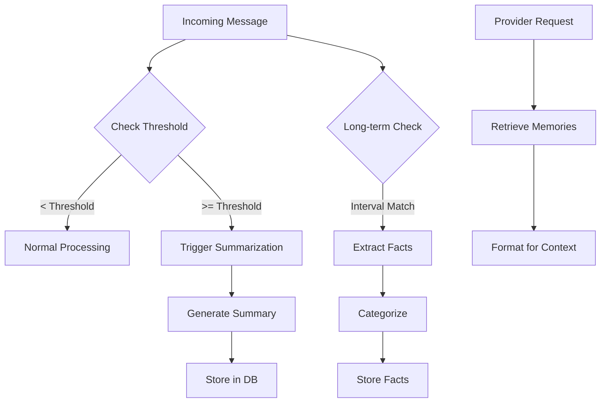

# @elizaos/plugin-memory

Advanced memory management plugin for elizaOS with conversation summarization and long-term persistent memory.

## Features

- **Short-term Memory (Conversation Summarization)**
  - Automatically summarizes long conversations to reduce context size
  - Retains recent messages while archiving older ones as summaries
  - Configurable thresholds for when to summarize

- **Long-term Memory (Persistent Facts)**
  - Extracts and stores persistent facts about users
  - Categorizes information using cognitive science principles:
    - **Episodic**: Specific events and experiences
    - **Semantic**: General facts and knowledge
    - **Procedural**: Skills and workflows
  - Provides context-aware user profiles across all conversations

## Multi-Language Support

This plugin is implemented in three languages with full parity:

| Language | Location | Build Command |
|----------|----------|---------------|
| TypeScript | `typescript/` | `bun run build:ts` |
| Python | `python/` | `pip install -e ./python` |
| Rust | `rust/` | `cargo build --release` |

## Installation

```bash
# TypeScript (primary)
bun add @elizaos/plugin-memory

# Python
pip install elizaos-plugin-memory

# Rust
cargo add elizaos-plugin-memory
```

## Usage

### TypeScript

```typescript
import { memoryPlugin } from '@elizaos/plugin-memory';

const agent = createAgent({
  plugins: [memoryPlugin],
});
```

### Python

```python
from elizaos_plugin_memory import MemoryPlugin

plugin = MemoryPlugin()
```

### Rust

```rust
use elizaos_plugin_memory::{MemoryService, MemoryConfig};

let config = MemoryConfig::default();
let service = MemoryService::new(config);
```

## Configuration

| Setting | Default | Description |
|---------|---------|-------------|
| `MEMORY_SUMMARIZATION_THRESHOLD` | 16 | Messages before summarization |
| `MEMORY_RETAIN_RECENT` | 6 | Recent messages to keep |
| `MEMORY_SUMMARIZATION_INTERVAL` | 10 | Update interval after threshold |
| `MEMORY_MAX_NEW_MESSAGES` | 20 | Max new messages per update |
| `MEMORY_LONG_TERM_ENABLED` | true | Enable long-term extraction |
| `MEMORY_CONFIDENCE_THRESHOLD` | 0.85 | Minimum confidence to store |
| `MEMORY_EXTRACTION_THRESHOLD` | 30 | Messages before extraction |
| `MEMORY_EXTRACTION_INTERVAL` | 10 | Run extraction every N messages |

## Development

```bash
# Build all languages
bun run build

# Run all tests
bun run test

# Lint all languages
bun run lint

# Format all languages
bun run format
```

## Architecture



## License

MIT
