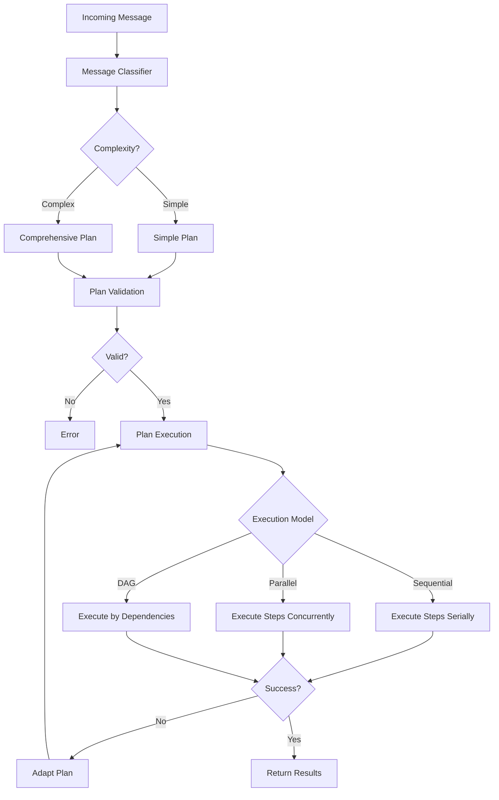

# @elizaos/plugin-planning

Comprehensive planning and execution plugin for elizaOS with REALM-Bench and API-Bank benchmarking.

## Features

- **Message Classification**: LLM-powered classification of message complexity and planning requirements
- **Simple Planning**: Quick plan generation for basic tasks
- **Comprehensive Planning**: Multi-step plans with dependency management and LLM generation
- **Execution Models**: Sequential, parallel, and DAG-based execution
- **Plan Validation**: Validates plans and detects circular dependencies
- **Plan Adaptation**: Dynamically adapts plans based on execution results
- **Benchmarking**: REALM-Bench and API-Bank test suites (Python and TypeScript)

## Multi-Language Support

This plugin is implemented in three languages with full parity:

| Language | Location | Build Command | Benchmarks |
|----------|----------|---------------|------------|
| TypeScript | `typescript/` | `bun run build:ts` | ✅ |
| Python | `python/` | `pip install -e ./python` | ✅ |
| Rust | `rust/` | `cargo build --release` | ❌ |

## Installation

```bash
# TypeScript (primary)
bun add @elizaos/plugin-planning

# Python
pip install elizaos-plugin-planning

# Rust
cargo add elizaos-plugin-planning
```

## Usage

### TypeScript

```typescript
import { planningPlugin, PlanningService } from '@elizaos/plugin-planning';

const agent = createAgent({
  plugins: [planningPlugin],
});

// Access the planning service
const planningService = agent.getService<PlanningService>('planning');

// Create a comprehensive plan
const context = {
  goal: 'Build and deploy a web application',
  constraints: [{ type: 'time', value: '2 hours' }],
  availableActions: ['ANALYZE', 'CREATE_FILE', 'DEPLOY'],
  preferences: { executionModel: 'dag' },
};

const plan = await planningService.createComprehensivePlan(runtime, context);
```

### Python

```python
from elizaos_plugin_planning import PlanningPlugin, PlanningService

plugin = PlanningPlugin()
await plugin.initialize(runtime)

# Create a comprehensive plan
context = {
    "goal": "Research AI trends and create a report",
    "constraints": [],
    "available_actions": ["SEARCH", "ANALYZE", "CREATE_FILE"],
    "preferences": {"execution_model": "sequential"},
}

plan = await plugin.service.create_comprehensive_plan(context)
```

### Rust

```rust
use elizaos_plugin_planning::{PlanningService, PlanningConfig, PlanningContext};

let config = PlanningConfig::default();
let service = PlanningService::new(config);

let context = PlanningContext {
    goal: "Build a comprehensive solution".to_string(),
    constraints: vec![],
    available_actions: vec!["ANALYZE".to_string()],
    available_providers: vec![],
    preferences: None,
};

let plan = service.create_comprehensive_plan(&context, None).await?;
```

## Benchmarking

### Run All Benchmarks

```bash
# Run TypeScript and Python benchmarks
bun run benchmark

# Run TypeScript benchmarks only
bun run benchmark:ts

# Run Python benchmarks only
bun run benchmark:python
```

### Python CLI

```bash
# Run all benchmarks
python -m elizaos_plugin_planning.benchmarks.cli --all

# Run REALM-Bench only
python -m elizaos_plugin_planning.benchmarks.cli --realm-bench

# Run API-Bank only
python -m elizaos_plugin_planning.benchmarks.cli --api-bank

# Custom output directory
python -m elizaos_plugin_planning.benchmarks.cli --all --output ./my_results
```

## Configuration

| Setting | Default | Description |
|---------|---------|-------------|
| `PLANNING_MAX_STEPS` | 10 | Maximum steps in a plan |
| `PLANNING_TIMEOUT_MS` | 60000 | Default execution timeout |
| `PLANNING_EXECUTION_MODEL` | sequential | Default execution model |
| `PLANNING_ENABLE_ADAPTATION` | true | Enable plan adaptation |

## Architecture



## Development

```bash
# Build all languages
bun run build

# Run all tests
bun run test

# Lint all languages
bun run lint

# Format all languages
bun run format
```

## License

MIT
